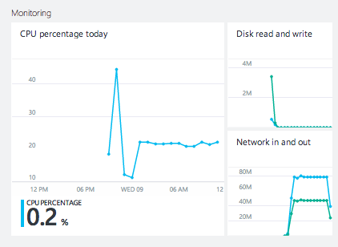
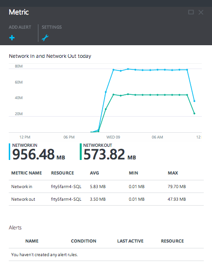
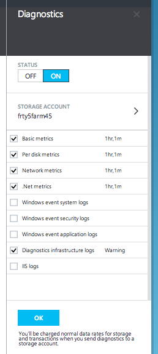
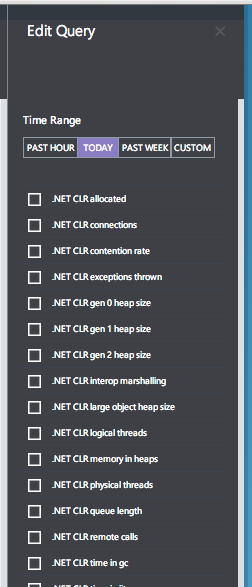
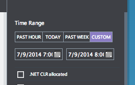
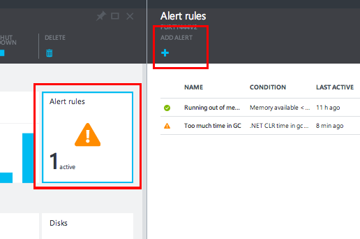
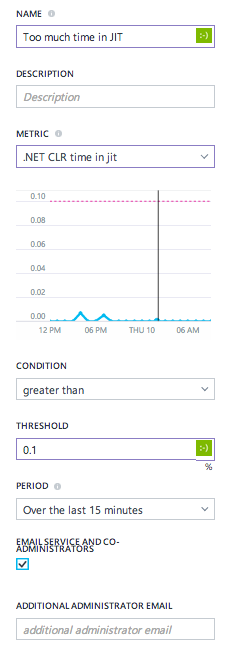

<properties title="" pageTitle="How to use diagnostics" description="Learn how to set up diagnostics for your resources in Azure." authors="stepsic-microsoft-com" manager="kamrani" editor="" services="application-insights" documentationCenter="" metaKeywords=""/>

<tags ms.service="application-insights" ms.workload="tbd" ms.tgt_pltfrm="ibiza" ms.devlang="na" ms.topic="article" ms.date="2014-11-04" ms.author="stepsic" />

# Setting up diagnostics

In the Azure Portal Preview, you can now configure rich, frequent, monitoring and diagnostics data about your Windows virtual machines and your storage accounts.

## Collecting rich data from Virtual machines
1. In the [Azure Portal Preview](https://portal.azure.com/), click **Browse**, then **Virtual machines**. Select the virtual machine you're interested in monitoring.
2. The **Monitoring** lens contains some default metrics, such as **CPU percentage**, **Disk read and write** and **Network in and out**. Clicking on any of these parts will show you the **Metric** blade.  
    
3. The **Metric** blade shows you details about metrics that you select. At the top of the blade is a graph, below that a table that shows you aggregation of those metrics, such as average, minimum and maximum. Below that is a list of the alerts you've defined, filtered to the metrics that appear on the blade.  
    
4. To enable rich diagnostics, click on the **Settings** button and you'll see the **Diagnostics** blade. Choose **ON**:  
    
    - **Basic metrics** : Health metrics about your virtual machine such as processor and memory 
    - **Per disk metrics** : Metrics about all of the disks attached to your virtual machine
    - **.NET metrics** : Metrics about the .NET and ASP.NET applications running on your virtual machine
    - **Network metrics** : Metrics about your network connections and web services
    - **Windows event application logs** : Windows events that are sent to the application channel
    - **Windows event system logs** : Windows events that are sent to the system channel. This also includes all events from [Microsoft Antimalware](http://go.microsoft.com/fwlink/?LinkID=404171&clcid=0x409). 
    - **Windows event security logs** : Windows events that are sent to the security channel
    - **Diagnostics infrastructure logs** : Logging about the diagnostics collection infrastructure
    - **IIS logs** : Logs about your IIS server
    All metrics and logs will be recorded at one-minute intervals, so you can always have the most up-to-date information about your machine.

When you enable diagnostics information to a storage account, that account will be charged the normal storage, transaction and egress costs. However, these features do not produce a large volume of data, with the possible exception of IIS logs. In order to minimize the egress costs, we do require you to select a storage account in the same region as the virtual machine.

Once you click **OK** data will begin appearing in your storage account within a few minutes. You cannot enable diagnostics for virtual machines running Linux, and the Guest Agent must be installed to enable diagnostics.

## Collecting rich data from storage accounts

You have always been able to collect some data from storage accounts, but now in the Azure Portal Preview, you can collect data at one-minute granularity to truly understand what is happening inside your storage account. The steps to enable one-minute metrics are similar to for Virtual machines:

1. Go to the **Metric** blade by clicking on any of the charts on the **Storage account** blade.
2. Click on the **Diagnostics** button in the command bar.
3. Select what data you want to collect from the storage account:  
    
4. Click **OK**. It will take a few minutes for data to appear for the first time.

## Visualizing diagnostics data 

Once you have enabled diagnostics you can see the full list of metrics available by right clicking on any chart and going to **Edit query**:

You can plot these metrics, and zoom in to the **Past hour**, out to the **Past week**, or even choose a **Custom** time range:
 

You will notice that these metrics are far more granular than the data that was previously available, and that there is minimal lag.

At this time there is no way to plot metrics that have multiple instances, such as per-process or per-disk metrics. For more information about how to customize your monitoring charts see [How to customize monitoring](http://go.microsoft.com/fwlink/?LinkID=394523&clcid=0x409).

## Alerting on diagnostics data

In addition to visualizing metrics you can alert on any of these metrics in the Portal Preview. First, scroll down to the **Alert rules** part on the virtual machine or storage blade, and then click **Add alert**:

Then you can select from any of the metrics that you have enabled for diagnostics:

The graph will show you a preview of your alert threshold compared the metric from the previous day. After you click **Save**, within a few minutes you will be informed whenever the metric you choose exceeds the threshold. 

Note that metrics which only appear in the Preview Portal are not alertable in the Full Portal. As a result, certain alert rules from the Preview Portal are not visible in the Full portal.