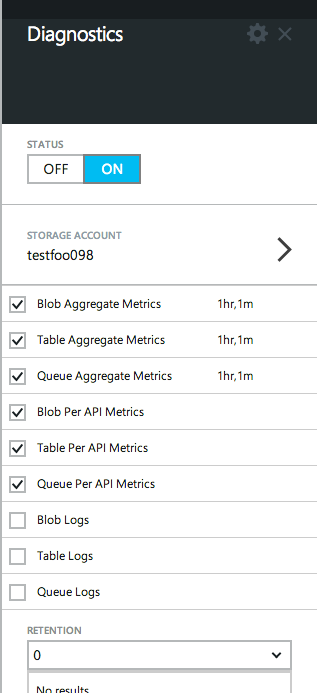

<properties 
	pageTitle="Enable monitoring and diagnostics" 
	description="Learn how to set up diagnostics for your resources in Azure." 
	authors="stepsic-microsoft-com" 
	manager="ronmart" 
	editor="" 
	services="azure-portal" 
	documentationCenter="na"/>

<tags 
	ms.service="azure-portal" 
	ms.workload="na" 
	ms.tgt_pltfrm="na" 
	ms.devlang="na" 
	ms.topic="article" 
	ms.date="04/28/2015" 
	ms.author="stepsic"/>

# Enable monitoring and diagnostics

In the [Azure Portal](http://portal.azure.com), you can configure rich, frequent, monitoring and diagnostics data about your resources. You can also use the [REST API](https://msdn.microsoft.com/library/azure/dn931932.aspx) or [.NET SDK](https://www.nuget.org/packages/Microsoft.Azure.Insights/) to configure diagnostics programmatically.

Diagnostics, monitoring and metric data in Azure is saved into a Storage account of your choice. This allows you to use whatever tooling you want to read the data, from a storage explorer, to Power BI to third-party tooling.

## When you create a resource

Most services allow you to enable diagnostics when you first create them in the [Azure Portal](http://portal.azure.com).

1. Go to **New** and choose the resource you are interested in. 

2. Select **Optional configuration**.
    

3. Select **Diagnostics**, and click **On**. You will need to choose the Storage account that you want diagnostics to be saved to. You’ll be charged normal data rates for storage and transactions when you send diagnostics to a storage account.

4. Click **OK** and create the resource. 

## Change settings for an existing resource

If you have already created a resource and you want to change the diagnostics settings (to change the level of data collection, for example), you can do that right in the Azure Portal.

1. Go to the resource and click the **Settings** command.

2. Select **Diagnostics**.

3. The **Diagnostics** blade has all of the possible diagnostics and monitoring collection data for that resource. For some resources you can also choose a **Retention** policy for the data, to clean it up from your storage account. 
    

4. Once you've chosen your settings, click the **Save** command. It may take a little while for monitoring data to show up if you are enabling it for the first time. 

### Categories of data collection for virtual machines
For virtual machines all metrics and logs will be recorded at one-minute intervals, so you can always have the most up-to-date information about your machine.

- **Basic metrics** : Health metrics about your virtual machine such as processor and memory 
- **Network and web metrics** : Metrics about your network connections and web services
- **.NET metrics** : Metrics about the .NET and ASP.NET applications running on your virtual machine
- **SQL metrics** : If you are running Microsoft SQL Service, its performance metrics
- **Windows event application logs** : Windows events that are sent to the application channel
- **Windows event system logs** : Windows events that are sent to the system channel. This also includes all events from [Microsoft Antimalware](http://go.microsoft.com/fwlink/?LinkID=404171&clcid=0x409). 
- **Windows event security logs** : Windows events that are sent to the security channel
- **Diagnostics infrastructure logs** : Logging about the diagnostics collection infrastructure
- **IIS logs** : Logs about your IIS server

Note that at this time certain distributions of Linux are not supported, and, the Guest Agent must be installed on the virtual machine.

## Next steps

* [Receive alert notifications](insights-receive-alert-notifications.md) whenever operational events happen or metrics cross a threshold.
* [Monitor service metrics](insights-how-to-customize-monitoring.md) to make sure your service is available and responsive.
* [Scale instance count automatically](insights-how-to-scale.md) to make sure your service scale based on demand.
* [Monitor application performance](insights-perf-analytics.md) if you want to understand exactly how your code is performing in the cloud.
* [View events and audit logs](insights-debugging-with-events.md) to learn everything that has happened in your service.
* [Track service health](insights-service-health.md) to find out when Azure has experienced performance degradation or service interruptions. 
