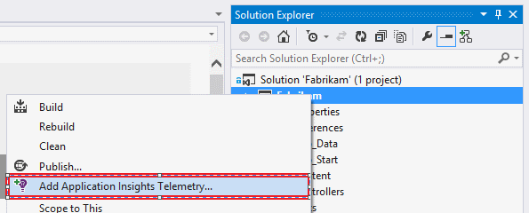
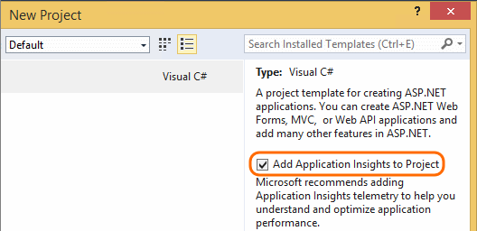
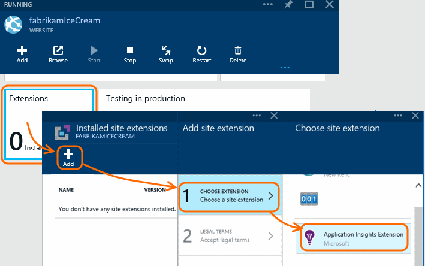
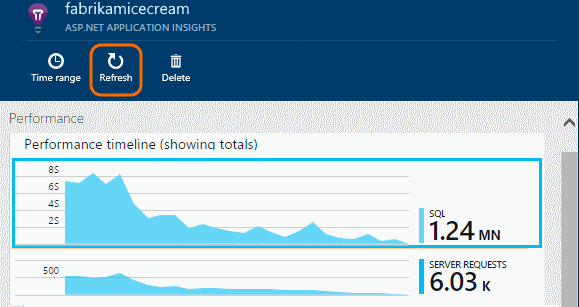
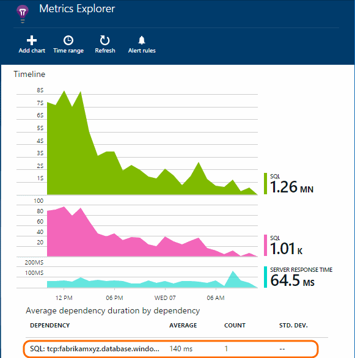

<properties 
	pageTitle="How to use end user analytics" 
	description="End user analytics for Microsoft Azure websites." 
	services="application-insights" 
	authors="alancameronwills" 
	manager="kamrani"/>

<tags 
	ms.service="application-insights" 
	ms.workload="tbd" 
	ms.tgt_pltfrm="ibiza" 
	ms.devlang="na" 
	ms.topic="article" 
	ms.date="2015-01-09" 
	ms.author="awills"/>

# Performance analytics for Microsoft Azure websites

After enabling the Azure WebSite extension (detailed steps below) you’ll be able to see statistics and details on your code's application dependencies.  These application dependencies are automatically discovered. 

Here's an example that shows the amount of time spent in a SQL dependency including the number of SQL calls and related statistics such as the average duration and standard deviation. 

 

## Set up Performance Analytics

#### 1. Add Application Insights to your Visual Studio project

In your project in Visual Studio 2013 Update 3 or later, add Application Insights to your project.

Or if you're creating a new project, just make sure to check the Application Insights option:

When you're asked to login, use the credentials for your Azure account.

#### 2. Enable Application Insights in your Azure website

Enable the Application Insights Extension on the Azure web site blade (not the Application Insight blade):

*Can I automate this step?*

Yes, there's a REST API for Azure websites. In PowerShell:

    $extension = "https://<sitename>.scm.azurewebsites.net/api/siteextensions/Microsoft.ApplicationInsights.AzureWebSites"
    Invoke-RestMethod -Uri $extension -Headers @{Authorization=("Basic {0}" -f $base64AuthInfo)} -Method PUT -Verbose

## Explore the data

Use your website for a while to generate some data.

Then refresh your Application Insights blade and scroll down to the performance lens.

Drill into the first or second chart to see your code dependencies:

Drill through to see individual requests:

## Get more Application Insights

* [Monitor usage][azure-usage] to find out how many users you have, how often they visit, and how the pages perform on their browsers
* [Create web tests][azure-availability] to make sure your site is available and responsive

[azure-usage]: ../insights-usage-analytics/
[azure-availability]: ../insights-create-web-tests/
