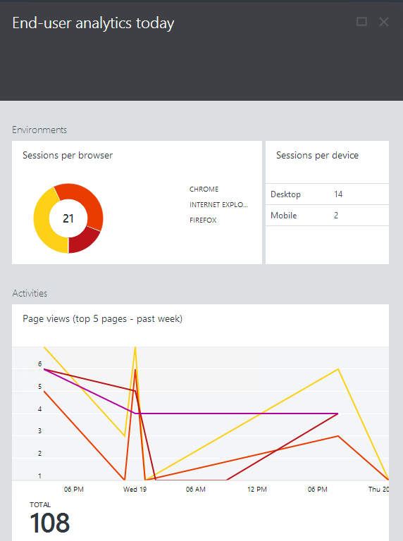
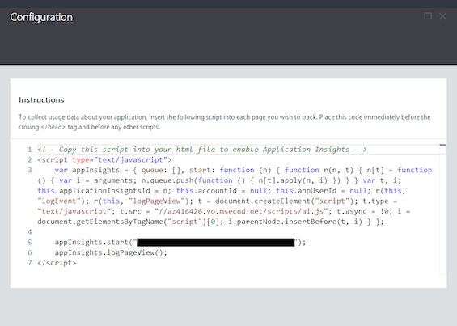
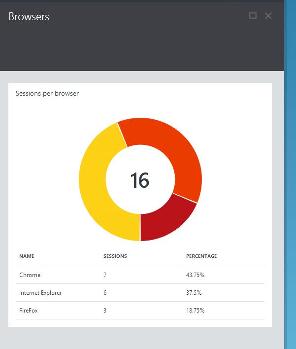
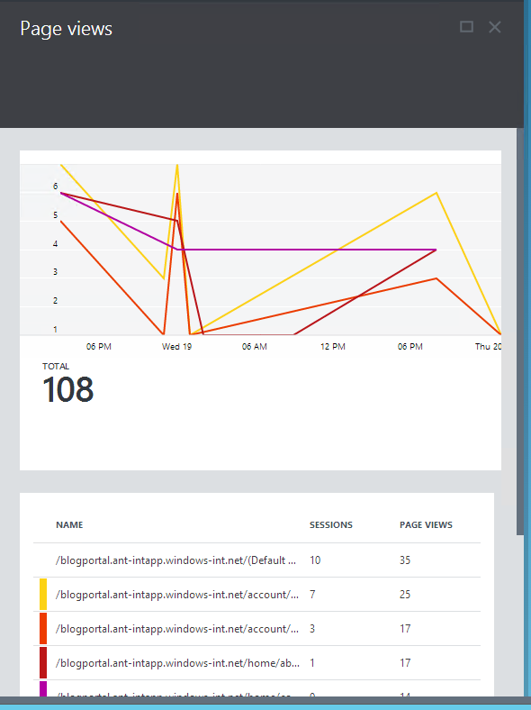

<properties 
	pageTitle="How to use end user analytics" 
	description="End user analytics for Microsoft Azure websites." 
	services="application-insights" 
	authors="alancameronwills" 
	manager="kamrani"/>

<tags 
	ms.service="application-insights" 
	ms.workload="tbd" 
	ms.tgt_pltfrm="ibiza" 
	ms.devlang="na" 
	ms.topic="article" 
	ms.date="2015-01-09" 
	ms.author="awills"/>

# Usage analytics for Microsoft Azure websites

Wonder how many users have visited you site?  Wonder what the average page load time is or what browsers are being used?  By inserting a few lines of script in your web pages, you can collect data about how your website is used by your customers. 

*You can do this for non-Azure websites too: [Monitor web app usage with Application Insights](../app-insights-web-track-usage/).*

## How to set up End User Analytics

1. Click on the part on the **Web site** blade that says **End user analytics**
2. On the **Configuration** blade, select the entire instrumentation script and copy it.  
    
3. Paste the script into each of your web pages, just before the close of the </head> tag. It's a good idea to insert the script into all your web pages. If you're using ASP.NET, you can do that by inserting the script into your application's master page.
4. Deploy and use your web application. Usage analytic information will begin to appear after about 5-10 minutes.

## Exploring the data

The Browsers session part allows you to drill into to see the different browsers and then browser versions.

The Analytics part shows:

- A break down of the different device types including Desktop and Mobile.
- Your top 5 pages and graphs the page load time over the past week.  The number of sessions and views is also available  
    
- Your slowest pages in the past week so you can improve them to meet your business goals and objectives

## Get more Application Insights

* [Monitor performance][azure-perf] to diagnose issues with your code's dependencies
* [Create web tests][azure-availability] to make sure your site is available and responsive

[azure-perf]: ../insights-perf-analytics/
[azure-availability]: ../insights-create-web-tests/
