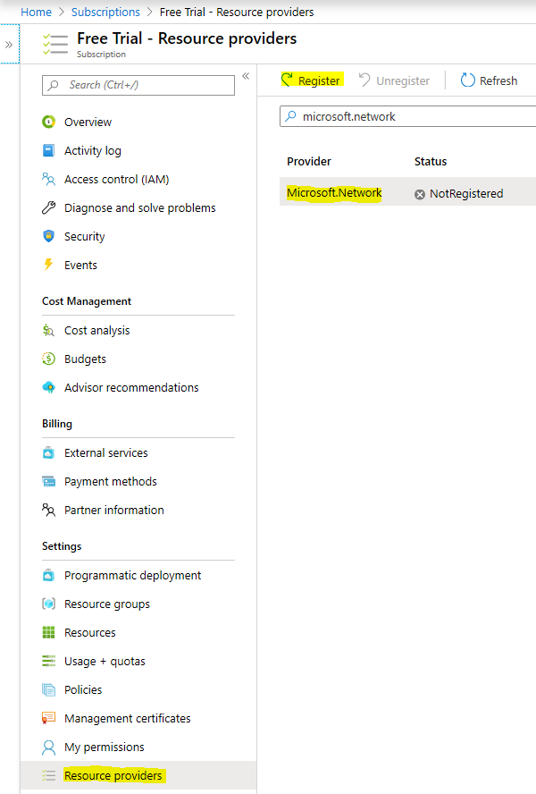

# Azure Internet Analyzer FAQ (Preview)

This is the FAQ for Azure Internet Analyzer- if you have additional questions, go to the [feedback forum](https://aka.ms/internetAnalyzerFeedbackForum) and post your question. When a question is frequently asked, we add it to this article so it can be found quickly and easily.

## How do I participate in the preview?

The preview is available to select customers. If you are interested in joining the preview, please do the following:

1. Sign in to the [Azure portal](https://ms.portal.azure.com).
2. Navigate to the **Subscriptions** page.
3. Click on the Azure subscription that you plan to use Internet Analyzer with.
4. Go to the **Resource providers** settings for the subscription.
5. Search for **Microsoft.Network** and click on the **Register** (or **Re-register**) button.

6. [Request approval](https://aka.ms/internetAnalyzerContact) by providing us your email address and the Azure subscription ID that was used to make the access request.
7. Once your request has been approved, you will receive an email confirmation and will be able to create/update/modify Internet Analyzer resources from the newly allowed Azure subscription.

## Do I need to embed the client to run a test?

Yes, the Internet Analyzer client must be installed in your application to collect metrics specific to your users. [Learn how to install the client.](internet-analyzer-embed-client.md) 

## Do I get billed for participating in the preview?
No, Azure Internet Analyzer is free to use in preview. There is no service-level agreement during preview.

## What scenarios is Internet Analyzer designed to address?

Internet Analyzer is designed to give you networking performance insights based on your user population. To help make the best performance decisions for your users, Internet Analyzer compares the performance of two Internet endpoints using your distinct user population. While Internet Analyzer can answer a multitude of questions, some of the most common are:

* What is the performance impact of migrating to the cloud? 
    * *Suggested Test: Custom (your current on-premises infrastructure) vs. Azure (any preconfigured endpoint)*
* What is the value of putting my data at the edge vs. in a data center? 
    *  *Suggested Test: Azure vs. Azure Front Door, Azure vs. Azure CDN from Microsoft*
* What is the performance benefit of Azure Front Door?
    *  *Suggested Test: Custom/ Azure/ CDN vs. Azure Front Door*
* What is the performance benefit of Azure CDN from Microsoft? 
    *  *Suggested Test: Custom/ Azure/ AFD vs. Azure CDN from Microsoft*
* How does Azure CDN from Microsoft stack up? 
    *  *Suggested Test: Custom (other CDN endpoint) vs. Azure CDN from Microsoft*
* What is the best cloud for your end-user population in each region? 
    *  *Suggested Test: Custom (other cloud service) vs. Azure (any preconfigured endpoint)*

## Which tests can I run in preview?

Each test you create in Internet Analyzer is composed of two endpoints—Endpoint A and Endpoint B. Any of the following combinations can be run as tests:  
* Two preconfigured endpoints,
* One custom and one preconfigured endpoint, or
* Two [custom endpoints](internet-analyzer-custom-endpoint.md) (one custom endpoint must reside in Azure).

The following preconfigured endpoints are available during preview:
* **Azure regions**
    * Brazil South
    * Central India
    * Central US
    * East Asia
    * East US
    * Japan West
    * North Europe
    * South Africa North
    * Southeast Asia
    * UAE North
    * UK West  
    * West Europe
    * West US
    * West US 2
* **Multiple Azure region combinations**
    * East US, Brazil South
    * East US, East Asia
    * West Europe, Brazil South
    * West Europe, Southeast Asia
    * West Europe, UAE North
    * West US, East US
    * West US, West Europe
    * West US, UAE North
    * West Europe, UAE North, Southeast Asia
    * West US, West Europe, East Asia
    * West US, North Europe, Southeast Asia, UAE North, South Africa North 
* **Azure + Azure Front Door** - deployed on any single or multiple Azure region combinations listed above
* **Azure + Azure CDN from Microsoft** - deployed on any single Azure region combination listed above
* **Azure + Azure Traffic Manager** - deployed on any multiple Azure region combination listed above

## How is Internet Analyzer different from other monitoring services provided by Azure?

Internet Analyzer helps you understand your end users' performance and assists in making decisions to improve their performance. While other Azure monitoring tools provide insights into your Azure services, Internet Analyzer focuses on measuring end-to-end Internet performance for your users.

## How is measurement data handled by Internet Analyzer?

Azure has [strong security processes and meets a broad range of compliance standards](https://azure.microsoft.com/support/trust-center/). Only you and your designated team have access to your data. Microsoft staff can have restricted access to it only under specific limited circumstances with your knowledge. It's encrypted in transit and at rest.

## Next steps

To learn more, see our [Internet Analyzer Overview](internet-analyzer-overview.md).
