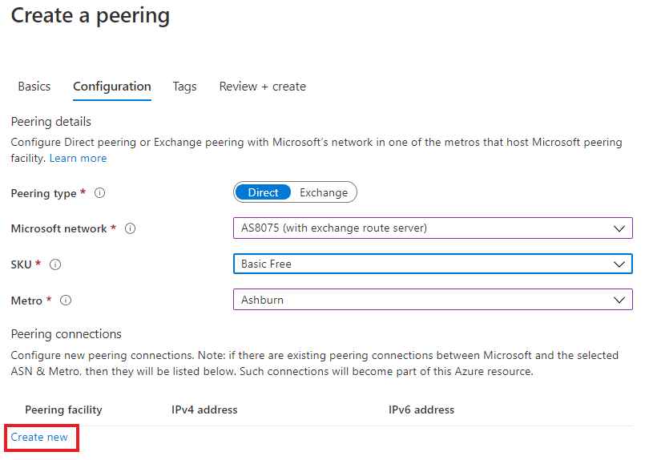
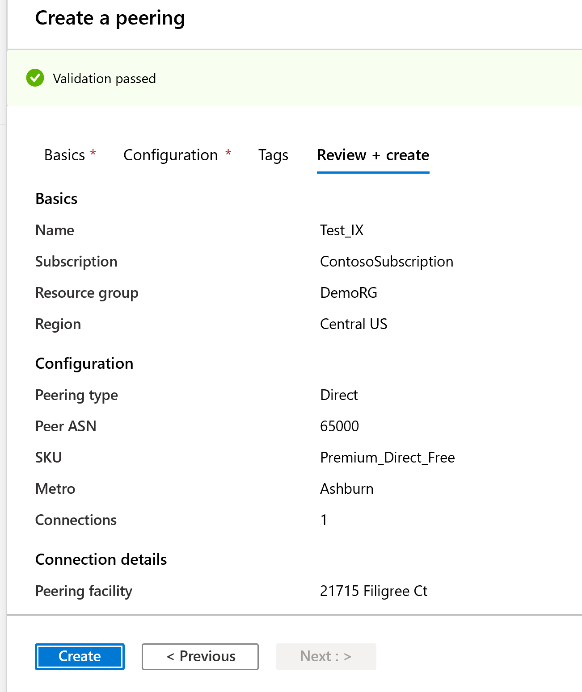
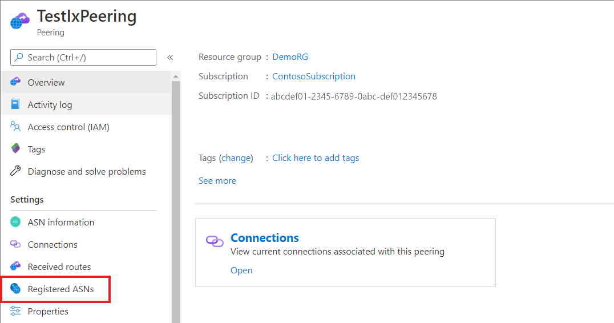
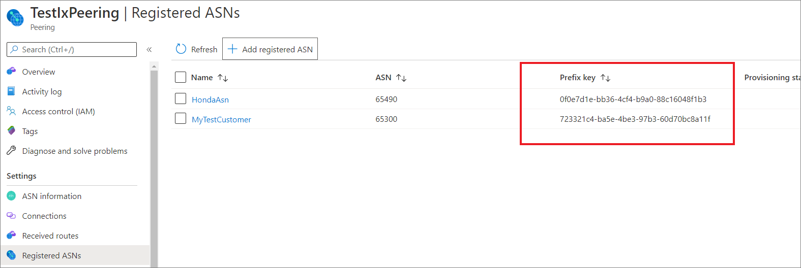

# Create or modify an Exchange peering with route server in Azure portal

This article describes how to create a Microsoft Exchange peering with a route server by using the Azure portal. This article also shows how to check the status of the resource, update it, or delete and deprovision it.

## Before you begin
* Review the [prerequisites](prerequisites.md) and the [Exchange peering walkthrough](walkthrough-exchange-all.md) before you begin configuration.
* If you already have Exchange peerings with Microsoft that aren't converted to Azure resources, see [Convert a legacy Exchange peering to an Azure resource by using the portal](howto-legacy-exchange-portal.md).

## Create and provision an Exchange peering

### Sign in to the portal and select your subscription
[!INCLUDE [Account](./includes/account-portal.md)]

### Create an Exchange peering with route server

As an Internet Exchange Provider, you can create an exchange peering request by [Creating a Peering]( https://go.microsoft.com/fwlink/?linkid=2129593).

1. On the **Create a Peering** page, on the **Basics** tab, fill in the boxes as shown here:

    > [!div class="mx-imgBorder"] 
    > 

* Select your Azure Subscription.

* For Resource group, you can either choose an existing resource group from the drop-down list or create a new group by selecting Create new. We'll create a new resource group for this example.

* Name corresponds to the resource name and can be anything you choose.

* Region is auto-selected if you chose an existing resource group. If you chose to create a new resource group, you also need to choose the Azure region where you want the resource to reside.

    >[!NOTE]
    >The region where a resource group resides is independent of the location where you want to create peering with Microsoft. But it's a best practice to organize your peering resources within resource groups that reside in the closest Azure regions. For example, for peerings in Ashburn, you can create a resource group in East US or East US2.

* Select your ASN in the **PeerASN** box.

    >[!IMPORTANT] 
    >You can only choose an ASN with ValidationState as Approved before you submit a peering request. If you just submitted your PeerAsn request, wait for 12 hours or so for ASN association to be approved. If the ASN you select is pending validation, you'll see an error message. If you don't see the ASN you need to choose, check that you selected the correct subscription. If so, check if you have already created PeerAsn by using **[Associate Peer ASN to Azure subscription](https://go.microsoft.com/fwlink/?linkid=2129592)**.

* Select **Next: Configuration** to continue.

#### Configure connections and submit

1. On the Create a Peering page, on the Configuration tab, fill in the boxes as shown here:

    > [!div class="mx-imgBorder"]
    > 
 
    * For Peering type, select **Direct**
    * For Microsoft network, select **AS8075 with exchange route server**. 
    * Select SKU as **Basic Free**. Don't select premium free as it's reserved for special applications.
    * Select the **Metro** location where you want to setup peering.

1. Under **Peering Connections**, select **Create new**

1.  Under **Direct Peering Connection**, fill in the following BGP session details:

    > [!div class="mx-imgBorder"]
    > 

     * Peering Facility, select the appropriate physical location for the peering
     * Session Address Provider, select Peer
     * Session IPv4 prefix will be provided by the exchange provider peer
     * Peer session IPv4 address, will be selected by the exchange peer for the route server from their IP prefix range.
     * Microsoft session IPv4 address, will be the router IP allocated from the IP prefix range.
     * Session IPv6 is optional at this time.
     * Maximum advertised IPv4 prefix can be up to 20000. 
     * Use for Peering Service is disabled by default. It can be enabled once the exchange provider has signed a Peering Service Agreement with Microsoft.

1. Upon completion, click **Save**. 

1. Under Create a peering, you will see validation passed. Once validation passed, click **Create**

    > [!div class="mx-imgBorder"]
    > 

    >[!NOTE]
    >For normal Internet Service Providers (ISP) who are a Microsoft Peering Service partner, customer IP prefixes registration is required. However, in the case of exchange partners with a route server, it is required to register customer ASNs and not prefixes. Same ASN key would be valid for the customer's prefix registration.

1. Select **Registered ASNs** under the Settings section.

    > [!div class="mx-imgBorder"]
    > 

1. Select **Add registered ASN** to create a new customer ASN under your exchange subscription.

    > [!div class="mx-imgBorder"]
    > 

1. Under Register an ASN, select a Name, populate the customer ASN, and click Save.

1. Under Registered ASNs, there will be an associated Prefix Key assigned to each ASN. As an exchange provider, you will need to provide this Prefix Key to your customer so they can register Peering Service under their subscription.

    > [!div class="mx-imgBorder"]
    > 

### Verify an Exchange peering
[!INCLUDE [peering-exchange-get-portal](./includes/exchange-portal-get.md)]

## Modify an Exchange peering
[!INCLUDE [peering-exchange-modify-portal](./includes/exchange-portal-modify.md)]

## Deprovision an Exchange peering
[!INCLUDE [peering-exchange-delete-portal](./includes/delete.md)]

## Next steps

* [Create or modify a Direct peering by using the portal](howto-direct-portal.md)
* [Convert a legacy Direct peering to an Azure resource by using the portal](howto-legacy-direct-portal.md)

## Additional resources

For more information, see [Internet peering FAQs](faqs.md).
