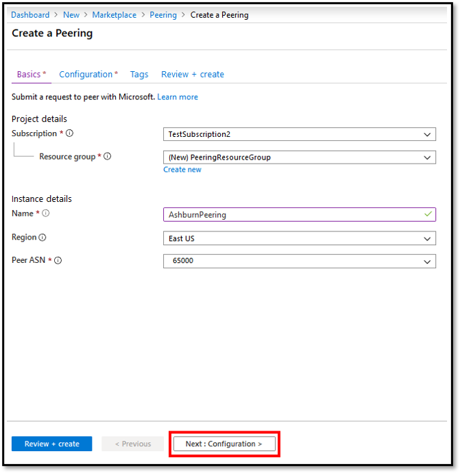

# Create or modify a Direct peering by using the Azure portal

This article describes how to create a Microsoft Direct peering for an Internet Service Provider or Internet Exchange Provider by using the Azure portal. This article also shows how to check the status of the resource, update it, or delete and de-provision it.

If you prefer, you can complete this guide by using Azure [PowerShell](howto-direct-powershell.md).

## Before you begin
* Review the [prerequisites](prerequisites.md) and the [Direct peering walkthrough](walkthrough-direct-all.md) before you begin configuration.
* If you already have Direct peering connections with Microsoft that aren't converted to Azure resources, see [Convert a legacy Direct peering to an Azure resource by using the portal](howto-legacy-direct-portal.md).

## Create and provision a Direct peering

### Sign in to the portal and select your subscription
[!INCLUDE [Account](./includes/account-portal.md)]

### Create a Direct peering

As an Internet Service Provider or Internet Exchange Provider, you can create a new direct peering request by [Creating a Peering]( https://go.microsoft.com/fwlink/?linkid=2129593).

1. On the **Create a Peering** page, on the **Basics** tab, fill in the boxes as shown here:

    

2. Select your Azure Subscription.

3. For Resource group, you can either choose an existing resource group from the drop-down list or create a new group by selecting Create new. We'll create a new resource group for this example.

4. Name corresponds to the resource name and can be anything you choose.

5. Region is auto-selected if you chose an existing resource group. If you chose to create a new resource group, you also need to choose the Azure region where you want the resource to reside.

    >[!NOTE]
    > The region where a resource group resides is independent of the location where you want to create peering with Microsoft. But it's a best practice to organize your peering resources within resource groups that reside in the closest Azure regions. For example, for peerings in Ashburn, you can create a resource group in East US or East US2.

6. Select your ASN in the **PeerASN** box.

    >[!IMPORTANT]
    >You can only choose an ASN with ValidationState as Approved before you submit a peering request. If you just submitted your PeerAsn request, wait for 12 hours or so for ASN association to be approved. If the ASN you select is pending validation, you'll see an error message. If you don't see the ASN you need to choose, check that you selected the correct subscription. If so, check if you have already created PeerAsn by using **[Associate Peer ASN to Azure subscription](https://go.microsoft.com/fwlink/?linkid=2129592)**.

7. Select **Next: Configuration** to continue.

    

#### Configure connections and submit
[!INCLUDE [direct-peering-configuration](./includes/direct-portal-configuration.md)]

### Verify Direct peering
[!INCLUDE [peering-direct-get-portal](./includes/direct-portal-get.md)]

## Modify a Direct peering
[!INCLUDE [peering-direct-modify-portal](./includes/direct-portal-modify.md)]

## Deprovision a Direct peering
[!INCLUDE [peering-direct-delete-portal](./includes/delete.md)]

## Next steps

* [Create or modify Exchange peering by using the portal](howto-exchange-portal.md)
* [Convert a legacy Exchange peering to an Azure resource by using the portal](howto-legacy-exchange-portal.md)

## Additional resources

For more information, see [Internet peering FAQs](faqs.md).
