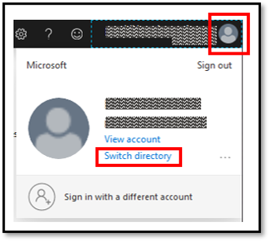
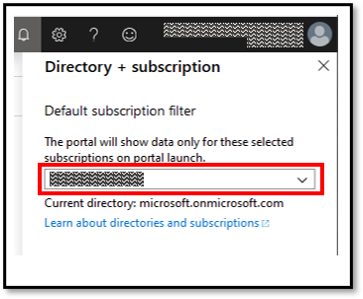

From a browser, go to the Azure [portal](https://portal.azure.com/) and sign in with your Azure account.

If you have multiple subscriptions and need to switch subscriptions:

1. Select the profile button, and then select **Switch Directory**.

    > [!div class="mx-imgBorder"]
    > 

1. Choose a subscription you want to use for peering setup.

    > [!div class="mx-imgBorder"]
    > 
