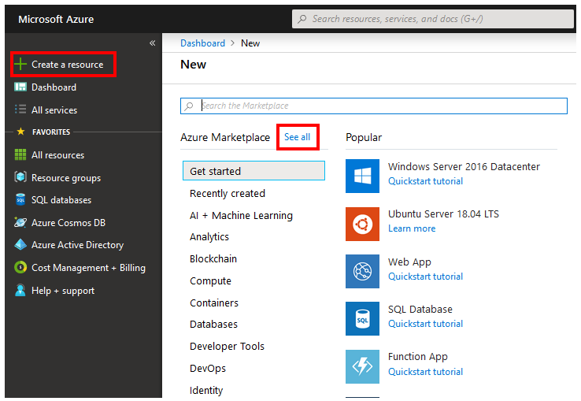
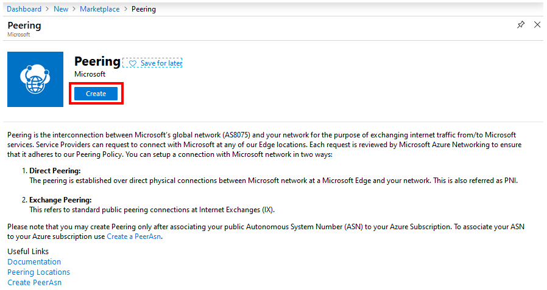

1. Select **Create a resource** > **See all**.

    > [!div class="mx-imgBorder"]
    > 

1. Search for **Peering** in the search box, and select **Enter** on your keyboard. From the results, select a **Peering** resource.

    > [!div class="mx-imgBorder"]
    > 

1. After **Peering** starts, review the page to understand the details. When you're ready, select **Create**.

    > [!div class="mx-imgBorder"]
    > 

1. On the **Create a Peering** page, on the **Basics** tab, fill in the boxes as shown here.

    > [!div class="mx-imgBorder"]
    > 

    * Select your Azure **Subscription**.
    * For **Resource group**, you can either choose an existing resource group from the drop-down list or create a new group by selecting **Create new**. We'll create a new resource group for this example.
    * **Name** corresponds to the resource name and can be anything you choose.
    * **Region** is autoselected if you chose an existing resource group. If you chose to create a new resource group, you also need to choose the Azure region where you want the resource to reside.

        > [!NOTE]
        > The region where a resource group resides is independent of the location where you want to create peering with Microsoft. But it's a best practice to organize your peering resources within resource groups that reside in the closest Azure regions. For example, for peerings in Ashburn, you can create a resource group in East US or East US2.

    * Select your ASN in the **Peer ASN** box.

        > [!IMPORTANT]
        > * You can only choose an ASN with ValidationState as Approved before you submit a peering request. If you just submitted your PeerAsn request, wait for 12 hours or so for ASN association to be approved. If the ASN you select is pending validation, you'll see an error message. 
        > * If you don't see the ASN you need to choose, check that you selected the correct subscription. If so, check if you have already created PeerAsn by using [Associate Peer ASN to Azure subscription](../howto-subscription-association-portal.md).

        > [!div class="mx-imgBorder"]
        > 

    * Select **Next : Configuration >** to continue.
