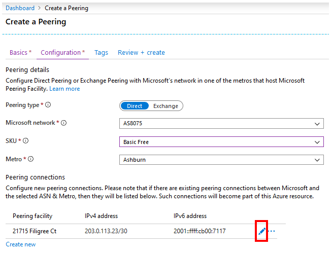
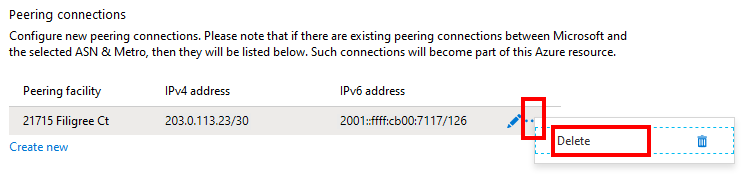
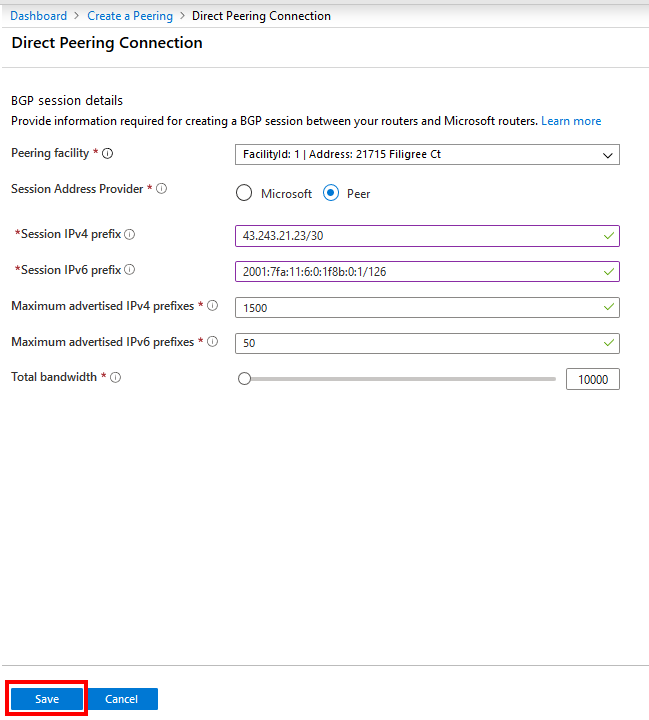
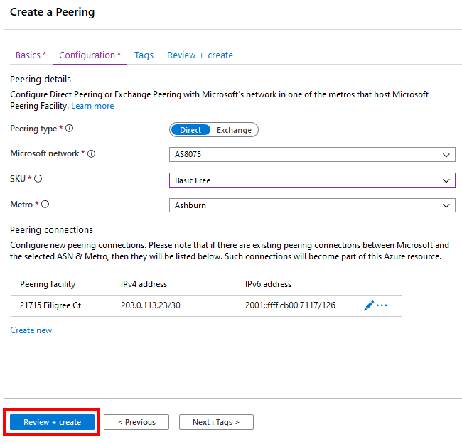

1. On the **Create a Peering** page, on the **Configuration** tab, fill in the boxes as shown here.

    * For **Peering type**, select **Direct**.
    * For **Microsoft network**, select **AS8075**. Don't create peering with ASN 8069. It's reserved for special applications and only used by [Microsoft peering](mailto:peering@microsoft.com).
    * Select **SKU** as **Basic Free**. Don't select Premium Free because it's reserved for special applications.
    * Select the **Metro** location where you want to set up peering.

        > [!NOTE]
        > If you already have peering connections with Microsoft in the selected **Metro** location, and you're using the Azure portal for the first time to set up peering in that location, your existing peering connections will be listed in the **Peering connections** section as shown. Microsoft will automatically convert these peering connections to an Azure resource so that you can manage them all, along with the new connections, in one place. For more information, see [Convert a legacy Direct peering to an Azure resource by using the portal](../howto-legacy-direct-portal.md).
        >

1. Under **Peering connections**, select **Create new** to add a line for each new connection you want to set up.

    * To configure or modify connection settings, select the edit button for a line.

        > [!div class="mx-imgBorder"]
        > 
    
    * To delete a line, select **...** > **Delete**.

        > [!div class="mx-imgBorder"]
        > 

    * You're required to provide all the settings for a connection, as shown here.

         > [!div class="mx-imgBorder"]
         > 

        1. Select the **Peering facility** where the connection needs to be set up.
        1. **Session Address Provider** is used to determine who provides the subnet needed to set up the BGP session between your network and Microsoft. If you can provide the subnet, select **Peer**. Otherwise, select **Microsoft** and [Microsoft peering](mailto:peering@microsoft.com) will contact you. Choosing this option will take longer for Microsoft to process the peering request. In some cases, Microsoft might not be able to provide subnets, which will result in request denial.
        1. If you selected the **Session Address Provider** option as **Peer**, enter the IPv4 and IPv6 addresses along with the prefix masks in the **Session IPv4 prefix** and **Session IPv6 prefix** boxes, respectively.
        1. Enter the number of IPv4 and IPv6 prefixes you'll advertise in the **Maximum advertised IPv4 addresses** and **Maximum advertised IPv6 addresses** boxes, respectively.
        1. Adjust the **Total bandwidth** slider to reflect the bandwidth for the connection.
        1. Select **Save** to save your connection settings.

1. Repeat the previous step to add more connections at any facility where Microsoft is colocated with your network, within the **Metro** that you selected previously.

1. After you add all the required connections, select **Review + create**.

    > [!div class="mx-imgBorder"]
    > 

1. Notice that the portal runs basic validation of the information you entered. A ribbon at the top displays the message *Running final validation...*.

    > [!div class="mx-imgBorder"]
    > 

1. After the message changes to *Validation passed*, verify your information. Submit the request by selecting **Create**. To modify your request, select **Previous** and repeat the steps.

    > [!div class="mx-imgBorder"]
    > 

1. After you submit the request, wait for deployment to finish. If deployment fails, contact [Microsoft peering](mailto:peering@microsoft.com). A successful deployment appears as shown here.

    > [!div class="mx-imgBorder"]
    > 
