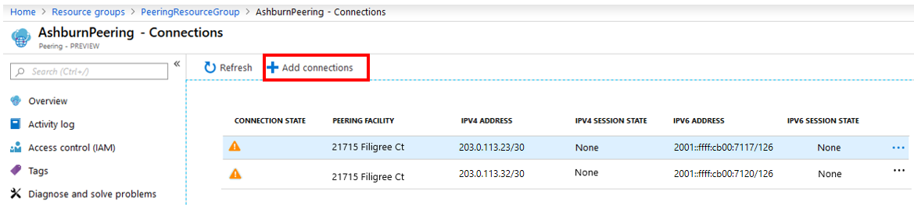
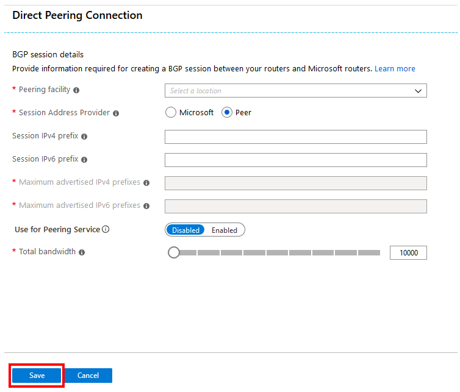
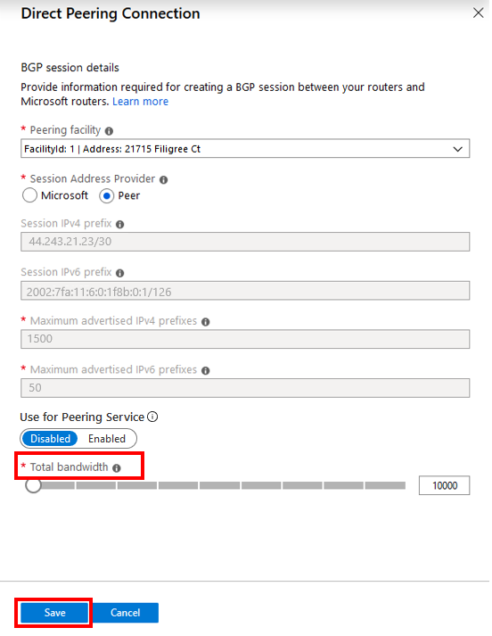

This section describes how to perform the following modification operations for Direct peering.

### Add Direct peering connections
1. Select the **+ Add connections** button, and configure a new peering connection.
    > [!div class="mx-imgBorder"]
    > 

1. Fill out the **Direct Peering Connection** form, and select **Save**. For help with configuring a peering connection, review the steps in the "Create and provision a Direct peering" section.
    > [!div class="mx-imgBorder"]
    > 

### Remove Direct peering connections

Removing a connection isn't currently supported in the Azure portal. For more information, contact [Microsoft peering](mailto:peeringexperience@microsoft.com).

### Upgrade or downgrade bandwidth on Active connections
1. Select a peering connection you want to modify, and then select **...** > **Edit connection**.
    > [!div class="mx-imgBorder"]
    > 

1. Modify bandwidth by moving the slider, and then select **Save**.
    > [!div class="mx-imgBorder"]
    > 

### Add IPv4 or IPv6 session information on Active connections
1. Select a peering connection you want to modify, and then select **...** > **Edit connection** as shown in step 1.
1. Enter **Session IPv4 prefix** or **Session IPv6 prefix** information, and select **Save**.

### Remove IPv4 or IPv6 session information on Active connections
Removing **Session IPv4 prefix** or **Session IPv6 prefix** information isn't currently supported in the portal. For more information, contact [Microsoft peering](mailto:peeringexperience@microsoft.com).
