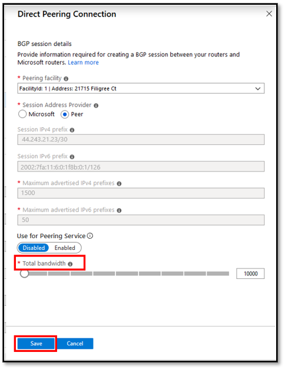

This section describes how to perform the following modification operations for Direct Peering:

### Add Direct Peering connections

* Click on the **+ Add connections** button on the top and configure a new peering connection.

    > [!div class="mx-imgBorder"]
    > 

* Fill-out the **Direct Peering Connection** form and click **Save**. For help with configuring a peering connection review the steps under "Create and provision a Direct Peering" section above.

    > [!div class="mx-imgBorder"]
    > 

### Remove Direct Peering connections

Removing a connection is not currently supported on Azure portal. Please contact [Microsoft Peering](mailto:peeringexperience@microsoft.com).

### Upgrade or downgrade bandwidth on Active connections

* Click on a peering connection you want to modify and then, click on the **...** > **Edit connection** button.

    > [!div class="mx-imgBorder"]
    > 

* Modify bandwidth as shown below and then click **Save**.

    > [!div class="mx-imgBorder"]
    > 

### Add IPv4/IPv6 session on Active connections.

* Click on a peering connection you want to modify and then, click on the **...** > **Edit connection** button as shown above.

* Add **Session IPv4 prefix** or **Session IPv6 prefix** info and click **Save**.

### Remove IPv4/IPv6 session on Active connections.

Removing a **Session IPv4 prefix** or **Session IPv6 prefix** info is not currently supported on Azure portal. Please contact [Microsoft Peering](mailto:peeringexperience@microsoft.com).
