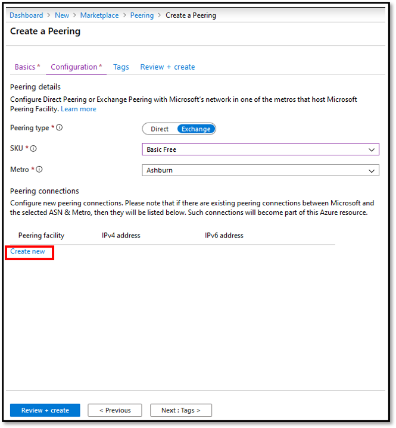
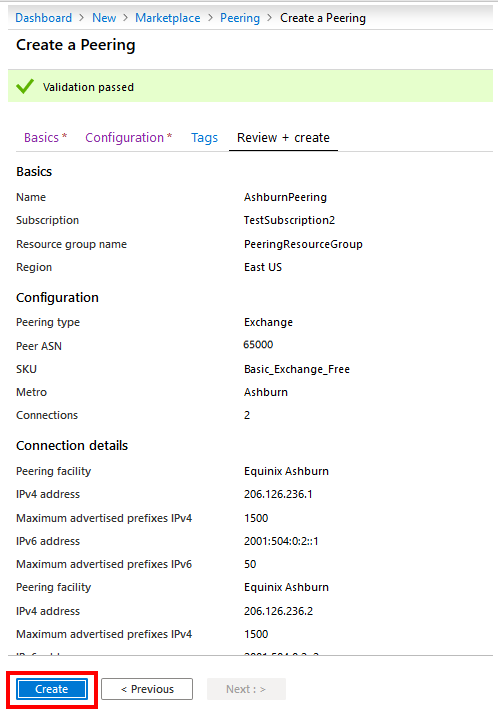
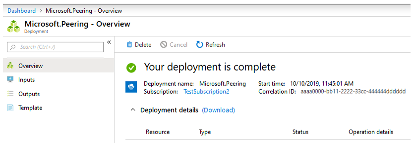

1. On the **Create a Peering** page, on the **Configuration** tab, fill in the boxes as shown here.

    > [!div class="mx-imgBorder"]
    > 

    * For **Peering type**, select **Exchange**.
    * Select **SKU** as **Basic Free**.
    * Select the **Metro** location where you want to convert peering to an Azure resource. If you have peering connections with Microsoft in the selected **Metro** location that aren't converted to an Azure resource, these connections will be listed in the **Peering connections** section as shown. You can now convert these peering connections to an Azure resource.

        > [!div class="mx-imgBorder"]
        > 

        > [!NOTE]
        > You can't modify settings for legacy peering connections. If you want to add additional peering connections with Microsoft in the selected **Metro** location, select **Create new**. For more information, see [Create or modify an Exchange peering by using the portal](../howto-exchange-portal.md).
        >

1. Select **Review + create**. Notice that the portal runs basic validation of the information you entered. A ribbon at the top displays the message *Running final validation...*.

    > [!div class="mx-imgBorder"]
    > 

1. After the message changes to *Validation passed*, verify your information. Submit the request by selecting **Create**. If you need to modify your request, select **Previous** and repeat the steps.

    > [!div class="mx-imgBorder"]
    > 

1. After you submit the request, wait for the deployment to finish. If deployment fails, contact [Microsoft peering](mailto:peering@microsoft.com). A successful deployment appears as shown.

    > [!div class="mx-imgBorder"]
    > 
