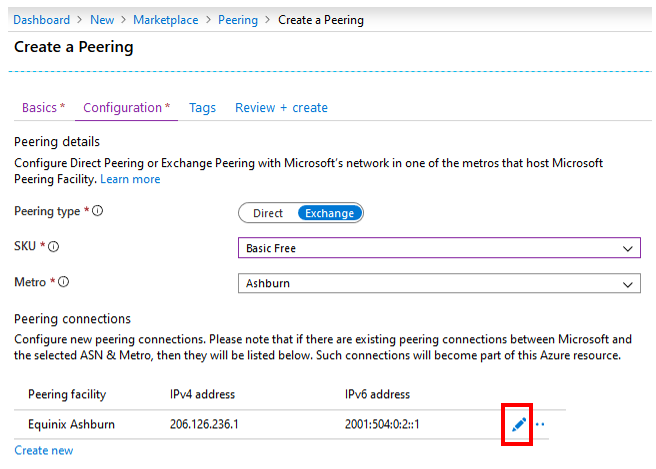
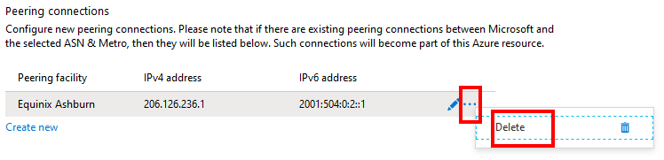
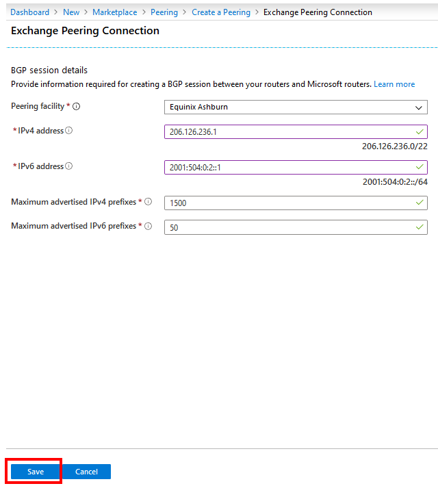

1. On the **Create a Peering** page, on the **Configuration** tab, fill in the boxes as shown.

    > [!div class="mx-imgBorder"]
    > 

    * For **Peering type**, select **Exchange**.
    * Select **SKU** as **Basic Free**.
    * Select the **Metro** location where you want to set up peering.

        > [!NOTE]
        > If you already have peering connections with Microsoft in the selected **Metro** location and you're using the portal for the first time to set up peering in that location, your existing peering connections will be listed in the **Peering connections** section as shown. Microsoft will automatically convert these peering connections to an Azure resource so that you can manage them all along with the new connections in one place. For more information, see [Convert a legacy Exchange peering to an Azure resource by using the portal](../howto-legacy-exchange-portal.md).
        >

1. Under **Peering connections**, select **Create new** to add a line for each new connection you want to set up.

    * To configure or modify connection settings, select the edit button for a line.

        > [!div class="mx-imgBorder"]
        > 

    * To delete a line, select **...** > **Delete**.

        > [!div class="mx-imgBorder"]
        > 

    * You're required to provide all the settings for a connection, as shown here.

         > [!div class="mx-imgBorder"]
         > 

        1. Select the **Peering facility** where the connection needs to be set up.
        1. In the **IPv4 address** and **IPv6 address** boxes, enter the IPv4 and IPv6 addresses, respectively, that would be configured in Microsoft routers by using the neighbor command.
        1. Enter the number of IPv4 and IPv6 prefixes you'll advertise in the **Maximum advertised IPv4 addresses** and **Maximum advertised IPv6 addresses** boxes, respectively.
        1. Select **OK** to save your connection settings.

1. Repeat the step to add more connections at any facility where Microsoft is colocated with your network, within the **Metro** selected previously.

1. After you add all the required connections, select **Review + create**.

    > [!div class="mx-imgBorder"]
    > 

1. Notice that the portal runs basic validation of the information you entered. A ribbon at the top displays the message *Running final validation...*.

    > [!div class="mx-imgBorder"]
    > 

1. After the message changes to *Validation passed*, verify your information. Submit the request by selecting **Create**. To modify your request, select **Previous** and repeat the steps.

    > [!div class="mx-imgBorder"]
    > 

1. After you submit the request, wait for the deployment to finish. If deployment fails, contact [Microsoft peering](mailto:peering@microsoft.com). A successful deployment appears as shown here.

    > [!div class="mx-imgBorder"]
    > 
