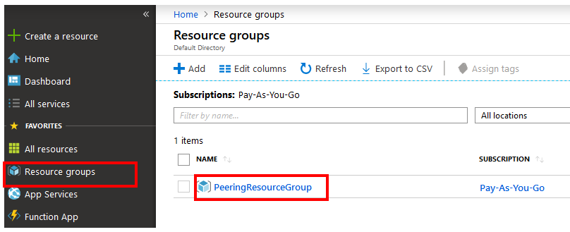
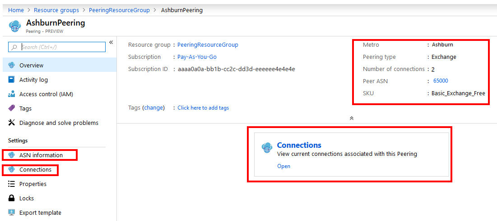
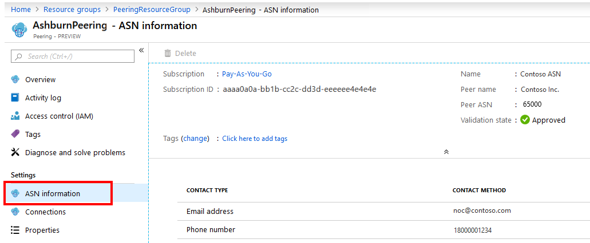
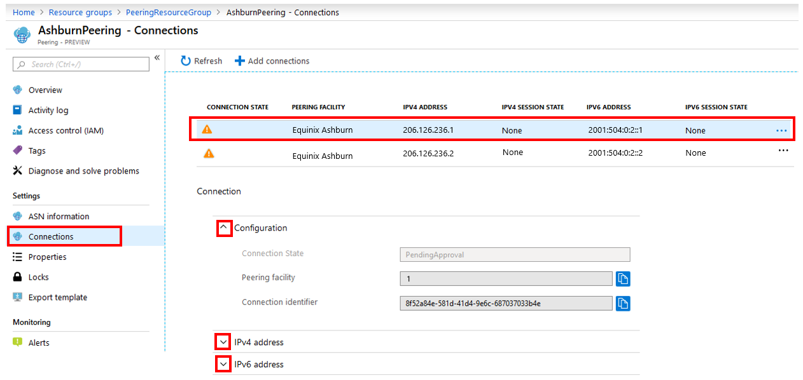
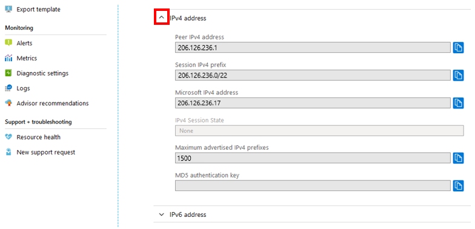

After the **Peering** resource is deployed successfully, you can view it by following these steps.

1. Go to **Resource groups**, and select the resource group you selected when you created the **Peering** resource. Use the **Filter** box if you have too many resource groups.

    > [!div class="mx-imgBorder"]
    > 

1. Select the **Peering** resource you created.

    > [!div class="mx-imgBorder"]
    > 

1. The **Overview** page shows high-level information, as shown here.

    > [!div class="mx-imgBorder"]
    > 

1. On the left, select **ASN information** to view the information submitted when you created PeerAsn.

    > [!div class="mx-imgBorder"]
    > 

1. On the left, select **Connections**. At the top of the screen, you see a summary of peering connections between your ASN and Microsoft, across different facilities within the metro. You can also access the connections summary from the **Overview** page by selecting **Connections** in the center pane, as shown.

    > [!div class="mx-imgBorder"]
    > 

    * **Connection State** corresponds to the state of the peering connection setup. The states displayed in this field follow the state diagram shown in the [Exchange peering walkthrough](../walkthrough-exchange-all.md).
    * **IPv4 Session State** and **IPv6 Session State** correspond to the IPv4 and IPv6 BGP session states, respectively.  
    * When you select a row at the top of the screen, the **Connection** section on the bottom shows details for each connection. Select the arrows to expand **Configuration**, **IPv4 address**, and **IPv6 address**.

    > [!div class="mx-imgBorder"]
    > 
