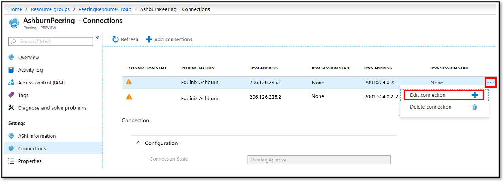
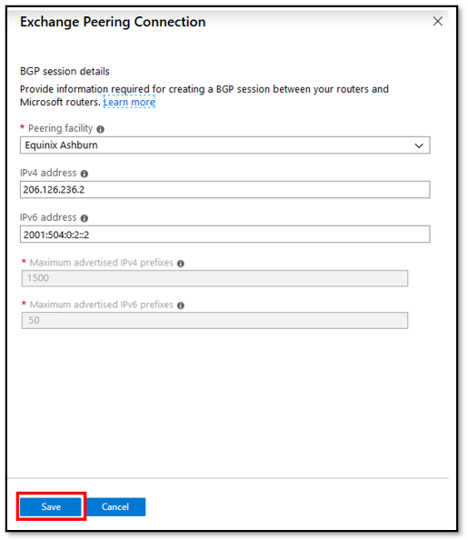

This section describes how to perform the following modification operations for Direct Peering:

### Add Exchange peering connections

* Click on the **+ Add connections** button on the top and configure a new peering connection.

    > [!div class="mx-imgBorder"]
    > 

* Fill out the **Exchange Peering Connection** form and click **Save**. For help with configuring a peering connection review the steps under "Create and provision a Direct Peering" section above.

    > [!div class="mx-imgBorder"]
    > 

### Remove Exchange peering connections

* Click on a peering connection you want to delete and then, click on the **...** > **Delete connection** button.

> [!div class="mx-imgBorder"]
> 

* Enter the resource Id into the **Confirm Delete** box as shown in the highlighted boxes and click **Delete**.

> [!div class="mx-imgBorder"]
> 

### Add IPv4/IPv6 session on Active connections

* Click on a peering connection you want to modify and then, click on the **...** > **Edit connection** button.

> [!div class="mx-imgBorder"]
> 

* Add **IPv4 address** or **IPv6 address** info and click **Save**.

    > [!div class="mx-imgBorder"]
    > 

### Remove IPv4/IPv6 session on Active connections

Removing an IPv4/IPv6 session from an existing connection is not currently supported on Azure portal. Please contact [Microsoft Peering](mailto:peeringexperience@microsoft.com).