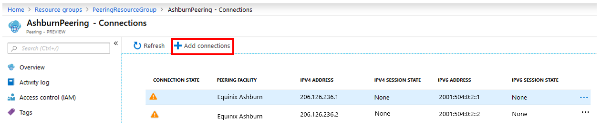
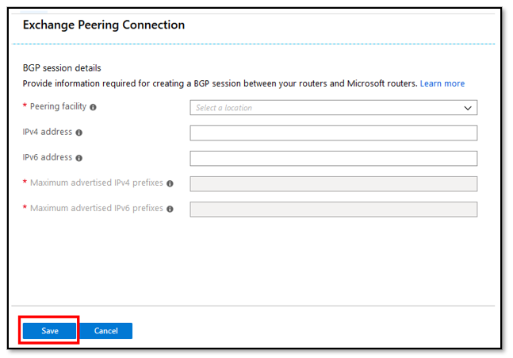
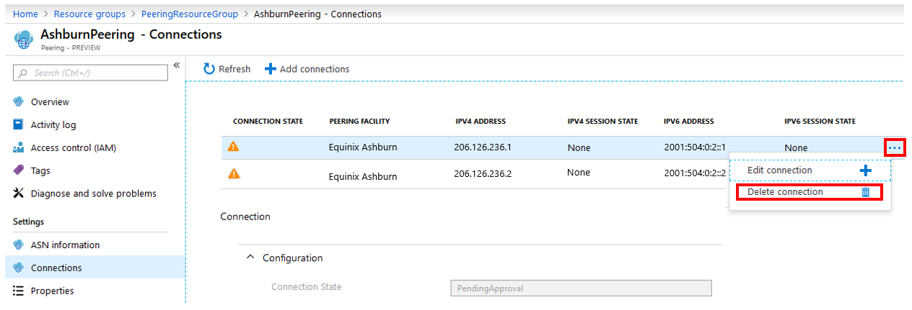
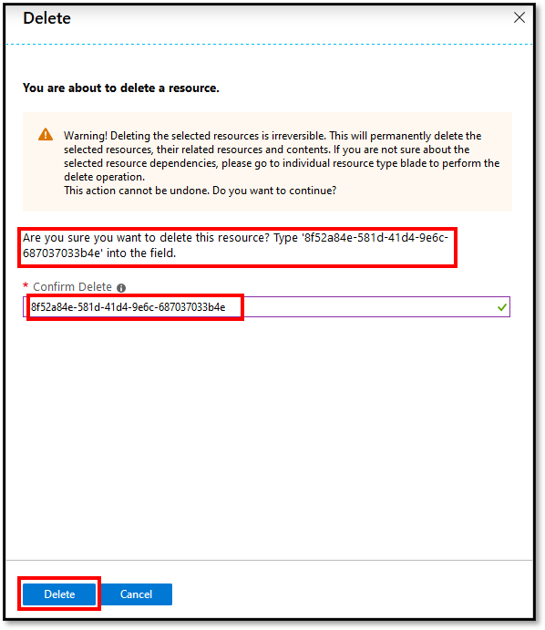
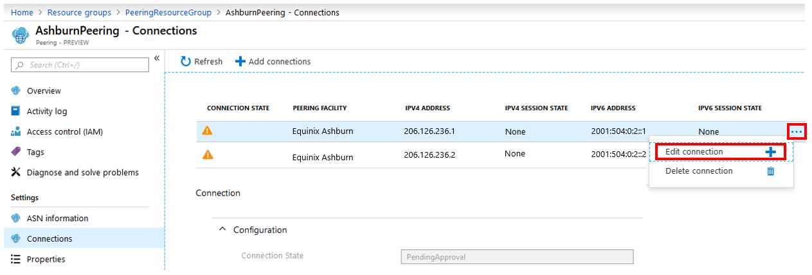
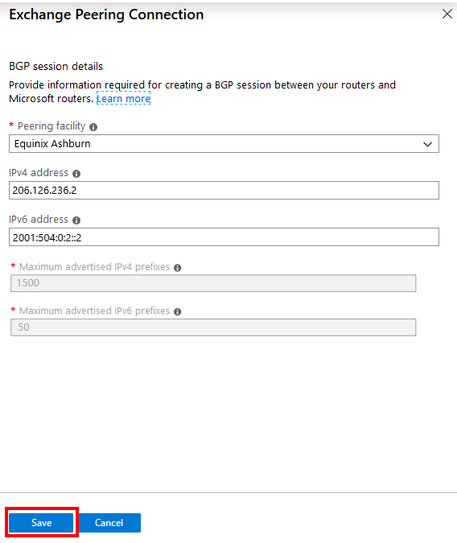

This section describes how to perform the following modification operations for Direct peering.

### Add Exchange peering connections

1. Select the **+ Add connections** button, and configure a new peering connection.
    > [!div class="mx-imgBorder"]
    > 
1. Fill out the **Exchange peering Connection** form, and select **Save**. For help with configuring a peering connection, review the steps in the "Create and provision a Direct peering" section.
    > [!div class="mx-imgBorder"]
    > 

### Remove Exchange peering connections

1. Select a peering connection you want to delete, and then select **...** > **Delete connection**.
    > [!div class="mx-imgBorder"]
    > 
1. Enter the resource ID in the **Confirm Delete** box, and select **Delete**.
    > [!div class="mx-imgBorder"]
    > 

### Add an IPv4 or IPv6 session on Active connections

1. Select a peering connection you want to modify, and then select **...** > **Edit connection**.
    > [!div class="mx-imgBorder"]
    > 
1. Add **IPv4 address** or **IPv6 address** information, and select **Save**.
    > [!div class="mx-imgBorder"]
    > 

### Remove an IPv4 or IPv6 session on Active connections

Removing an IPv4 or IPv6 session from an existing connection isn't currently supported on the portal. For more information, contact [Microsoft peering](mailto:peeringexperience@microsoft.com).