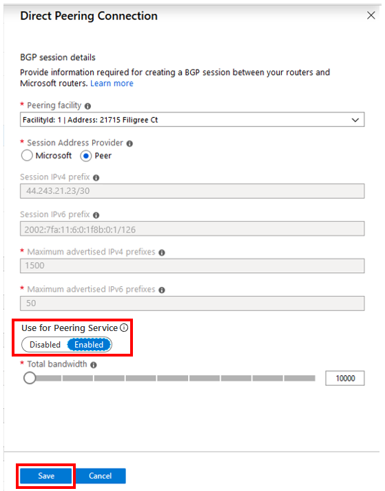
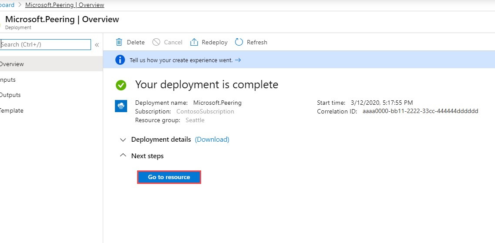
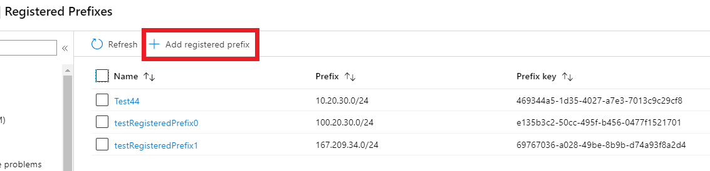
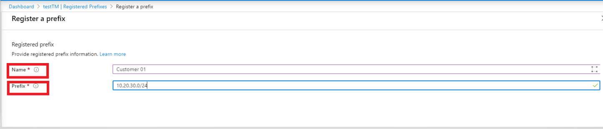
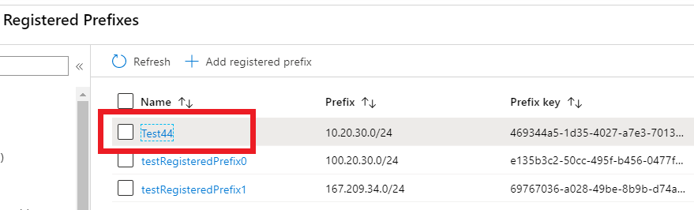
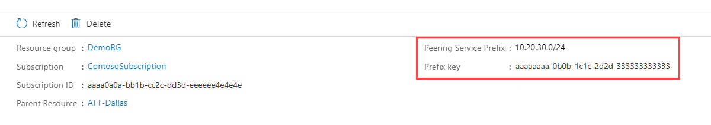

1. Select a peering connection you want to enable for Azure Peering Service. Then select **...** > **Edit connection**.
    > [!div class="mx-imgBorder"]
    > 
1. Under **Use for Peering Service**, select **Enabled** and then select **Save**.
    > [!div class="mx-imgBorder"]
    > 
1. On the **Overview** screen, you see the deployment details. After your deployment is finished, select **Go to resource**.
    > [!div class="mx-imgBorder"]
    > 

1. On the **Registered Prefixes** pane, select **Add registered prefix**.
    > [!div class="mx-imgBorder"]
    > 
1. Register a prefix by selecting a **Name** and a **Prefix** and selecting **Save**.
    > [!div class="mx-imgBorder"]
    >   

1. After a prefix is created, you see it in the list of **Registered Prefixes**. Select the **Name** of the prefix to see more details.
    > [!div class="mx-imgBorder"]
    > 
1. On the registered prefix page, you see the full details, which include the **Prefix key** for each prefix. This key must be provided to the customer allocated this prefix from their provider ISP. The customer can then register their prefix within their subscription by using this key.
    > [!div class="mx-imgBorder"]
    > 