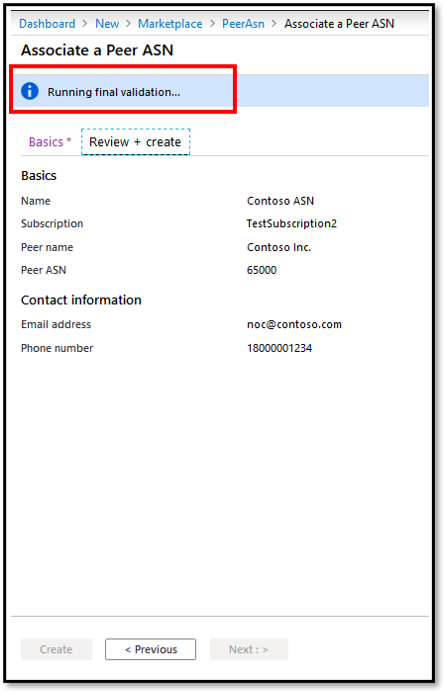

# Associate Peer ASN to Azure Subscription using Portal
> [!div class="op_single_selector"]
> * [Portal](internet-peering-subscription-registration-portal.md)
> * [PowerShell](internet-peering-subscription-registration.md)
>

## Create PeerAsn to associate your ASN with Azure Subscription

### 1. Sign in to the Azure portal
[!INCLUDE [Account](./includes/internet-peering-account-portal.md)]

### 2. Register for Peering feature flag and Peering resource provider
[!INCLUDE [Account](./includes/internet-peering-flag-portal.md)]

### 3. Create PeerAsn
You can create a new PeerAsn resource for associating an Autonomous System Number (ASN) with Azure subscription. You can associate multiple ASNs to a subscription by creating a **PeerAsn** for each ASN you need to associate.

1. Click **Create a resource** > **See all**.

    > [!div class="mx-imgBorder"]
    > 

1. Search for *PeerAsn* in the search box and hit *Enter* on your keyboard. From the results, click on **PeerAsn** resource.

    > [!div class="mx-imgBorder"]
    > 

1. Once **PeerAsn** is launched click **Create**.

    > [!div class="mx-imgBorder"]
    > 

1. On the **Associate a Peer ASN** page, under **Basics** tab, fill out the fields as shown below.

    > [!div class="mx-imgBorder"]
    > 

    * **Name** corresponds to resource name and can be anything you choose.  
    * Choose the **Subscription** that you need to associate the ASN with.
    * **Peer name** corresponds to your company's name and needs to be as close as possible to your PeeringDb profile. Note that value supports only characters a-z, A-Z, and space
    * Enter your ASN in the **Peer ASN** field.
    * Click on **Create new** and enter **EMAIL ADDRESS** and **PHONE NUMBER** for your Network Operations Center (NOC)
    * Then, click on **Review + create** and observe that Azure Portal runs basic validation of the information you entered. This is displayed in a ribbon on the top, as *Running final validation...*.

        > [!div class="mx-imgBorder"]
        > 

    * Once the message in the ribbon turns to *Validation Passed*, verify your information and submit the request by clicking **Create**. If the validation doesn't pass, then click on **Previous** and repeat the steps above to modify your request and ensure the values you enter have no errors.

        > [!div class="mx-imgBorder"]
        > 

    * After you submit the request, wait for it to complete deployment. If deployment fails, please contact [Microsoft Peering](mailto:peering@microsoft.com). A successful deployment will appear as below.

        > [!div class="mx-imgBorder"]
        > 

### 3. View status of a PeerAsn
Once PeerAsn resource is deployed successfully, you will need to wait for Microsoft to approve the association request. It may take up to 12 hours for approval. Once approved, you will receive a notification to the email address entered in the above section.

> [!IMPORTANT]
> Please wait for the ValidationState to turn "Approved" before submitting a Peering request. It may take up to 12 hours for this approval.

## Modify PeerAsn
Modifying PeerAsn is not currently supported. If you need to modify, please contact [Microsoft Peering](mailto:peering@microsoft.com).

## Delete PeerAsn
Deleting a PeerAsn is not currently supported. If you need to delete PeerAsn, please contact [Microsoft Peering](mailto:peering@microsoft.com).

## Next steps

* [Create or modify a Direct Peering using Portal](internet-peering-howto-directpeering-arm-portal.md)
* [Convert a legacy Direct Peering to Azure Resource using Portal](internet-peering-howto-legacydirect-arm-portal.md)
* [Create or modify Exchange Peering using Portal](internet-peering-howto-exchangepeering-arm-portal.md)
* [Convert a legacy Exchange Peering to Azure Resource using Portal](internet-peering-howto-legacyexchange-arm-portal.md)

## Additional Resources

For more information, please visit [Peering FAQs](internet-peering-faqs.md)

[!INCLUDE [peering-feedback](./includes/internet-peering-feedback.md)]
