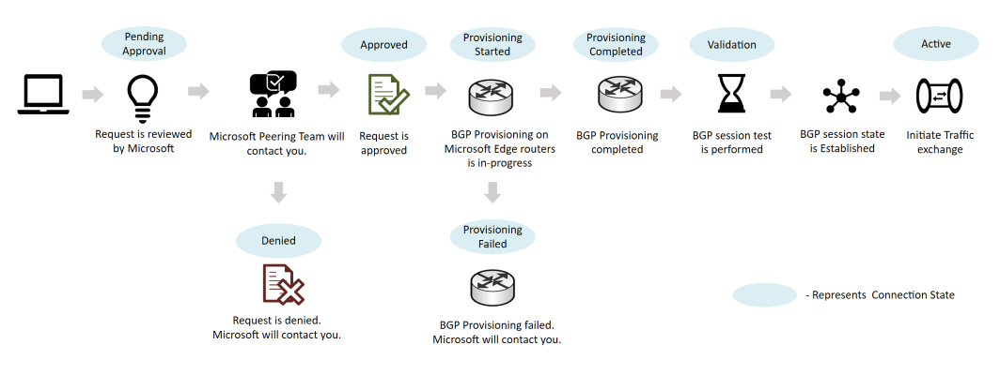

# Direct peering walkthrough

This section explains the steps you need to follow to set up and manage a Direct peering.

## Create a Direct peering
> [!div class="mx-imgBorder"]
> 

The following steps must be followed in order to provision a Direct peering:
1. Review Microsoft [peering policy](https://peering.azurewebsites.net/peering) to understand requirements for Direct peering.
1. Follow the instructions in [Create or modify a Direct peering](howto-direct-powershell.md) to submit a peering request.
1. After you submit a peering request, Microsoft will contact using your registered email address to provide LOA (Letter Of Authorization) or for other information.
1. Once peering request is approved, connection state changes to ProvisioningStarted.
1. You need to:
    1. complete wiring according to the LOA
    1. (optionally) perform link test using 169.254.0.0/16
    1. configure BGP session and then notify us.
1. Microsoft provisions BGP session with DENY ALL policy and validate end-to-end.
1. If successful, you will receive a notification that peering connection state is Active.
1. Traffic will then be allowed through the new peering.

Note that connection states are not to be confused with standard [BGP](https://en.wikipedia.org/wiki/Border_Gateway_Protocol) session states.

## Convert a legacy Direct peering to Azure resource
The following steps must be followed in order to convert a legacy Direct peering to Azure resource:
1. Follow the instructions in [Convert a legacy Direct peering to Azure resource](howto-legacy-direct-powershell.md)
1. After you submit the conversion request, Microsoft will review the request and contact you if required.
1. Once approved, you will see your Direct peering with a connection state as Active.

## Deprovision Direct peering
Contact [Microsoft peering](mailto:peering@microsoft.com) team to deprovision Direct peering.

When a Direct peering is set for deprovision, you will see the connection state as **PendingRemove**

> [!NOTE]
> If you run PowerShell cmdlet to delete the Direct peering when the ConnectionState is ProvisioningStarted or ProvisioningCompleted the operation will fail.

## Next steps

* Learn about [Prerequisites to set up peering with Microsoft](prerequisites.md).
