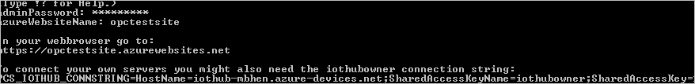

# Deploy OPC Twin to an existing project

The OPC Twin module runs on IoT Edge and provides several edge services to the OPC Twin and Registry services.

The OPC Twin microservice facilitates the communication between factory operators and OPC UA server devices on the factory floor via an OPC Twin IoT Edge module. The microservice exposes OPC UA services (Browse, Read, Write, and Execute) via its REST API. 

The OPC UA device registry microservice provides access to registered OPC UA applications and their endpoints. Operators and administrators can register and unregister new OPC UA applications and browse the existing ones, including their endpoints. In addition to application and endpoint management, the registry service also catalogs registered OPC Twin IoT Edge modules. The service API gives you control of edge module functionality, for example, starting or stopping server discovery (scanning services), or activating new endpoint twins that can be accessed using the OPC Twin microservice.

The core of the module is the Supervisor identity. The supervisor manages endpoint twin, which corresponds to OPC UA server endpoints that are activated using the corresponding OPC UA registry API. This endpoint twins translate OPC UA JSON received from the OPC Twin microservice running in the cloud into OPC UA binary messages, which are sent over a stateful secure channel to the managed endpoint. The supervisor also provides discovery services that send device discovery events to the OPC UA device onboarding service for processing, where these events result in updates to the OPC UA registry.  This article shows you how to deploy the OPC Twin module to an existing project.

> [!NOTE]
> For more information on deployment details and instructions, see the GitHub [repository](https://github.com/Azure/azure-iiot-opc-twin-module).

## Prerequisites

Make sure you have PowerShell and [AzureRM PowerShell](https://docs.microsoft.com/powershell/azure/azurerm/install-azurerm-ps) extensions installed. If you've not already done so, clone this GitHub repository. Run the following commands in PowerShell:

```powershell
git clone --recursive https://github.com/Azure/azure-iiot-components.git
cd azure-iiot-components
```

## Deploy industrial IoT services to Azure

1. In your PowerShell session, run:

    ```powershell
    set-executionpolicy -ExecutionPolicy Unrestricted -Scope Process
    .\deploy.cmd
    ```

2. Follow the prompts to assign a name to the resource group of the deployment and a name to the website.   The script deploys the microservices and their Azure platform dependencies into the resource group in your Azure subscription.  The script also registers an Application in your Azure Active Directory (AAD) tenant to support OAUTH-based authentication.  Deployment will take several minutes.  An example of what you'd see once the solution is successfully deployed:

   

   The output includes the  URL of the public endpoint. 

3. Once the script completes successfully, select whether you want to save the `.env` file.  You need the `.env` environment file if you want to connect to the cloud endpoint using tools such as the Console or deploy modules for development and debugging.

## Troubleshooting deployment failures

### Resource group name

Ensure you use a short and simple resource group name.  The name is used also to name resources as such it must comply with resource naming requirements.  

### Website name already in use

It is possible that the name of the website is already in use.  If you run into this error, you need to use a different application name.

### Azure Active Directory (AAD) registration

The deployment script tries to register two AAD applications in Azure Active Directory.  Depending on your rights to the selected AAD tenant, the deployment might fail. There are two options:

1. If you chose a AAD tenant from a list of tenants, restart the script and choose a different one from the list.
2. Alternatively, deploy a private AAD tenant in another subscription, restart the script, and select to use it.

> [!WARNING]
> NEVER continue without Authentication.  If you choose to do so, anyone can access your OPC Twin endpoints from the Internet unauthenticated.   You can always choose the ["local" deployment option](howto-opc-twin-deploy-dependencies.md) to kick the tires.

## Deploy an all-in-one industrial IoT services demo

Instead of just the services and dependencies you can also deploy an all-in-one demo.  The all in one demo contains three OPC UA servers, the OPC Twin module, all microservices, and a sample Web Application.  It is intended for demonstration purposes.

1. Make sure you have a clone of the repository (see above). Open a PowerShell prompt in the root of the repository and run:

    ```powershell
    set-executionpolicy -ExecutionPolicy Unrestricted -Scope Process
    .\deploy -type demo
    ```

2. Follow the prompts to assign a new name to the resource group and a name to the website.  Once deployed successfully, the script will display the URL of the web application endpoint.

## Deployment script options

The script takes the following parameters:

```powershell
-type
```

The type of deployment (vm, local, demo)

```powershell
-resourceGroupName
```

Can be the name of an existing or a new resource group.

```powershell
-subscriptionId
```

Optional, the subscription ID where resources will be deployed.

```powershell
-subscriptionName
```

Or the subscription name.

```powershell
-resourceGroupLocation
```

Optional, a resource group location. If specified, will try to create a new resource group in this location.

```powershell
-aadApplicationName
```

A name for the AAD application to register under.

```powershell
-tenantId
```

AAD tenant to use.

```powershell
-credentials
```

## Next steps

Now that you've learned how to deploy OPC Twin to an existing project, here is the suggested next step:

> [!div class="nextstepaction"]
> [Secure communication of OPC UA Client and OPC UA PLC](howto-opc-vault-secure.md)
