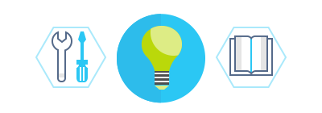

# IoT solution accelerators documentation

Learn how to use the IoT solution accelerators. These articles show you how to use the solution accelerators to kick-start your implementation of common IoT scenarios such as remote monitoring, industrial IoT, predictive maintenance, and device simulation.

<ul class="panelContent cardsK">
    <li>
        <a href="/azure/iot-accelerators/about-iot-accelerators">
        

            

                

                    

                        

                            
                        

                    

                    

                        <h3>Learn about the Azure IoT solution accelerators</h3>
                    

                

            

        

        </a>
    </li>
    <li>
        <a href="/azure/iot-accelerators/iot-accelerators-remote-monitoring-sample-walkthrough">
        

            

                

                    

                        

                            
                        

                    

                    

                        <h3>Remote Monitoring solution accelerator overview</h3>
                    

                

            

        

        </a>
    </li>
    <li>
        <a href="/azure/iot-accelerators/iot-accelerators-connected-factory-features">
        

            

                

                    

                        

                            
                        

                    

                    

                        <h3>Connected Factory solution accelerator overview</h3>
                    

                

            

        

        </a>
    </li>
    <li>
        <a href="/azure/iot-accelerators/iot-accelerators-device-simulation-overview">
        

            

                

                    

                        

                            
                        

                    

                    

                        <h3>Device Simulation solution accelerator overview</h3>
                    

                

            

        

        </a>
    </li>
    <li>
        <a href="/azure/iot-accelerators/iot-accelerators-predictive-walkthrough">
        

            

                

                    

                        

                            
                        

                    

                    

                        <h3>Predictive Maintenance solution accelerator overview</h3>
                    

                

            

        

        </a>
    </li>
    <li>
        <a href="/azure/iot-accelerators/iot-accelerators-architecture-overview">
        

            

                

                    

                        

                            
                        

                    

                    

                        <h3>Azure IoT reference architecture introduction</h3>
                    

                

            

        

        </a>
    </li></ul>

---

<h2>5-Minute Quickstarts</h2>

<h3>Get started with the IoT solution accelerators:</h3>

* [Try a cloud-based remote monitoring solution](quickstart-remote-monitoring-deploy.md)
* [Try a cloud-based connected factory solution](quickstart-connected-factory-deploy.md)
* [Try a cloud-based device simulation solution](quickstart-device-simulation-deploy.md)
* [Try a cloud-based predictive maintenance solution](quickstart-predictive-maintenance-deploy.md)

<h2>Step-by-Step Tutorials</h2>

<h3>Learn about the IoT solution accelerators and the key scenarios they implements:</h3>

1. [Monitor your IoT devices](iot-accelerators-remote-monitoring-monitor.md)
1. [Detect issues with devices connected to your monitoring solution](iot-accelerators-remote-monitoring-automate.md)
1. [Configure and manage devices connected to your monitoring solution](iot-accelerators-remote-monitoring-manage.md)
1. [Conduct a root cause analysis on an alert](iot-accelerators-remote-monitoring-root-cause-analysis.md)
1. [Use alerts and fix device issues](iot-accelerators-remote-monitoring-maintain.md)
