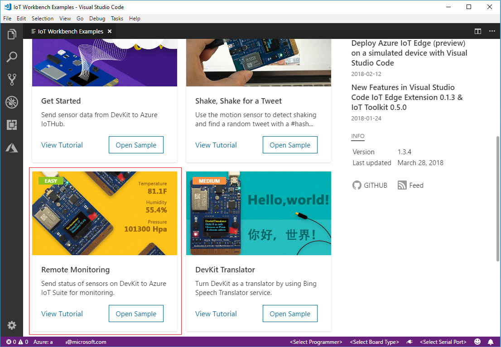
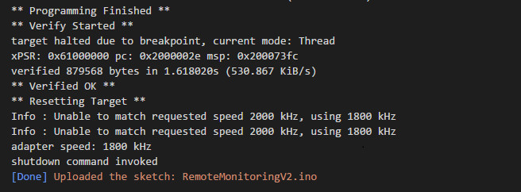
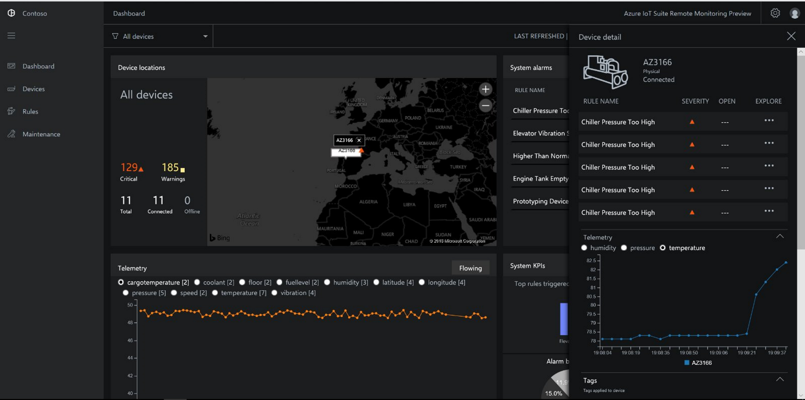
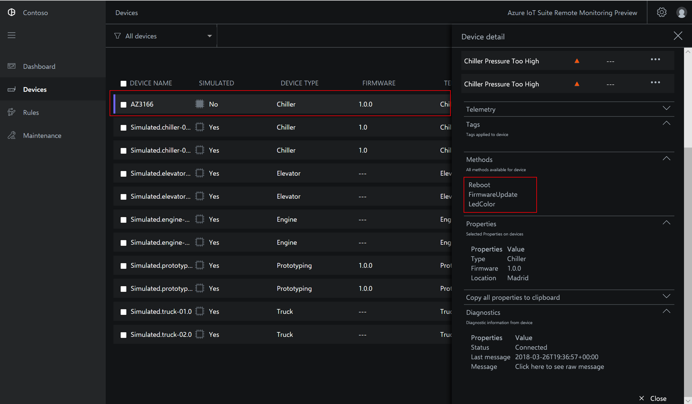
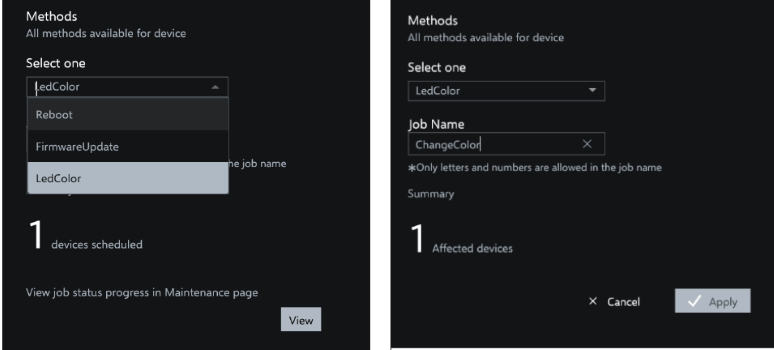
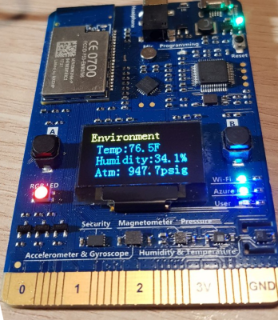

# Connect an IoT DevKit device to the Remote Monitoring solution accelerator

[!INCLUDE [iot-suite-selector-connecting](../../includes/iot-suite-selector-connecting.md)]

This how-to guide shows you how to run a sample application on your IoT DevKit device. The sample code sends telemetry from the sensors on the DevKit device to your solution accelerator.

The [MXChip IoT DevKit](https://aka.ms/iot-devkit) is an all-in-one Arduino compatible board with rich peripherals and sensors. You can develop for it using [Azure IoT Device Workbench](https://aka.ms/iot-workbench) or [Azure IoT Tools](https://aka.ms/azure-iot-tools) extension pack in Visual Studio Code. The [projects catalog](https://microsoft.github.io/azure-iot-developer-kit/docs/projects/) contains sample applications to help you prototype IoT solutions.

## Before you begin

To complete the steps in this tutorial, first do the following tasks:

* Prepare your DevKit by following the steps in [Connect IoT DevKit AZ3166 to Azure IoT Hub in the cloud](/azure/iot-hub/iot-hub-arduino-iot-devkit-az3166-get-started).

## Open sample project

To open the Remote Monitoring sample in VS Code:

1. Make sure your IoT DevKit isn't to your computer. Start VS Code first, and then connect the DevKit to your computer.

1. Click `F1` to open the command palette, type and select **Azure IoT Device Workbench: Open Examples...**. Then select **IoT DevKit** as board.

1. Find **Remote Monitoring** and click **Open Sample**. A new VS Code window opens showing the project folder:

   

## Configure the device

To configure IoT Hub device connection string on your DevKit device:

1. Switch the IoT DevKit into **Configuration mode**:

    * Hold down button **A**.
    * Push and release the **Reset** button.

1. The screen displays the DevKit ID and `Configuration`.

    

1. Press **F1** to open the command palette, type and select **Azure IoT Device Workbench: Configure Device Settings... > Config Device Connection String**.

1. Paste the connection string you copied previously and press **Enter** to configure the device.

## Build the code

To build and upload the device code:

1. Press `F1` to open the command palette, type and select **Azure IoT Device Workbench: Upload Device Code**:

1. VS Code compiles and uploads the code to your DevKit device:

    

1. The DevKit device reboots and runs the code you uploaded.

## Test the sample

To verify that the sample application you uploaded to the DevKit device is working, complete the following steps:

### View the telemetry sent to Remote Monitoring solution

When the sample app runs, the DevKit device sends telemetry from its sensors data over Wi-Fi to your solution accelerator. To see the telemetry:

1. Go to your solution dashboard, and click **Device Explorer**.

1. Click on the device name of your DevKit device. on the right-hand tab, you can see the telemetry from the DevKit in real time:

    

### Control the DevKit device

The Remote Monitoring solution accelerator lets you control your device remotely. The sample code implements three methods that you can see in the **Method** section when you select the device on the **Device Explorer** page:

To change the color of one of the DevKit LEDs, use the **LedColor** method:

1. Select the device name from device list and click on the **Jobs**:

    

1. Configure the Jobs using the following values and click **Apply**:

   * Select Job: **Run method**
   * Method name: **LedColor**
   * Job Name: **ChangeLedColor**

     

1. After a couple of seconds, the color of the RGB LED (below the button A) on your DevKit changes:

    

## Clean up resources

If you plan to move on to the tutorials, leave the Remote Monitoring solution accelerator deployed.

If you no longer need the solution accelerator, delete it from the Provisioned solutions page, by selecting it, and then clicking Delete Solution:

## Problems and feedback

If you run into any problems, refer to [the IoT DevKit FAQs](https://microsoft.github.io/azure-iot-developer-kit/docs/faq/) or reach out to us using the following channels:

* [Gitter.im](https://gitter.im/Microsoft/azure-iot-developer-kit)
* [Stack Overflow](https://stackoverflow.com/questions/tagged/iot-devkit)

## Next steps

Now that you've learned how to connect a DevKit device to your Remote Monitoring solution accelerator, here are some suggested next steps:

* [Azure IoT solution accelerators overview](https://docs.microsoft.com/azure/iot-accelerators/)
* [Customize the UI](iot-accelerators-remote-monitoring-customize.md)
* [Connect IoT DevKit to your Azure IoT Central application](../iot-central/core/howto-connect-devkit.md)