# Use features in the Connected Factory solution accelerator dashboard

The [Deploy a cloud-based solution to manage my industrial IoT devices](quickstart-connected-factory-deploy.md) quickstart showed you how to navigate the dashboard and respond to alarms. This how-to guide shows you some additional dashboard features you can use to monitor and manage your industrial IoT devices.

## Apply filters

You can filter the information displayed on the dashboard either in the **Factory Locations** panel or the **Alarms** panel:

1. Click the **funnel** icon to display a list of available filters in either the factory locations panel or the alarms panel.

1. The filters panel is displayed:

    [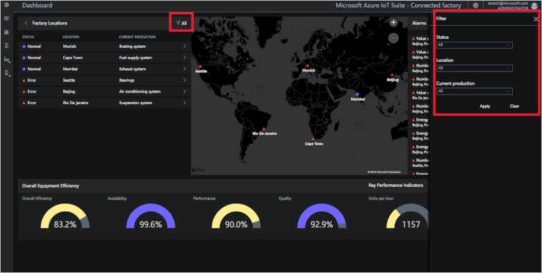](./media/iot-accelerators-connected-factory-dashboard/filterpanel-expanded.png#lightbox)

1. Choose the filter that you require and click **Apply**. It's also possible to type free text into the filter fields.

1. The filter is then applied. The extra funnel icon indicates that a filter is applied:

    [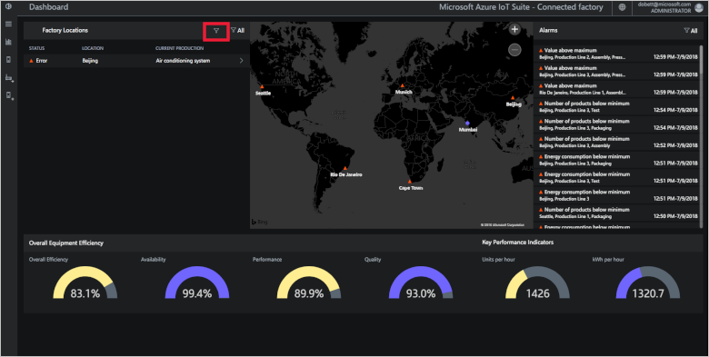](./media/iot-accelerators-connected-factory-dashboard/filterapplied-expanded.png#lightbox)

    > [!NOTE]
    > An active filter doesn't affect the displayed OEE and KPI values, it only filters the list contents.

1. To clear a filter, click the funnel and click **Clear** in the filter panel.

## Browse an OPC UA server

When you deploy the solution accelerator, you automatically provision a set of simulated OPC UA servers that you can browse from the dashboard. Simulated servers make it easy for you to experiment with the solution accelerator without the need to deploy real servers.

1. Click the **browser icon** in the dashboard navigation bar:

    [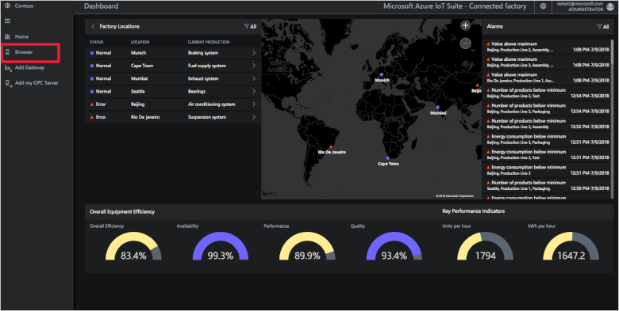](./media/iot-accelerators-connected-factory-dashboard/browser-expanded.png#lightbox)

1. Choose one of the servers from the list that shows the servers deployed for you in the solution accelerator:

    [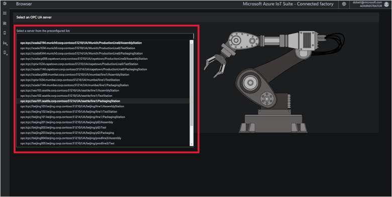](./media/iot-accelerators-connected-factory-dashboard/serverlist-expanded.png#lightbox)

1. Click **Connect**, a security dialog displays. For the simulation, it's safe to click **Proceed**.

1. To expand any of the nodes in the server tree, click it. Nodes that are publishing telemetry have a check mark beside them:

    [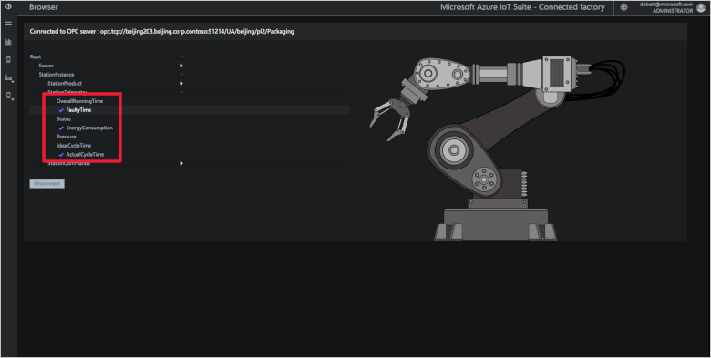](./media/iot-accelerators-connected-factory-dashboard/servertree-expanded.png#lightbox)

1. Right-click an item to read, write, publish, or call that node. The actions available to you depend on your permissions and the attributes of the node. The read option displays a context panel showing the value of the specific node. The write option displays a context panel where you can enter a new value. The call option displays a node where you can enter the parameters for the call.

## Publish a node

When you browse a *simulated OPC UA server*, you can also choose to publish new nodes. You can analyze the telemetry from these nodes in the solution. These *simulated OPC UA servers* make it easy to experiment with the solution accelerator without deploying real devices:

1. Browse to a node in the OPC UA server browser tree that you wish to publish.

1. Right-click the node. Click **Publish**:

    [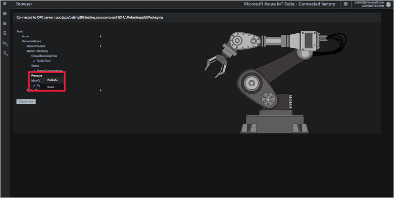](./media/iot-accelerators-connected-factory-dashboard/publishnode-expanded.png#lightbox)

1. A context panel appears which tells you that the publish has succeeded. The node appears in the station level view with a check mark beside it:

    [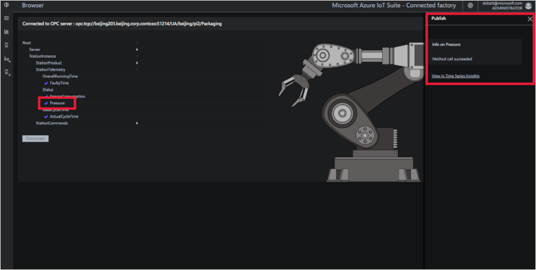](./media/iot-accelerators-connected-factory-dashboard/publishsuccess-expanded.png#lightbox)

## Command and control

The Connected Factory allows you command and control your industry devices directly from the cloud. You can use this feature to respond to alarms generated by the device. For example, you could send a command to the device to open a pressure release valve. You can find the available commands in the **StationCommands** node in the OPC UA servers browser tree. In this scenario, you open a pressure release valve on the assembly station of a production line in Munich. To use the command and control functionality, you must be in the **Administrator** role for the solution accelerator deployment:

1. Browse to the **StationCommands** node in the OPC UA server browser tree for the Munich, production line 0, assembly station.

1. Choose the command that you wish use. Right-click the **OpenPressureReleaseValve** node. Click **Call**:

    [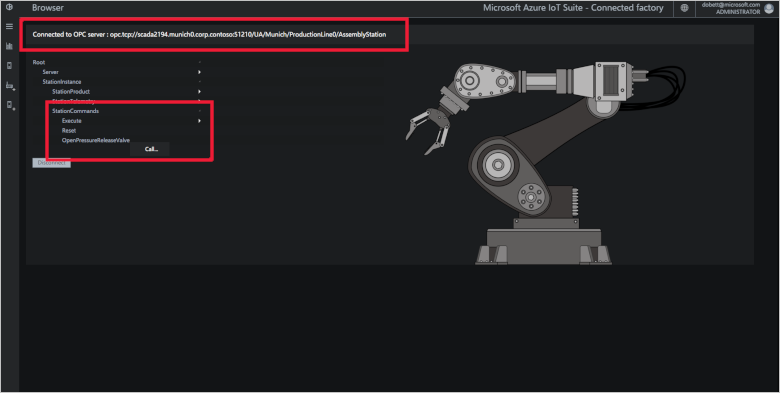](./media/iot-accelerators-connected-factory-dashboard/callcommand-expanded.png#lightbox)

1. A context panel appears informing you which method you're about to call and any parameter details. Click **Call**:

    [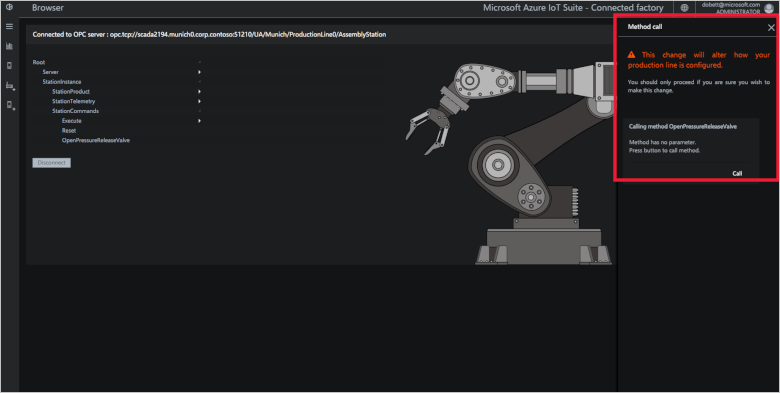](./media/iot-accelerators-connected-factory-dashboard/callpanel-expanded.png#lightbox)

1. The context panel is updated to inform you that the method call succeeded. You can verify the call succeeded by reading the value of the pressure node that updated as a result of the call.

    [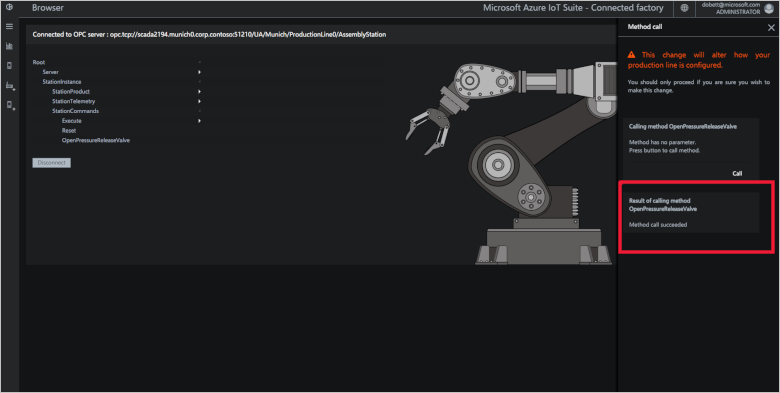](./media/iot-accelerators-connected-factory-dashboard/callsuccess-expanded.png#lightbox)

## Behind the scenes

When you deploy a solution accelerator, the deployment process creates multiple resources in the Azure subscription you selected. You can view these resources in the Azure [portal](https://portal.azure.com). The deployment process creates a **resource group** with a name based on the name you choose for your solution accelerator:

[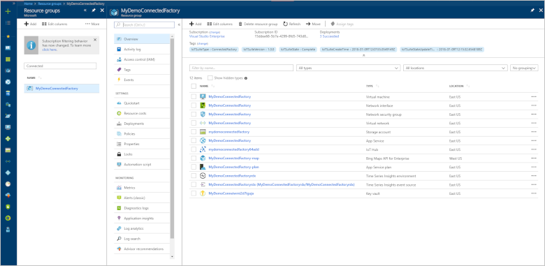](./media/iot-accelerators-connected-factory-dashboard/resourcegroup-expanded.png#lightbox)

You can view the settings of each resource by selecting it in the list of resources in the resource group.

You can also view the source code for the solution accelerator in the [azure-iot-connected-factory](https://github.com/Azure/azure-iot-connected-factory) GitHub repository.

When you're done, you can delete the solution accelerator from your Azure subscription on the [azureiotsolutions.com](https://www.azureiotsolutions.com/Accelerators#dashboard) site. This site enables you to easily delete all the resources that were provisioned when you created the solution accelerator.

> [!NOTE]
> To ensure that you delete everything related to the solution accelerator, delete it on the [azureiotsolutions.com](https://www.azureiotsolutions.com/Accelerators#dashboard) site. Do not delete the resource group in the portal.

## Next steps

Now that you’ve deployed a working solution accelerator, you can continue getting started with IoT solution accelerators by reading the following articles:

* [Configure the Connected Factory solution accelerator](iot-accelerators-connected-factory-configure.md)
* [Permissions on the azureiotsolutions.com site](iot-accelerators-permissions.md)
