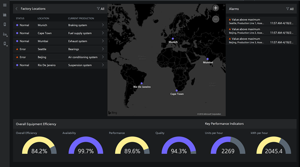

# What is Connected Factory IoT solution accelerator?

Connected Factory is an implementation of Microsoft's Azure Industrial IoT reference architecture, packaged as on open-source solution. You can use it as a starting point for a commercial product. You can deploy a pre-built version of the Connected Factory solution into your Azure subscription from [Azure IoT solution accelerators](https://www.azureiotsolutions.com/#solutions/types/CF).

The Connected Factory solution accelerator [code is available on GitHub](https://github.com/Azure/azure-iot-connected-factory).

Connected Factory includes the following features:

## Industrial device interoperability

- Connect to industrial assets with an OPC UA interface.
- Use the simulated production lines (running OPC UA servers in Docker containers) to see live telemetry from them.
- Browse the OPC UA information model of the OPC UA servers from a cloud dashboard.

## Remote management

- Configure your OPC UA assets from the cloud dashboard (call methods, read, and write data).
- Publish and unpublish telemetry data from your OPC UA assets from a cloud dashboard.

## Cloud dashboard

- View telemetry previews directly in a cloud dashboard.
- View trends in telemetry data and create correlations using the Time Series Insights Explorer dashboard.
- See calculated Overall Equipment Efficiency (OEE) and Key Performance Indicators (KPIs) from a cloud dashboard.
- View industrial asset hierarchies in a tree topology as well as on an interactive map.
- View, acknowledge, and close alerts from a cloud dashboard.

## Azure Time Series Insights

- [Azure Time Series Insights](../time-series-insights/time-series-insights-overview.md) is built for storing, visualizing, and querying large amounts of time-series data. Connected Factory leverages this service.
- Connected Factory integrates with this service enabling you perform deep, real-time analysis of your device data.

## Rules and alerts

[Configure threshold-based rules for alerts](iot-accelerators-connected-factory-configure.md).

## End-to-end security

- Configure security permissions for users using Role-Based Access Control (RBAC).
- End-to-end encryption is implemented using OPC UA authentication (using X.509 certificates) as well as security tokens.

## Customizability

- Customize the solution to meet specific business requirements.
- Full solution source-code available on GitHub. See the [Connected Factory preconfigured solution](https://github.com/Azure/azure-iot-connected-factory) repository.

## Next steps

To learn more about the Connected Factory solution accelerator, see the Quickstart [Try a cloud-based solution to manage my industrial IoT devices](quickstart-connected-factory-deploy.md).
