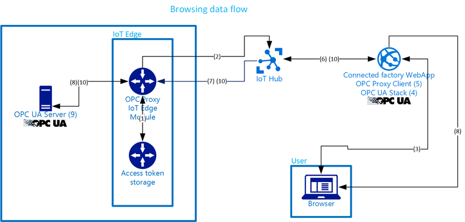

# Connected Factory solution accelerator walkthrough

The Connected Factory [solution accelerator][lnk-preconfigured-solutions] is an implementation of an end-to-end industrial solution that:

* Connects to both simulated industrial devices running OPC UA servers in simulated factory production lines, and real OPC UA server devices. For more information about OPC UA, see the [Connected Factory FAQ](iot-accelerators-faq-cf.md).
* Shows operational KPIs and OEE of those devices and production lines.
* Demonstrates how a cloud-based application could be used to interact with OPC UA server systems.
* Enables you to connect your own OPC UA server devices.
* Enables you to browse and modify the OPC UA server data.
* Integrates with the Azure Time Series Insights (TSI) service to provide customized views of the data from your OPC UA servers.

You can use the solution as a starting point for your own implementation and [customize][lnk-customize] it to meet your own specific business requirements.

This article walks you through some of the key elements of the Connected Factory solution to enable you to understand how it works. The article also describes how data flows through the solution. This knowledge helps you to:

* Troubleshoot issues in the solution.
* Plan how to customize to the solution to meet your own specific requirements.
* Design your own IoT solution that uses Azure services.

For more information, see the [Connected Factory FAQ](iot-accelerators-faq-cf.md).

## Logical architecture

The following diagram outlines the logical components of the solution accelerator:

![Connected Factory logical architecture][connected-factory-logical]

## Communication patterns

The solution uses the [OPC UA Pub/Sub specification](https://opcfoundation.org/news/opc-foundation-news/opc-foundation-announces-support-of-publish-subscribe-for-opc-ua/) to send OPC UA telemetry data to IoT Hub in JSON format. The solution uses the [OPC Publisher](https://github.com/Azure/iot-edge-opc-publisher) IoT Edge module for this purpose.

The solution also has an OPC UA client integrated into a web application that can establish connections with on-premises OPC UA servers. The client uses a [reverse-proxy](https://wikipedia.org/wiki/Reverse_proxy) and receives help from IoT Hub to make the connection without requiring open ports in the on-premises firewall. This communication pattern is called service-assisted communication. The solution uses the [OPC Proxy](https://github.com/Azure/iot-edge-opc-proxy/) IoT Edge module for this purpose.

## Simulation

The simulated stations and the simulated manufacturing execution systems (MES) make up a factory production line. The simulated devices and the OPC Publisher Module are based on the [OPC UA .NET Standard][lnk-OPC-UA-NET-Standard] published by the OPC Foundation.

The OPC Proxy and OPC Publisher are implemented as modules based on [Azure IoT Edge][lnk-Azure-IoT-Gateway]. Each simulated production line has a gateway attached.

All simulation components run in Docker containers  hosted in an Azure Linux VM. The simulation is configured to run eight simulated production lines by default.

## Simulated production line

A production line manufactures parts. It's composed of different stations: an assembly station, a test station, and a packaging station.

The simulation runs and updates the data that is made available through the OPC UA nodes. All simulated production line stations are orchestrated by the MES through OPC UA.

## Simulated manufacturing execution system

The MES monitors each station in the production line through OPC UA to detect station status changes. It calls OPC UA methods to control the stations and passes a product from one station to the next until it's complete.

## Gateway OPC publisher module

OPC Publisher Module connects to the station OPC UA servers and subscribes to the OPC nodes to be published. The module:

1. Converts the node data into JSON format.
1. Encrypts the JSON.
1. Sends the JSON to IoT Hub as OPC UA pub/sub messages.

The OPC Publisher module only requires an outbound https port (443) and can work with existing enterprise infrastructure.

## Gateway OPC proxy module

The Gateway OPC UA Proxy Module tunnels binary OPC UA command and control messages and only requires an outbound https port (443). It can work with existing enterprise infrastructure, including Web Proxies.

It uses IoT Hub Device methods to transfer packetized TCP/IP data at the application layer to ensure endpoint trust, data encryption, and integrity using SSL/TLS.

The OPC UA binary protocol relayed through the proxy itself uses UA authentication and encryption.

## Azure Time Series Insights

The Gateway OPC Publisher Module subscribes to OPC UA server nodes to detect change in the data values. If a data change is detected in one of the nodes, this module then sends messages to Azure IoT Hub.

IoT Hub provides an event source to Azure TSI. TSI stores data for 30 days based on timestamps attached to the messages. This data includes:

* OPC UA ApplicationUri
* OPC UA NodeId
* Value of the node
* Source timestamp
* OPC UA DisplayName

Currently, TSI doesn't allow customers to customize how long they wish to keep the data for.

TSI queries against node data using a time-based **SearchSpan** and aggregates by **OPC UA ApplicationUri** or **OPC UA NodeId** or **OPC UA DisplayName**.

To retrieve the data for the OEE and KPI gauges and the time series charts, the solution aggregates data by the count of events, **Sum**, **Avg**, **Min**, and **Max**.

The time series are built using a different process. The solution calculates OEE and KPI values from station base data and bubbles the values up for the production lines, factories, and enterprise.

Additionally, time series for OEE and KPI topology is calculated in the app, whenever a displayed timespan is ready. For example, the day view is updated every full hour.

The time series view of node data comes directly from TSI using an aggregation for timespan.

## IoT Hub
The [IoT hub][lnk-IoT Hub] receives data sent from the OPC Publisher Module into the cloud and makes it available to the Azure TSI service. 

The IoT Hub in the solution also:
- Maintains an identity registry that stores the IDs for all OPC Publisher Module and all OPC Proxy Modules.
- Is used as transport channel for bidirectional communication of the OPC Proxy Module.

## Azure Storage
The solution uses Azure blob storage as disk storage for the VM and to store deployment data.

## Web app
The web app deployed as part of the solution accelerator includes an integrated OPC UA client, alerts processing, and telemetry visualization.

## Telemetry data flow

### Flow steps

1. OPC Publisher reads the required OPC UA X509 certificates and IoT Hub security credentials from the local certificate store.
    - If necessary, OPC Publisher creates and stores any missing certificates or credentials in the certificate store.

2. OPC Publisher registers itself with IoT Hub.
    - Uses the configured protocol. Can use any IoT Hub client SDK supported protocol. The default is MQTT.
    - Protocol communication is secured by TLS.

3. OPC Publisher reads configuration file.

4. OPC Publisher creates an OPC Session with each configured OPC UA Server.
    - Uses TCP connection.
    - OPC Publisher and OPC UA Server authenticate each other using X509 certificates.
    - All further OPC UA traffic is encrypted by the configured OPC UA encryption mechanism.
    - OPC Publisher creates, in the OPC Session for each configured publishing interval, an OPC Subscription.
    - Creates OPC Monitored items for the OPC Nodes to publish in the OPC Subscription.

5. If a monitored OPC Node value changes, OPC UA Server sends updates to OPC Publisher.

6. OPC Publisher transcodes the new value.
    - Batches multiple changes if batching is enabled.
    - Creates an IoT Hub message.

7. OPC Publisher sends a message to IoT Hub.
    - Use the configured protocol.
    - Communication is secured by TLS.

8. Time Series Insights (TSI) reads the messages from IoT Hub.
    - Uses AMQP over TCP/TLS.
    - This step is internal to the datacenter.

9. Data at rest in TSI.

10. Connected Factory WebApp in Azure AppService queries required data from TSI.
    - Uses TCP/TLS secured communication.
    - This step is internal to the datacenter.

11. Web browser connects to the Connected Factory WebApp.
    - Displays the Connected Factory dashboard.
    - Connects over HTTPS.
    - Access to the Connected Factory App requires authentication of the user via Azure Active Directory.
    - Any WebApi calls into Connected Factory app are secured by Anti-Forgery-Tokens.

12. On data updates, the Connected Factory WebApp sends updated data to the web browser.
    - Uses the SignalR protocol.
    - Secured by TCP/TLS.

## Browsing data flow

### Flow steps

1. OPC Proxy (server component) starts up.
    - Reads the shared access keys from a local store.
    - If necessary, stores missing access keys in the store.

2. OPC Proxy (server component) registers itself with IoT Hub.
    - Reads all it's known devices from IoT Hub.
    - Uses MQTT over TLS over Socket or Secure WebSocket.

3. Web browser connects to the Connected Factory WebApp and displays the Connected Factory dashboard.
    - Uses HTTPS.
    - A user selects an OPC UA server to connect to.

4. Connected Factory WebApp establishes an OPC UA Session to the selected OPC UA server.
    - Uses OPC UA stack.

5. OPC Proxy transport receives a request from the OPC UA stack to establish a TCP socket connection to OPC UA server.
    - It just retrieves the TCP payload and uses it unchanged.
    - This step is internal to the Connected Factory WebApp.

6. OPC Proxy (client component) looks up OPC Proxy (server component) device in the IoT Hub device registry. Then calls a device method of the OPC Proxy (server component) device in IoT Hub.
    - Uses HTTPS over TCP/TLS to look up OPC Proxy.
    - Uses using HTTPS over TCP/TLS to establish a TCP socket connection to the OPC UA server.
    - This step is internal to the datacenter.

7. IoT Hub calls a device method in the OPC Proxy (server component) device.
    - Uses an established MQTT over TLS over Socket or Secure Websocket connection to establish a TCP socket connection to the OPC UA server.

8. OPC Proxy (server component) sends the TCP payload on to the shopfloor network.

9. The OPC UA server processes the payload and sends back the response.

10. The response is received by the socket of the OPC Proxy (server component).
    - OPC Proxy sends the data as return value of the device method to IoT Hub and the OPC Proxy (client component).
    - This data is delivered to the OPC UA stack in the Connected Factory app.

11. Connected Factory WebApp returns OPC Browser UX enriched with the OPC UA-specific information it received from the OPC UA server to the Web Browser to render it.
    - While a user browses through the OPC address-space and applies functions to nodes in the OPC address-space, the OPC Browser UX client uses AJAX calls over HTTPS secured with Anti-Forgery Tokens to get data from the Connected Factory WebApp.
    - If necessary, the client uses the communication explained in steps 4 through to 10 to exchange information with the OPC UA server.

> [!NOTE]
> The OPC Proxy (server component) and OPC Proxy (client) component complete steps #4 through #10 for all TCP traffic related to the OPC UA communication.

> [!NOTE]
> For the OPC UA server and the OPC UA stack within the Connected Factory WebApp, the OPC Proxy communication is transparent and all OPC UA security features for authentication and encryption apply.

## Next steps

You can continue getting started with IoT solution accelerators by reading the following articles:

* [Permissions on the azureiotsolutions.com site][lnk-permissions]
* [Deploy a gateway on Windows or Linux for the Connected Factory solution accelerator](iot-accelerators-connected-factory-gateway-deployment.md)
* [OPC Publisher reference implementation](https://github.com/Azure/iot-edge-opc-publisher/blob/master/README.md).

[connected-factory-logical]:media/iot-accelerators-connected-factory-sample-walkthrough/cf-logical-architecture.png

[lnk-preconfigured-solutions]:about-iot-accelerators.md
[lnk-customize]: iot-accelerators-connected-factory-customize.md
[lnk-IoT Hub]: https://azure.microsoft.com/documentation/services/iot-hub/
[lnk-direct-methods]: ../iot-hub/iot-hub-devguide-direct-methods.md
[lnk-OPC-UA-NET-Standard]:https://github.com/OPCFoundation/UA-.NETStandardLibrary
[lnk-Azure-IoT-Gateway]: https://github.com/azure/iot-edge
[lnk-permissions]: iot-accelerators-faq.md
