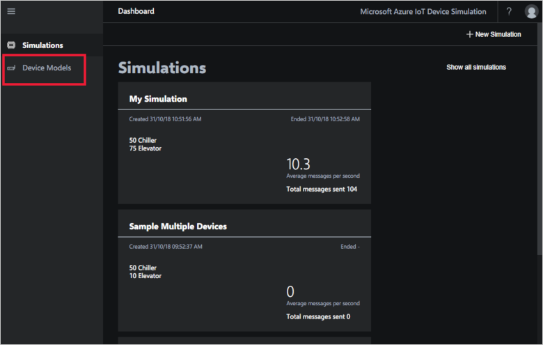
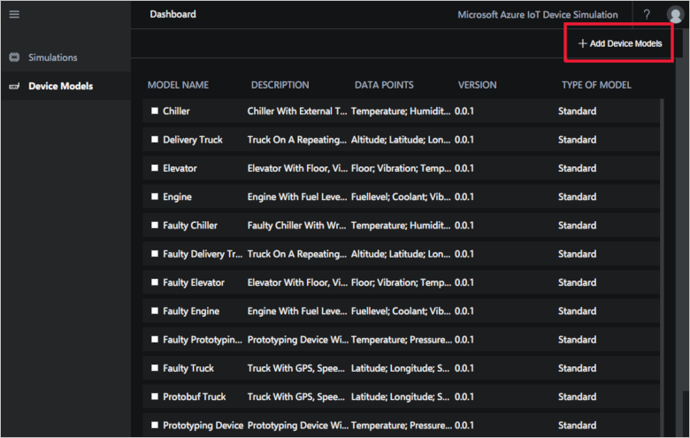
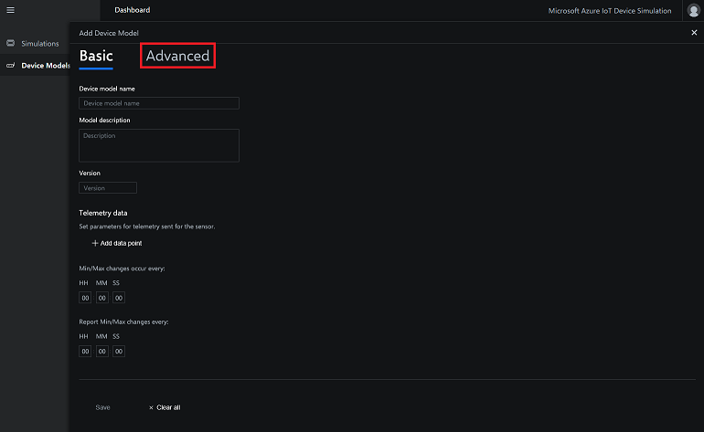
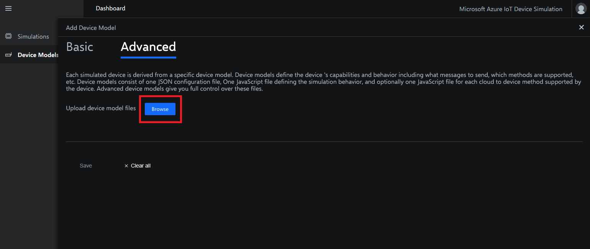
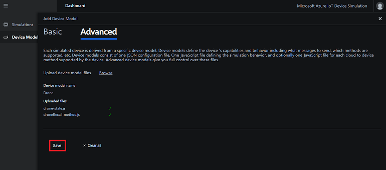

# Create an advanced device model

This how-to guide describes the JSON and JavaScript files that define a custom device model. The article includes some sample device model definition files and shows you how to upload them to your Device Simulation instance. You can create advanced device models to simulate more realistic device behaviors for your testing.

If you don't have an Azure subscription, create a [free account](https://azure.microsoft.com/free/?WT.mc_id=A261C142F) before you begin.

## Prerequisites

To follow the steps in this how-to guide, you need a deployed instance of Device Simulation in your Azure subscription.

If you haven't deployed Device Simulation yet, see [Device Simulation deployment](https://github.com/Azure/azure-iot-pcs-device-simulation/blob/master/README.md) on GitHub.

### Open Device Simulation

If you haven't deployed Device Simulation yet, see [Device Simulation deployment](https://github.com/Azure/azure-iot-pcs-device-simulation/blob/master/README.md) on GitHub.

## Device models

Each simulated device belongs to a specific device model that defines the simulation behavior. This behavior includes how frequently to send telemetry, what kind of messages to send, and the supported methods.

You define a device model using a JSON device definition file and a set of JavaScript files. These JavaScript files define the simulation behavior such as the random telemetry and the method logic.

A typical device model has:

* One JSON file for each device model (for example, elevator.json).
* One JavaScript behavior script file for each device model (for example, elevator-state.js)
* One JavaScript method script file for each device method (for example, elevator-go-down.js)

> [!NOTE]
> Not all device models define methods. Therefore a device model may or may not have method scripts. However, all device models must have a behavior script.

## Device definition file

Each device definition file contains details of a simulated device model, including the following information:

* Device model name: string.
* Protocol: AMQP | MQTT | HTTP.
* The initial device state.
* How often to refresh the device state.
* Which JavaScript file to use to refresh the device state.
* A list of telemetry messages to send, each with a specific frequency.
* The schema of the telemetry messages, used by back-end application to parse the telemetry received.
* A list of supported methods and the JavaScript file to use to simulate each method.

### File schema

The schema version is always "1.0.0" and is specific to the format of this file:

```json
"SchemaVersion": "1.0.0"
```

### Device model description

The following properties describe the device model. Each type has a unique identifier, a semantic version, a name, and a description:

```json
"Id": "chiller-01",
"Version": "0.0.1",
"Name": "Chiller",
"Description": "Chiller with external temperature and humidity sensors."
```

### IoT Protocol

IoT devices can connect using different protocols. The simulation lets you use either **AMQP**, **MQTT**, or **HTTP**:

```json
"Protocol": "AMQP"
```

### Simulated device state

Each simulated device has an internal state, which must be defined. The state also defines the properties that can be reported in telemetry. For example, a chiller might have an initial state such as:

```json
"InitialState": {
    "temperature": 50,
    "humidity": 40
},
```

A moving device with several sensors might have more properties, for example:

```json
"InitialState": {
    "latitude": 47.445301,
    "longitude": -122.296307,
    "speed": 30.0,
    "speed_unit": "mph",
    "cargotemperature": 38.0,
    "cargotemperature_unit": "F"
}
```

Device state is kept in memory by the simulation service, and provided as input to the JavaScript function. The JavaScript function could decide:

* To ignore the state and generate some random data.
* To update the device state in some realistic way for a given scenario.

The function that generates the state also receives as input:

* The device ID.
* The device model.
* The current time. This value makes it possible to generate different data by device and by time.

### Generating telemetry messages

The simulation service can send several telemetry types for each device. Typically, telemetry includes data from the device state. For example, a simulated room might send information about temperature and humidity every 10 seconds. Note the placeholders in the following snippet, which are automatically replaced with values from the device state:

```json
"Telemetry": [
    {
        "Interval": "00:00:10",
        "MessageTemplate":
            "{\"temperature\":${temperature},\"temperature_unit\":\"${temperature_unit}\",\"humidity\":\"${humidity}\"}",
        "MessageSchema": {
            "Name": "RoomComfort;v1",
            "Format": "JSON",
            "Fields": {
                "temperature": "double",
                "temperature_unit": "text",
                "humidity": "integer"
            }
        }
    }
],
```

The placeholders use a special syntax **${NAME}** where **NAME** is a key from the device state object returned by the JavaScript **main** function. Strings should be quoted, while numbers shouldn't.

#### Message schema

Each message type must have a well-defined schema. The message schema is also published to IoT Hub, so that back-end applications can reuse the information to interpret the incoming telemetry.

The schema supports JSON format, which allows for easy parsing, transformation and analytics, across several systems and services.

The fields listed in the schema can be of the following types:

* Object - serialized using JSON
* Binary - serialized using base64
* Text
* Boolean
* Integer
* Double
* DateTime

### Supported methods

Simulated devices can also react to method calls, in which case they  execute some logic and provide some response. Similarly to the simulation, the method logic is stored in a JavaScript file, and can interact with the device state. For example:

```json
"CloudToDeviceMethods": {
    "Start": {
        "Type": "JavaScript",
        "Path": "release-pressure.js"
    }
}
```

## Create a device definition file

In this how-to-guide you see how to create a device model for a drone. The drone will randomly fly around an initial set of coordinates changing location and altitude.

Copy the following JSON into a text editor and save it as **drone.json**.

### Device definition JSON example

```json
{
  "SchemaVersion": "1.0.0",
  "Id": "drone",
  "Version": "0.0.1",
  "Name": "Drone",
  "Description": "Simple drone.",
  "Protocol": "AMQP",
  "Simulation": {
    "InitialState": {
      "velocity": 0.0,
      "velocity_unit": "mm/sec",
      "acceleration": 0.0,
      "acceleration_unit": "mm/sec^2",
      "latitude": 47.476075,
      "longitude": -122.192026,
      "altitude": 0.0
    },
    "Interval": "00:00:05",
    "Scripts": [{
      "Type": "JavaScript",
      "Path": "drone-state.js"
    }]
  },
  "Properties": {
    "Type": "Drone",
    "Firmware": "1.0",
    "Model": "P-96"
  },
  "Tags": {
    "Owner": "Contoso"
  },
  "Telemetry": [{
      "Interval": "00:00:05",
      "MessageTemplate": "{\"velocity\":\"${velocity}\",\"acceleration\":\"${acceleration}\",\"position\":\"${latitude}|${longitude}|${altitude}\"}",
      "MessageSchema": {
        "Name": "drone-event-sensor;v1",
        "Format": "JSON",
        "Fields": {
          "velocity": "double",
          "velocity_unit": "text",
          "acceleration": "double",
          "acceleration_unit": "text",
          "latitude": "double",
          "longitude": "double",
          "altitude": "double"
        }
      }
    }
  ],
    "CloudToDeviceMethods": {
        "RecallDrone": {
            "Type": "JavaScript",
            "Path": "droneRecall-method.js"
        }
    }
}
```

## Behavior script files

The code in the behavior script file moves the drone. The script alters the drone's elevation and location by manipulating the device's in memory state.

The JavaScript files must have a **main** function, that accepts two parameters:

* A **context** object that contains three properties:
    * **currentTime** as a string with format **yyyy-MM-dd'T'HH:mm:sszzz**.
    * **deviceId**. For example, **Simulated.Elevator.123**.
    * **deviceModel**. For example, **Elevator**.
* A **state** object that's the value returned by the function in the previous call. This device state is maintained by the simulation service, and used to generate telemetry messages.

The **main** function returns the new device state. For example:

```JavaScript
function main(context, state) {

    // Use context if the simulation depends on
    // time or device details.
    // Execute some logic, updating 'state'

    return state;
}
```

## Create a behavior script file

Copy the following JavaScript into a text editor and save it as **drone-state.js**.

### Device model JavaScript simulation example

```JavaScript
"use strict";

// Position control
const DefaultLatitude = 47.476075;
const DefaultLongitude = -122.192026;
const DistanceVariation = 10;

// Altitude control
const DefaultAltitude = 0.0;
const AverageAltitude = 499.99;
const AltitudeVariation = 5;

// Velocity control
const AverageVelocity = 60.00;
const MinVelocity = 20.00;
const MaxVelocity = 120.00;
const VelocityVariation = 5;

// Acceleration control
const AverageAcceleration = 2.50;
const MinAcceleration = 0.01;
const MaxAcceleration = 9.99;
const AccelerationVariation = 1;

// Display control for position and other attributes
const GeoSpatialPrecision = 6;
const DecimalPrecision = 2;

// Default state
var state = {
    velocity: 0.0,
    velocity_unit: "mm/sec",
    acceleration: 0.0,
    acceleration_unit: "mm/sec^2",
    latitude: DefaultLatitude,
    longitude: DefaultLongitude,
    altitude: DefaultAltitude
};

// Default device properties
var properties = {};

/**
 * Restore the global state using data from the previous iteration.
 *
 * @param previousState device state from the previous iteration
 * @param previousProperties device properties from the previous iteration
 */
function restoreSimulation(previousState, previousProperties) {
    // If the previous state is null, force a default state
    if (previousState) {
        state = previousState;
    } else {
        log("Using default state");
    }

    if (previousProperties) {
        properties = previousProperties;
    } else {
        log("Using default properties");
    }
}

/**
 * Simple formula generating a random value around the average
 * in between min and max
 */
function vary(avg, percentage, min, max) {
    var value = avg * (1 + ((percentage / 100) * (2 * Math.random() - 1)));
    value = Math.max(value, min);
    value = Math.min(value, max);
    return value;
}

/**
 * Entry point function called by the simulation engine.
 * Returns updated simulation state.
 * Device property updates must call updateProperties() to persist.
 *
 * @param context             The context contains current time, device model and id
 * @param previousState       The device state since the last iteration
 * @param previousProperties  The device properties since the last iteration
 */
/*jslint unparam: true*/
function main(context, previousState, previousProperties) {

    // Restore the global state before generating the new telemetry, so that
    // the telemetry can apply changes using the previous function state.
    restoreSimulation(previousState, previousProperties);

    state.acceleration = vary(AverageAcceleration, AccelerationVariation, MinAcceleration, MaxAcceleration).toFixed(DecimalPrecision);
    state.velocity = vary(AverageVelocity, VelocityVariation, MinVelocity, MaxVelocity).toFixed(DecimalPrecision);

    // Use the last coordinates to calculate the next set with a given variation
    var coords = varylocation(Number(state.latitude), Number(state.longitude), DistanceVariation);
    state.latitude = Number(coords.latitude).toFixed(GeoSpatialPrecision);
    state.longitude = Number(coords.longitude).toFixed(GeoSpatialPrecision);

    // Fluctuate altitude between given variation constant by more or less
    state.altitude = vary(AverageAltitude, AltitudeVariation, AverageAltitude - AltitudeVariation, AverageAltitude + AltitudeVariation).toFixed(DecimalPrecision);

    return state;
}

/**
 * Generate a random geolocation at some distance (in miles)
 * from a given location
 */
function varylocation(latitude, longitude, distance) {
    // Convert to meters, use Earth radius, convert to radians
    var radians = (distance * 1609.344 / 6378137) * (180 / Math.PI);
    return {
        latitude: latitude + radians,
        longitude: longitude + radians / Math.cos(latitude * Math.PI / 180)
    };
}
```

## Create a method script file

Method scripts are similar to behavior scripts. They define the device behavior when a specific cloud to device method is called.

The drone recall script sets the drone's coordinates to a fixed point to simulate the drone returning home.

Copy the following JavaScript into a text editor and save it as **droneRecall-method.js**.

### Device model JavaScript simulation example

```JavaScript
"use strict";

// Default state
var state = {
    velocity: 0.0,
    velocity_unit: "mm/sec",
    acceleration: 0.0,
    acceleration_unit: "mm/sec^2",
    latitude: 0.0,
    longitude: 0.0,
    altitude: 0.0
};

// Default device properties
var properties = {};

/**
 * Restore the global state using data from the previous iteration.
 *
 * @param previousState device state from the previous iteration
 * @param previousProperties device properties from the previous iteration
 */
function restoreSimulation(previousState, previousProperties) {
    // If the previous state is null, force a default state
    if (previousState) {
        state = previousState;
    } else {
        log("Using default state");
    }

    if (previousProperties) {
        properties = previousProperties;
    } else {
        log("Using default properties");
    }
}

/**
 * Entry point function called by the simulation engine.
 *
 * @param context        The context contains current time, device model and id, not used
 * @param previousState  The device state since the last iteration, not used
 * @param previousProperties  The device properties since the last iteration
 */
/*jslint unparam: true*/
function main(context, previousState, previousProperties) {

    // Restore the global device properties and the global state before
    // generating the new telemetry, so that the telemetry can apply changes
    // using the previous function state.
    restoreSimulation(previousState, previousProperties);

    //simulate the behavior of a drone when recalled
  state.latitude = 47.476075;
  state.longitude = -122.192026;
  return state;
}
```

## Debugging script files

While you can't attach a debugger to a running behavior file, it's possible to write information to the service log using the **log** function. For syntax errors, the interpreter fails and writes information about the exception to the log.

Logging example:

```JavaScript
function main(context, state) {

    log("This message will appear in the service logs.");

    log(context.deviceId);

    if (typeof(state) !== "undefined" && state !== null) {
        log("Previous value: " + state.temperature);
    }

    // ...

    return updateState;
}
```

## Deploy an advanced device model

To deploy your advanced device model, you upload the files your Device Simulation instance:

Select **Device models** in the menu bar. The **Device models** page lists the device models available in this instance of Device Simulation:



Click **+ Add Device Models** in the top right corner of the page:



Click **Advanced** to open the advanced device model tab:



Click **Browse** and select the JSON and JavaScript files you created. Be sure to select all three files. If any one file is missing, validation fails:



If your files pass validation, click **Save** and your device model is ready to be used in a simulation. Otherwise, fix any errors and reupload the files:



## Next steps

In this how-to guide, you learned about the device model files used in Device Simulation and how to create an advanced device model. Next, you may want to explore how to [Use Time Series Insights to visualize telemetry sent from the Device Simulation solution accelerator](./iot-accelerators-device-simulation-time-series-insights.md).