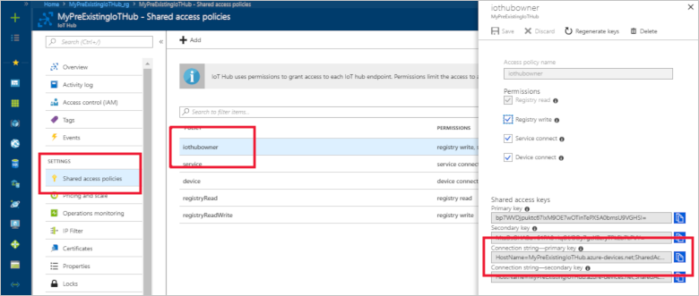
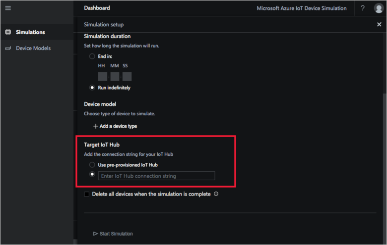

# Use an existing IoT hub with the Device Simulation solution accelerator

When you deploy Device Simulation, you can also choose to deploy an IoT hub to use in your simulation. This option deploys an [S2 tier IoT hub with a single scale unit](../iot-hub/iot-hub-scaling.md). If you do deploy this optional IoT hub, you can still choose to target another IoT Hub for a simulation run.

If you choose not to deploy the optional IoT Hub, you must use your own hub for any simulations you run.

If you don't have an IoT hub, you can always create a new one from the [Azure portal](https://portal.azure.com).

To use a pre-existing IoT hub, you need the connection string for the **iothubowner** shared access policy. You can get this connection string from the [Azure portal](https://portal.azure.com):

1. On the hub's configuration page in the portal, click **Shared access policies**.

1. Click **iothubowner**.

1. Copy either the primary or secondary connection string.

Use the connection string you copied when you configure the simulation:

### Next steps

In this how-to guide, you've learned how to use an existing IoT hub in a simulation. Next, you may want to learn how to [Create an advanced device model](iot-accelerators-device-simulation-advanced-device.md) for a simulation.
