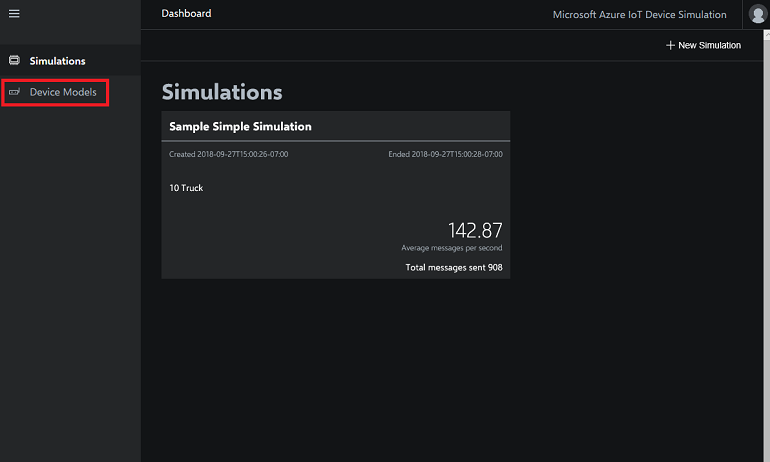
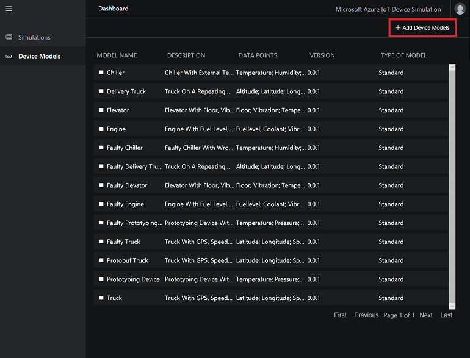
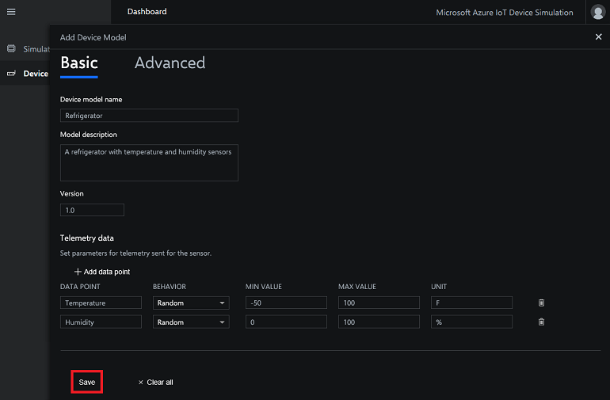
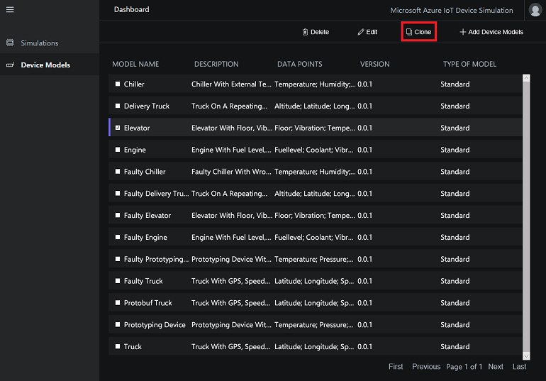
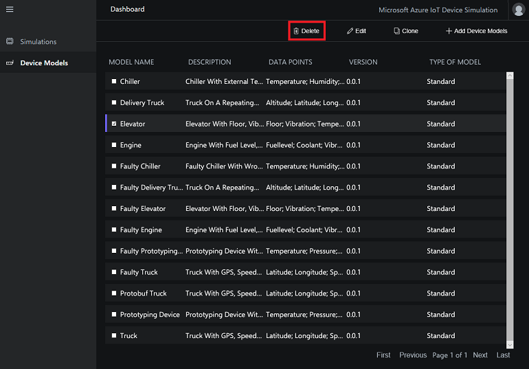

# Tutorial: Create a custom simulated device

In this tutorial, you use Device Simulation to create a custom simulated device for use in simulations. To get started with Device Simulation, you can use one of the included sample simulated devices. You can also create custom simulated devices as described in this article. For more customization options, see [Create an advanced device model](iot-accelerators-device-simulation-advanced-device.md).

In this tutorial, you:

>[!div class="checklist"]
> * View a list of your simulated device models
> * Create custom simulated device
> * Clone a device model
> * Delete a device model

If you don't have an Azure subscription, create a [free account](https://azure.microsoft.com/free/?WT.mc_id=A261C142F) before you begin.

## Prerequisites

To follow this tutorial, you need a deployed instance of Device Simulation in your Azure subscription.

If you haven't deployed Device Simulation yet, you should complete the [Deploy and run an IoT device simulation in Azure](quickstart-device-simulation-deploy.md) quickstart.

## Open Device Simulation

To run Device Simulation in your browser, first navigate to [Microsoft Azure IoT Solution Accelerators](https://www.azureiotsolutions.com).

You may be asked to sign in using your Azure subscription credentials.

Then click **Launch** on the tile for Device Simulation that you deployed in the [Deploy and run an IoT device simulation in Azure](quickstart-device-simulation-deploy.md) quickstart.

## View your device models

Select **Device models** in the menu bar. The **Device models** page lists all the available device models in this instance of Device Simulation:

## Create a device model

Click **+ Add Device Models** in the top right corner of the page:

In this tutorial, you create a simulated refrigerator that sends both temperature and humidity data.

Fill out the form with the following information:

| Setting             | Value                                                |
| ------------------- | ---------------------------------------------------- |
| Device model name   | Refrigerator                                         |
| Model description   | A refrigerator with temperature and humidity sensors |
| Version             | 1.0                                                  |

> [!NOTE]
> The device model name must be unique.

Click **+ Add data point** to add data points for temperature and humidity with the following values:

| Data Point          | Behavior        | Min Value | Max Value | Unit |
| ------------------- | --------------- | --------- | --------- | ---- |
| Temperature         | Random          | -50       | 100       | F    |
| Humidity            | Random          | 0         | 100       | %    |

Click **Save** to save the device model.

Your refrigerator is now included in the list of device models. You may need to click **Next** to go to another page to see your refrigerator.

## Clone a device model

Cloning a device model lets you create a copy of an existing device model. You can then edit the copy to meet your specific needs. Cloning saves time when you need to create similar device models.

To clone a device model, check the box next to the model and then click **Clone** in the action bar:

## Delete a device model

You can delete any custom device model. To delete a device model, check the box next to the model and then click **Delete** in the action bar:

## Next steps

In this tutorial, you learned how to create, clone, and delete a custom device models. To learn more about device models, see the following  how-to article:

> [!div class="nextstepaction"]
> [Create an advanced device model](iot-accelerators-device-simulation-advanced-device.md)