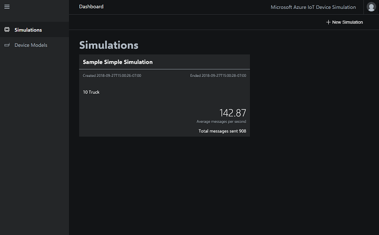
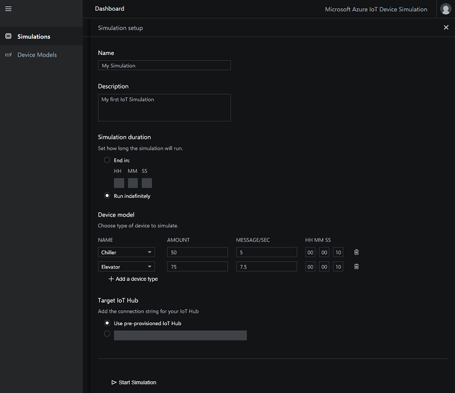
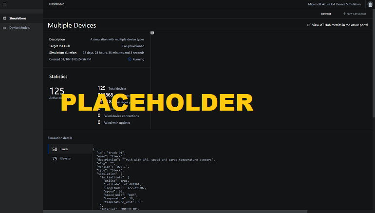

# Tutorial: Create and run an IoT device simulation

In this tutorial, you use Device Simulation to create and run a new IoT simulation using one or more simulated devices.

In this tutorial, you:

>[!div class="checklist"]
> * View all active and historical simulations
> * Create and run a new simulation
> * View metrics for a simulation
> * Stop a simulation

If you don't have an Azure subscription, create a [free account](https://azure.microsoft.com/free/?WT.mc_id=A261C142F) before you begin.

## Prerequisites

To follow this tutorial, you need a deployed instance of the Device Simulation in your Azure subscription.

If you haven't deployed Device Simulation yet, you should complete the [Deploy and run an IoT device simulation in Azure](quickstart-device-simulation-deploy.md) quickstart.

## Open Device Simulation

To run Device Simulation in your browser, first navigate to [Microsoft Azure IoT Solution Accelerators](https://www.azureiotsolutions.com). 

You may be asked to sign in using your Azure subscription credentials.

Then click **Launch** on the tile for Device Simulation that you deployed in the [Quickstart](quickstart-device-simulation-deploy.md).

## View simulations

Select **Simulations** in the menu bar. The **Simulations** page displays information about all the available simulations. From this page, you can see  simulations that are currently running and that ran previously. To rerun a previous simulation, click on the simulation tile to open the simulation details:

## Create a simulation

To create a simulation click **+ New Simulation** in the top right corner.

A simulation consists of one or more device models. The device model defines the behavior, telemetry, and message format of the device to be simulated.

To add a device model, click **+ Add a device type** and select the device model from the list. Your simulation can have more than one device model. Each device model can have a different device count and message frequency.

When the new simulation form is complete, click **Start Simulation** to begin the simulation.

Depending on the number of simulated devices, it may take a few minutes for your simulation to be configured and started:

## Stop a simulation

When you click **Start Simulation**, you see the simulation details page. This details page shows live simulation statistics and metrics from IoT Hub. You can also navigate to this details page by clicking on the simulation's tile on the **Simulations** page.

To stop a simulation, click **Stop Simulation** in the action bar in the top right.

## Next steps

In this tutorial, you learned how to create, run, and stop a simulation. You also learned how to view the simulation details. To learn more about how to run simulations, continue to the next tutorial:

> [!div class="nextstepaction"]
> [Create a custom simulated device](iot-accelerators-device-simulation-create-custom-device.md)
