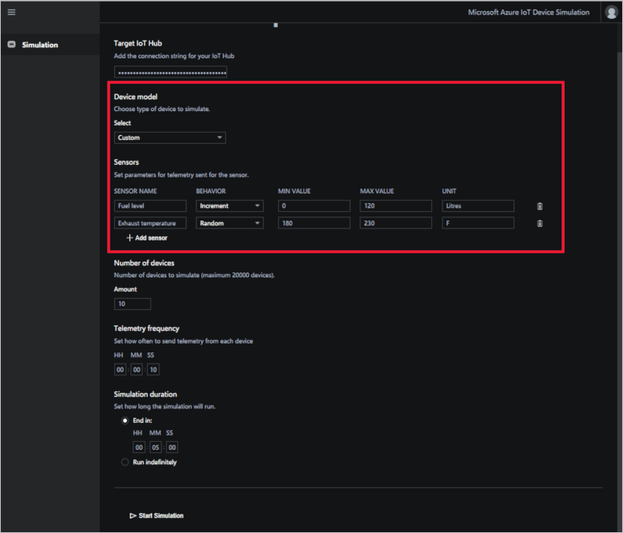

# Device models

When you configure a simulation you can choose to use an existing device model with a predefined set of sensors, or create a custom device model with your choice of simulated sensors. Custom sensors let you more closely model your real devices.

## Pre-configured device models

The Device Simulation solution accelerator provides three pre-configured device models: Chillers, Elevators, and Trucks.

Pre-configured device models have multiple sensors with advanced behaviors defined in a JavaScript file. You cannot configure these behaviors in the web UI.

The following table shows the configurations for each pre-configured device model:

| Device model  | Sensor           | Unit  |
| ------------- | ---------------- | ----- |
| Chiller       | humidity         | %     |
|               | pressure         | psig  |
|               | temperature      | F     |
| Elevator      | Floor            |       |
|               | Vibration        | mm    |
|               | Temperature      | F     |
| Truck         | Latitude         |       |
|               | Longitude        |       |
|               | speed            | mph   |
|               | cargotemperature | F     |

## Custom device models

Custom device models let you model sensors that more closely model your own devices. A custom device can have up to 10 custom sensors.

When you select the custom device model type, you add new sensors by clicking **+Add sensor**.

Custom sensors have the following properties:

| Field     | Description |
| --------- | ----------- |
| Sensor Name | A friendly name for the sensor such as **temperature** or **speed**.  |
| Behavior  | Behaviors enable telemetry data to vary from one message to the next to simulate real-world data. **Increment** increases the value by one in each message sent starting at the minimum value. Once the maximum value is met, then it starts over again at the minimum value. **Decrement** behaves in the same way as **Increment** but counts down. The **Random** behavior generates a random value between the minimum value and maximum values. |
| Min Value | The lowest number in your acceptable range. |
| Max Value | The largest number in your acceptable range. |
| Unit      | The unit of measurement for the sensor such as °F or MPH. |

## Next steps

In this how-to guide, you've learned how to configure a custom device model for a simulation. Next, you may want to explore some of the other [IoT solution accelerators](about-iot-accelerators.md).