# Integrate the Remote Monitoring solution with Azure Data Lake Store

You may have advanced analytics requirements beyond what is offered in the Remote Monitoring solution. Azure Data Lake Store is ideal for this application because it can store data from massive and diverse datasets as well as integrate with Azure Data Lake Analytics to provide on-demand analytics.

In this how-to, you will use an Azure Stream Analytics job to stream data from the IoT hub in your Remote Monitoring solution to an Azure Data Lake Store.

## Prerequisites

To complete this how-to, you will need the following:

* [Deploy the Remote Monitoring solution accelerator](quickstart-remote-monitoring-deploy.md).
  * The Remote Monitoring solution will deploy the IoT hub and Azure Stream Analytics job used in this article into your Azure subscription.
* [Deploy an Azure Data Lake Store](../data-lake-store/data-lake-store-get-started-portal.md)
  * Your Data Lake Store should be deployed to the same region as your Remote Monitoring solution.
  * [Create a folder](../data-lake-store/data-lake-store-get-started-portal.md#createfolder) named "streaming" in your account.

## Create a consumer group

Create a dedicated consumer group in the IoT hub of your Remote Monitoring solution. This will be used by the Stream Analytics job for streaming data to your Data Lake Store.

> [!NOTE]
> Consumer groups are used by applications to pull data from Azure IoT Hub. You should create a new consumer group for every five output consumers. You can create up to 32 consumer groups.

1. Sign in to the Azure portal.

1. In the Azure portal, click the **Cloud Shell** button.

    

1. Execute this command to create a new consumer group:

```azurecli-interactive
az iot hub consumer-group create --hub-name contoso-rm30263 --name streamanalyticsjob --resource-group contoso-rm
```

> [!NOTE]
> Use the resource group and IoT hub names from your Remote Monitoring solution.

## Create Stream Analytics Job

Create an Azure Stream Analytics job to stream the data from your IoT hub to your Azure Data Lake store.

1. Click **Create a resource**, select Internet of Things from the Marketplace, and click **Stream Analytics job**.

    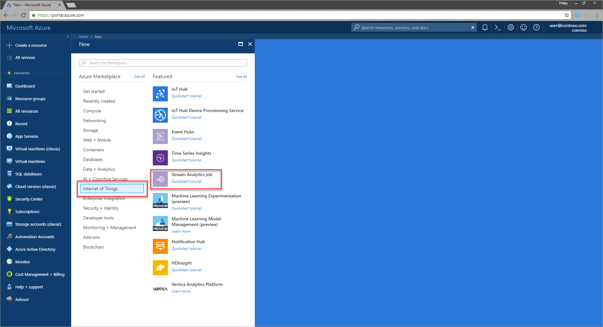

1. Enter a job name and select the appropriate Subscription and Resource group.

1. Select a Location in the near or in the same region as your Data Lake Store. Here we are using East US.

1. Ensure to leave the Hosting environment as the default **Cloud**.

1. Click **Create**.

    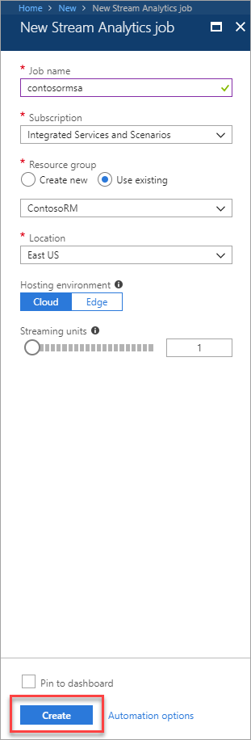

## Configure the Stream Analytics job

1. Go to the **Stream Analytics job** in your Remote Monitoring solution resource group.

1. On the Overview page, click **Inputs**.

    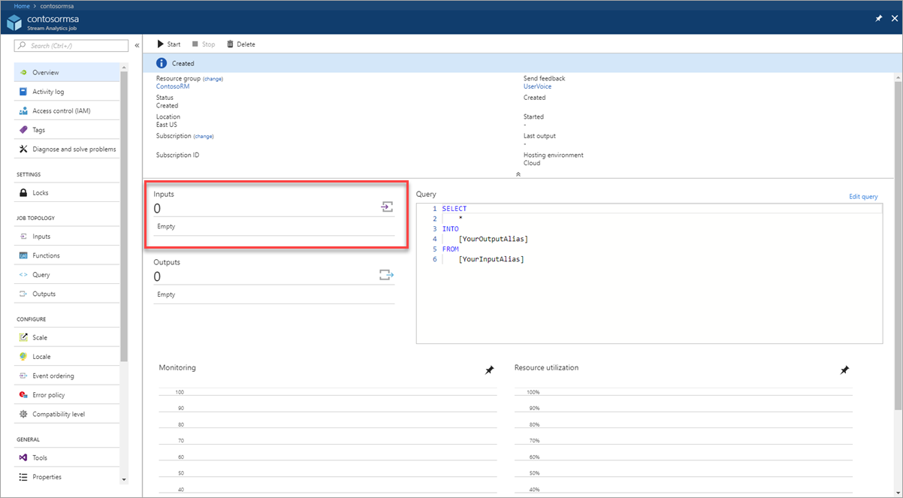

1. Click **Add stream input** and select **IoT Hub** from the drop-down.

    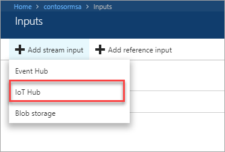

1. On the New input tab, enter an Input alias of **IoTHub**.

1. From the Consumer group drop-down, select the consumer group you created earlier. Here we are using **streamanalyticsjob**.

    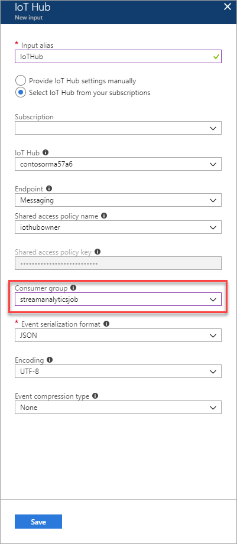

1. Click **Save**.

1. On the Overview page, click **Outputs**.

    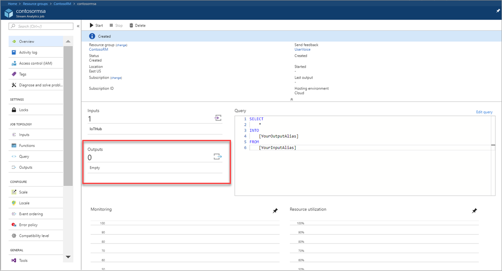

1. Click **Add** and select **Data Lake Store** from the drop-down.

    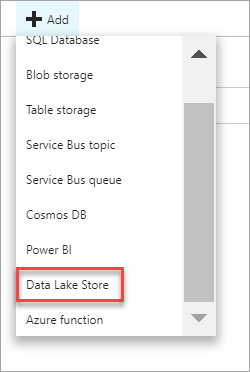

1. On the New output tab, enter an Output alias of **DataLakeStore**.

1. Select the Data Lake Store account you created in previous steps and provide folder structure to stream data to the store.

1. In the Date format field, enter **/streaming/{date}/{time}**. Leave the default Date format of YYYY/MM/DD and Time format of HH.

    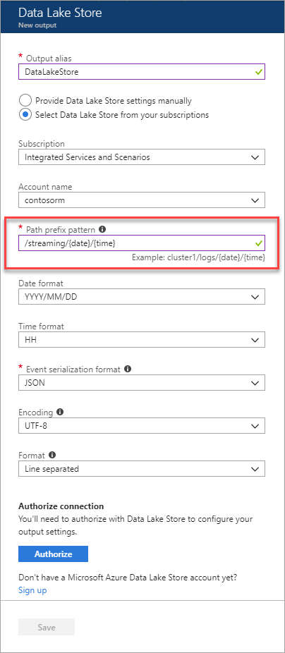

1. Click **Authorize**.

    You will have to authorize with Data Lake Store to give the Stream analytics job write access to the file system.

    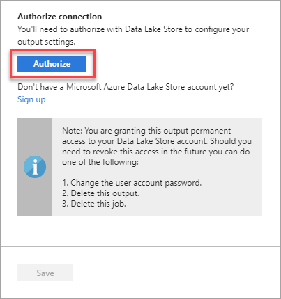

    You will see a popup and once the popup closes Authorize button will be greyed out after authorization is complete.

    > [!NOTE]
    > If you see an error in the popup window, open a new browser window in Incognito Mode and try again.

1. Click **Save**.

## Edit the Stream Analytics query

Azure Stream Analytics uses a SQL-like query language to specify an input source that streams data, transform that data as desired, and output to a variety of storage or processing destinations.

1. On the Overview tab, click **Edit query**.

    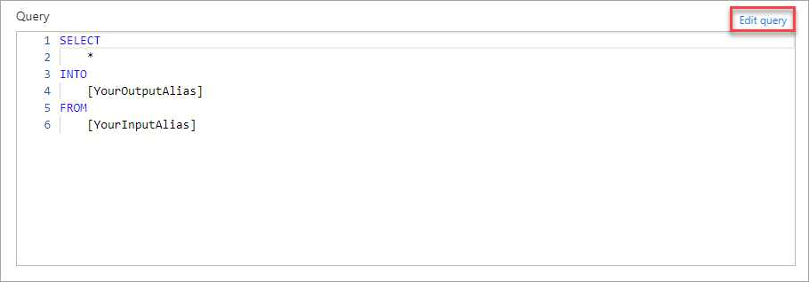

1. In the Query editor, replace the [YourOutputAlias] and [YourInputAlias] placeholders with the values you defined previously.

    ```sql
    SELECT
        *, System.Timestamp as time
    INTO
        DataLakeStore
    FROM
        IoTHub
    ```

    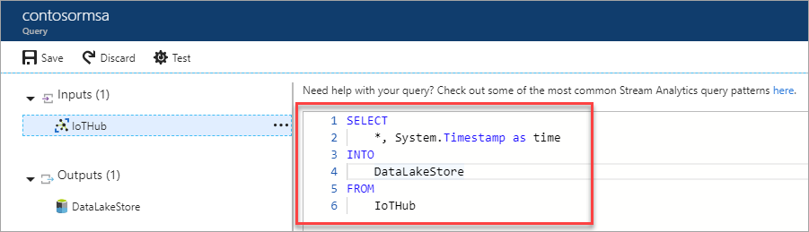

1. Click **Save**.
1. Click **Yes** to accept the changes.

## Start the Stream Analytics job

1. On the Overview tab, click **Start**.

    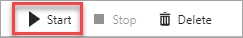

1. On the Start job tab, click **Custom**.

1. Set custom time to go back a few hours to pick up data from when your device has started streaming.

1. Click **Start**.

    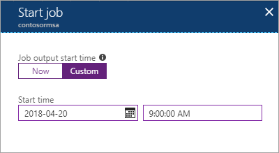

    Wait until job goes into running state, if you see errors it could be from your query, make sure to verify that the syntax is correct.

    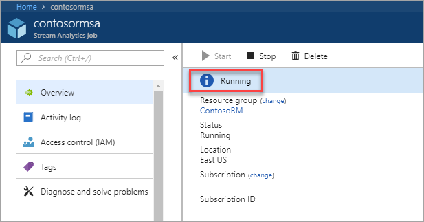

    The streaming job will begin to read data from your IoT Hub and store the data in your Data Lake Store. It may take a few minutes for the data to begin to appear in your Data Lake Store.

## Explore the streaming data

1. Go to your Data Lake Store.

1. On the Overview tab, click **Data explorer**.

1. In the Data explorer, drill down to the **/streaming** folder. You will see folders created with YYYY/MM/DD/HH format.

    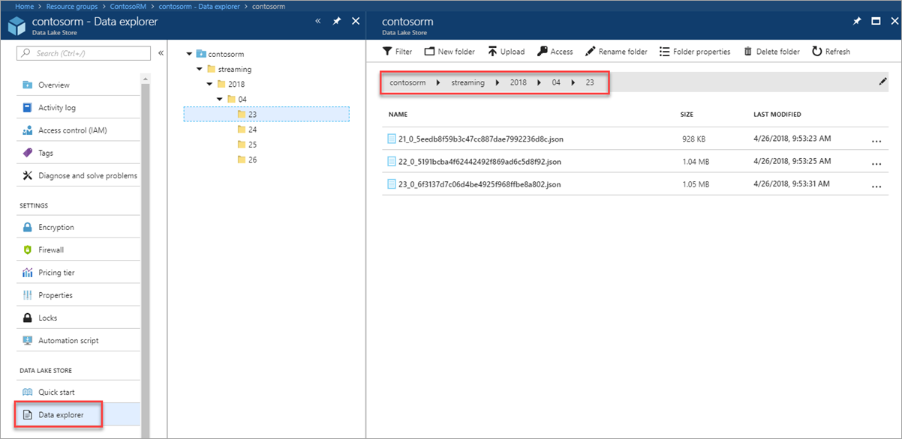

    You will see json files with one file per hour.

    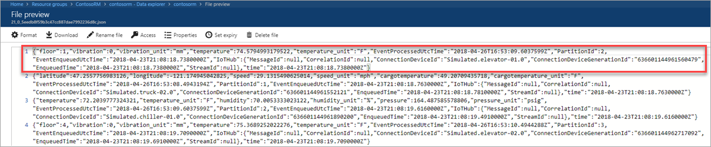

## Next Steps

Azure Data Lake Analytics can be used to perform big data analysis on your Data Lake Store data sets. Learn more on the [Data Lake Analytics Documentation](https://docs.microsoft.com/azure/data-lake-analytics).
