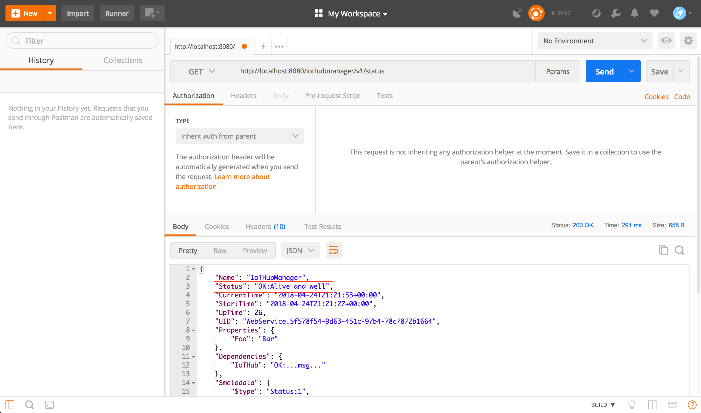
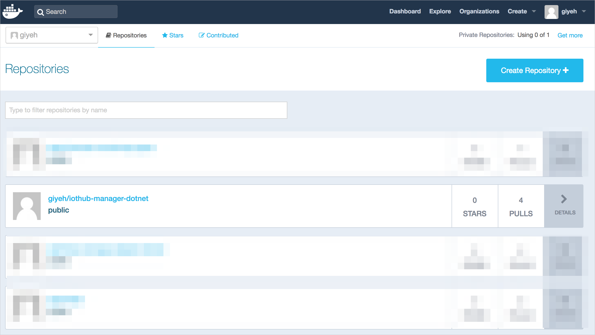
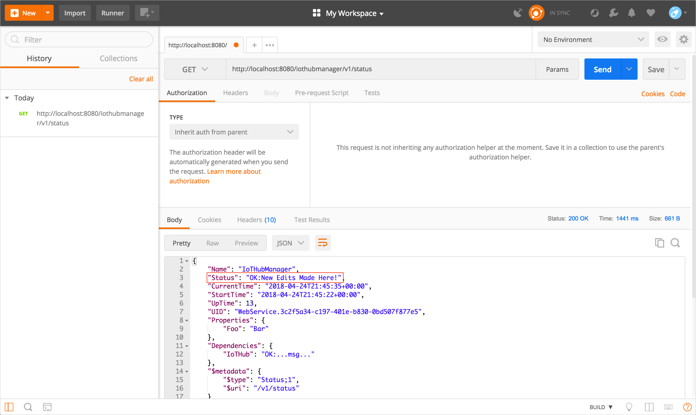

# Customize and redeploy a microservice

This tutorial shows you how to edit one of the microservices in the Remote Monitoring solution, build an image of your microservice, deploy the image to your docker hub, and then use it in Remote Monitoring solution. To introduce this concept, the tutorial uses a basic scenario where you call a microservice API and change the status message from "Alive and Well" to "New Edits Made Here!"

Remote Monitoring solution uses microservices that are built using docker images  that are pulled from a docker hub. 

In this tutorial, you learn how to:

>[!div class="checklist"]
> * Edit and build a microservice in the Remote Monitoring solution
> * Build a docker image
> * Push a docker image to your docker hub
> * Pull the new docker image
> * Visualize the changes 

## Prerequisites

To follow this tutorial, you need:

>[!div class="checklist"]
> * [Deploy the Remote Monitoring solution accelerator locally](iot-accelerators-remote-monitoring-deploy-local.md)
> * [A Docker account](https://hub.docker.com/)
> * [Postman](https://www.getpostman.com/) - Needed to view the API response

## Call the API and view response status

In this part, you call the default IoT hub manager microservice API. The API returns a status message that you change later on by customizing the microservice.

1. Make sure the Remote Monitoring solution is running locally on your machine.
2. Locate where you downloaded Postman and open it.
3. In Postman, enter the following in the GET: http://localhost:8080/iothubmanager/v1/status.
4. View the return and you should see, "Status": "OK:Alive and Well".

    

## Change the status and build the image

Now change the status message of the Iot Hub Manager microservice to "New Edits Made Here!" and then rebuild the docker image with this new status. If you run into issues here, refer to our [Troubleshooting](#Troubleshoot) section.

1. Make sure your terminal is open and change to the directory where you have cloned the Remote Monitoring solution. 
2. Change your directory to "azure-iot-pcs-remote-monitoring-dotnet/services/iothub-manager/WebService/v1/Controllers".
3. Open StatusController.cs in any text editor or IDE that you like. 
4. Locate the following code:

    ```csharp
    return new StatusApiModel(true, "Alive and well");
    ```

    and change it to the code below and save it.

    ```csharp
    return new StatusApiModel(true, "New Edits Made Here!");
    ```

5. Go back to your terminal but now change to the following directory:
 "azure-iot-pcs-remote-monitoring-dotnet/services/iothub-manager/scripts/docker".
6. To build your new docker image, type

    ```cmd/sh
    sh build
    ```

7. To verify your new image was successfully created, type

    ```cmd/sh
    docker images 
    ```

The repository should be "azureiotpcs/iothub-manager-dotnet".


## Tag and push the image
Before you can push your new docker image to a docker hub, Docker expects your images to be tagged. If you run into issues here, refer to our [Troubleshooting](#Troubleshoot) section.

1. Locate the Image ID of the docker image you created by typing:

    ```cmd/sh
    docker images
    ```

2. To tag your image with "testing" type

    ```cmd/sh
    docker tag [Image ID] [docker ID]/iothub-manager-dotnet:testing 
    ```

3. To push your newly tagged image to your docker hub, type

    ```cmd/sh
    docker push [docker ID]/iothub-manager-dotnet:testing
    ```

4. Open your internet browser and go to your [docker hub](https://hub.docker.com/) and sign in.
5. You should now see your newly pushed docker image on your docker hub.


## Update your Remote Monitoring solution
You now need to update your local docker-compose.yml to pull your new docker image from your docker hub. If you run into issues here, refer to our [Troubleshooting](#Troubleshoot) section.

1. Go back to the terminal and change to the following directory:
"azure-iot-pcs-remote-monitoring-dotnet/services/scripts/local".
2. Open docker-compose.yml in any text editor or IDE that you like.
3. Locate the following code:

    ```docker
    image: azureiotpcs/iothub-manager-dotnet:testing
    ```

    and change it to look like the image below and save it.

    ```cmd/sh
    image: [docker ID]/iothub-manager-dotnet:testing
    ```

## View the new response status
Finish up by redeploying a local instance of the Remote Monitoring solution and viewing the new status response in Postman.

1. Go back to your terminal and change to the following directory: "azure-iot-pcs-remote-monitoring-dotnet/scripts/local".
2. Start your local instance of the Remote Monitoring solution by typing the following command into the terminal:

    ```cmd/sh
    docker-compose up
    ```

3. Locate where you downloaded Postman and open it.
4. In Postman, enter the following request in the GET: http://localhost:8080/iothubmanager/v1/status. You should now see, "Status": "OK: New Edits Made Here!".



## <a name="Troubleshoot"></a>Troubleshoot

If you're running into issues, try removing the docker images and containers on the local machine.

1. To remove all containers, you'll first need to stop all running containers. Open your terminal and type

    ```cmd/sh
    docker stop $(docker ps -aq)
    docker rm $(docker ps -aq)
    ```
    
2. To remove all images, open your terminal and type 

    ```cmd/sh
    docker rmi $(docker images -q)
    ```

3. You can check if there are any containers on the machine by typing

    ```cmd/sh
    docker ps -aq 
    ```

    If you successfully removed all containers, nothing should show up.

4. You can check if there are any images on the machine by typing

    ```cmd/sh
    docker images
    ```

    If you successfully removed all containers, nothing should show up.

## Next steps

In this tutorial, you saw how to:

<!-- Repeat task list from intro -->
>[!div class="checklist"]
> * Edit and build a microservice in the Remote Monitoring solution
> * Build a docker image
> * Push a docker image to your docker hub
> * Pull the new docker image
> * Visualize the changes 

The next thing to try is [customizing the device simulator microservice in the Remote Monitoring solution](iot-accelerators-microservices-example.md)

For more developer information about the Remote Monitoring solution, see:

* [Developer Reference Guide](https://github.com/Azure/azure-iot-pcs-remote-monitoring-dotnet/wiki/Developer-Reference-Guide)
<!-- Next tutorials in the sequence -->

