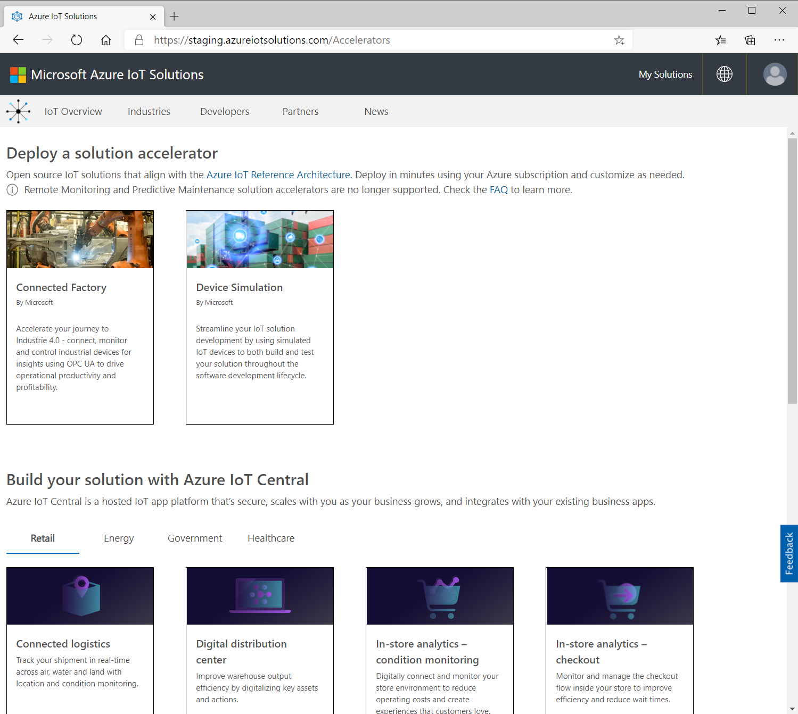

# Use the azureiotsolutions.com site to deploy your solution accelerator

You can deploy Azure IoT solution accelerators to your Azure subscription from [AzureIoTSolutions.com](https://www.azureiotsolutions.com/Accelerators). AzureIoTSolutions.com hosts both the Microsoft open source and partner solution accelerators. These solution accelerators align with the [Azure IoT Reference Architecture](https://aka.ms/iotrefarchitecture). You can use the site to quickly deploy a solution accelerator as a demo or production environment.

> [!TIP]
> If you need more control over the deployment process, you can use  the [CLI to deploy a solution accelerator](iot-accelerators-remote-monitoring-deploy-cli.md).

You can deploy the solution accelerators in the following configurations:

* **Standard**: An expanded infrastructure deployment for developing a production environment. The Azure Container Service deploys the microservices to several Azure virtual machines. Kubernetes orchestrates the Docker containers that host the individual microservices.
* **Basic**: A reduced cost version for a demonstration or to test a deployment. All the microservices deploy to a single Azure virtual machine.
* **Local**: A local machine deployment for testing and development. This approach deploys the microservices to a local Docker container and connects to the IoT Hub, Azure Cosmos DB, and Azure storage services in the cloud.

Each of the solution accelerators uses a different combination of Azure services such as IoT Hub, Azure Stream Analytics, and Cosmos DB. For more information, visit [AzureIoTSolutions.com](https://www.azureiotsolutions.com/Accelerators) and select a solution accelerator.

## Sign in at azureiotsolutions.com

Before you can deploy a solution accelerator, you must sign in at AzureIoTSolutions.com using credentials associated with an Azure subscription. If your account is associated with more than one Microsoft Azure Active Directory (AD) tenant, you can use the **Account selection dropdown** to choose the directory to use.

Your permissions to deploy solution accelerators, manage users, and manage Azure services depend on your role in the selected directory. Common Azure AD roles associated with the solution accelerators include:

* **Global administrator**: There can be many [global administrators](../active-directory/users-groups-roles/directory-assign-admin-roles.md) per Azure AD tenant:

  * When you create an Azure AD tenant, you are by default the global administrator of that tenant.
  * The global administrator can deploy basic and standard solution accelerators.

* **Domain user**: There can be many domain users per Azure AD tenant. A domain user can deploy a basic solution accelerator.

* **Guest user**: There can be many guest users per Azure AD tenant. Guest users can't deploy a solution accelerator in the Azure AD tenant.

For more information about users and roles in Azure AD, see the following resources:

* [Create users in Azure Active Directory](../active-directory/fundamentals/active-directory-users-profile-azure-portal.md)
* [Assign users to apps](../active-directory/manage-apps/assign-user-or-group-access-portal.md)

## Choose your device

The AzureIoTSolutions.com site links to the [Azure Certified for IoT device catalog](https://catalog.azureiotsolutions.com/).

The catalog lists hundreds of certified IoT hardware devices you can connect to your solution accelerators to start building your IoT solution.

If you're a hardware manufacturer, click **Become a Partner** to learn about partnering with Microsoft on the Certified for IoT program.

## Next steps

To try out one of the IoT solution accelerators, check out the quickstarts:

* [Try a remote monitoring solution](quickstart-remote-monitoring-deploy.md)
* [Try a connected factory solution](quickstart-connected-factory-deploy.md)
* [Try a predictive maintenance solution](quickstart-predictive-maintenance-deploy.md)
* [Try a device simulation solution](quickstart-device-simulation-deploy.md)
