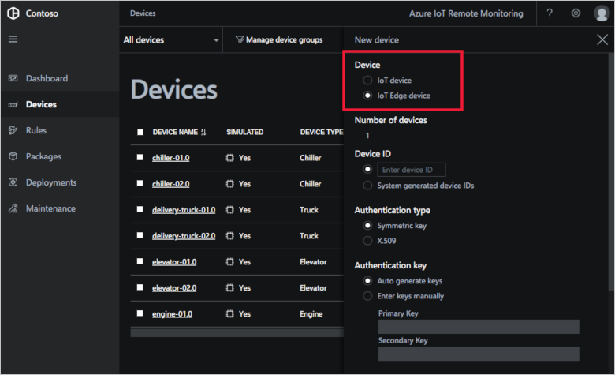

# Add an IoT Edge device to your Remote Monitoring solution accelerator

To add an [IoT Edge](../iot-edge/about-iot-edge.md) device to your solution accelerator, complete the following two steps:

1. Add the Edge device on the **Device Explorer** page in the Remote Monitoring solution accelerator web UI.
1. Install the IoT Edge runtime on your Edge device.

## Add the IoT Edge device

To add an IoT Edge device to the Remote Monitoring solution accelerator, navigate to the **Device Explorer** page in the web UI and click **+ New device**.

In the **New device** panel, choose **IoT Edge device**. You can leave the default values for the other settings. Then click **Apply**:

### Alternative ways to add an IoT Edge device

It's also possible to register an IoT Edge device directly with the IoT Hub instance in your solution accelerator. You need to know the name of the IoT hub in your solution accelerator before you follow any of these how-to guides:

- [Register a new Azure IoT Edge device from the Azure portal](../iot-edge/how-to-register-device-portal.md)
- [Register a new Azure IoT Edge device with Azure CLI](../iot-edge/how-to-register-device-cli.md)
- [Register a new Azure IoT Edge device from Visual Studio Code](../iot-edge/how-to-register-device-vscode.md)

When you register a device directly with the IoT hub in the Remote Monitoring solution accelerator, it's listed on the **Device Explorer** page in the web UI.

## Install the IoT Edge runtime

Before you can deploy modules to your Edge device, you must install the IoT Edge runtime on the real device. The following how-to guides show you how to install the runtime on common device platforms:

- [Install the Azure IoT Edge runtime on Linux (x64)](../iot-edge/how-to-install-iot-edge-linux.md)
- [Install Azure IoT Edge runtime on Linux (ARM32v7/armhf)](../iot-edge/how-to-install-iot-edge-linux-arm.md)
- [Install Azure IoT Edge runtime on Windows to use with Windows containers](../iot-edge/how-to-install-iot-edge-windows-with-windows.md)
- [Install the Azure IoT Edge runtime on Windows to use with Linux containers](../iot-edge/how-to-install-iot-edge-windows-with-linux.md)
- [Install the IoT Edge runtime on Windows IoT Core](../iot-edge/how-to-install-iot-core.md)

## Next steps

Now that you have prepared your IoT Edge device, the next step is to deploy modules to it. See [Import an IoT Edge package into your Remote Monitoring solution accelerator](iot-accelerators-remote-monitoring-import-edge-package.md)
