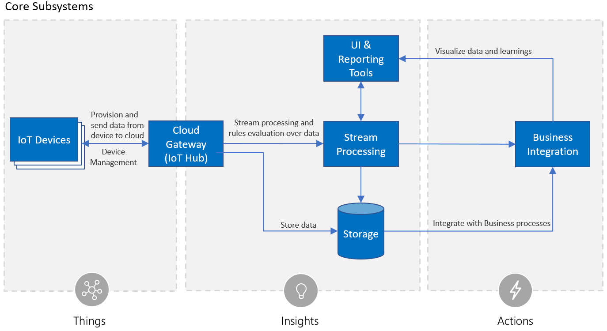

# Remote Monitoring architectural choices

The Azure IoT Remote Monitoring solution accelerator is an open-source, MIT licensed, solution accelerator that introduces common IoT scenarios such as device connectivity, device management, and stream processing, so customers can speed up their development process.  The Remote Monitoring solution follows the recommended Azure IoT reference architecture published [here](https://aka.ms/iotrefarchitecture).  

This article describes the architectural and technical choices made in each of the subsystems for the Remote Monitoring solution, and discusses alternatives considered.  It is important to note that the technical choices made in the Remote Monitoring solution are not the only way to implement a remote monitoring IoT solution.  The technical implementation is a baseline for building a successful application and should be modified to fit the skills, experience, and vertical application needs for a customer solution implementation.

## Architectural choices

### Microservices, serverless, and cloud native

The architecture we recommend for IoT applications are cloud native, microservice, and serverless based.  The different subsystems of an IoT application should be built as discrete services that are independently deployable, and able to scale independently.  These attributes enable greater scale, more flexibility in updating individual subsystems, and provide the flexibility to choose appropriate technology on a per subsystem basis.  Microservices can be implemented with multiple technologies. For example, using container technology such as Docker with serverless technology such as Azure Functions, or hosting microservices in PaaS services such as Azure App Services.

## Core subsystem technology choices

This section details the technology choices made in the Remote Monitoring solution for each of the core subsystems.

 

### Cloud Gateway
The Azure IoT Hub is used as the Remote Monitoring solution cloud gateway.  The IoT Hub offers secure, bi-directional communication with devices. You can learn more about IoT Hub [here](https://azure.microsoft.com/services/iot-hub/). For IoT device connectivity, the .NET Core and Java IoT Hub SDKs are used.  The SDKs offer wrappers around the IoT Hub REST API and handle scenarios such as retries.

### Stream processing
For stream processing the Remote Monitoring solution uses Azure Stream Analytics for complex rule processing.  For customers wanting simpler rules, we also have a custom microservice with support for processing of simple rules, although this set-up not part of the out of the box deployment. The reference architecture recommends use of Azure Functions for simple rule processing and Azure Stream Analytics (ASA) for complex rule processing.  

### Storage
For storage, the Remote Monitoring solution accelerator uses both Azure Time Series Insights and Azure Cosmos DB. Azure Time Series Insights stores the messages coming through IoT Hub from your connected devices. The solution accelerator uses Azure Cosmos DB for all other storage such as cold storage, rules definitions, alarms, and configuration settings. Azure Cosmos DB is the recommended general-purpose warm storage solution for IoT applications though solutions such as Azure Time Series Insights and Azure Data Lake are appropriate for many use cases. With Azure Time Series Insights you can gain deeper insights into your time-series sensor data by spotting trends and anomalies, which allows you to conduct root-cause analyses and avoid costly downtime. 

> [!NOTE]
> Time Series Insights is not currently available in the Azure China cloud. New Remote Monitoring solution accelerator deployments in the Azure China cloud use Cosmos DB for all storage.

### Business integration
Business integration in the Remote Monitoring solution is limited to generation of alarms, which are placed in warm storage. Further business integrations can be performed by integrating the solution with Azure Logic Apps.

### User Interface
The web UI is built with JavaScript React.  React offers a commonly used industry web UI framework and is similar to other popular frameworks such as Angular.  

### Runtime and orchestration
The application runtime chosen for subsystem implementation in the Remote Monitoring solution is Docker containers with Kubernetes as the orchestrator for horizontal scale.  This architecture allows for individual scale definition per subsystem however incurs DevOps costs in keeping VMs and containers up-to-date from a security perspective.  Alternatives to Docker and Kubernetes include hosting microservices in PaaS services (for example, Azure App Service) or using Service Fabric, DCOS, Swarm, etc. as an orchestrator.

## Next steps
* Deploy your Remote Monitoring solution [here](https://www.azureiotsolutions.com/).
* Explore GitHub code in [C#](https://github.com/Azure/azure-iot-pcs-remote-monitoring-dotnet/) and [Java](https://github.com/Azure/azure-iot-pcs-remote-monitoring-java/).  
* Learn more about the IoT Reference Architecture [here](https://aka.ms/iotrefarchitecture).
