# Tutorial: Detect issues with devices connected to your monitoring solution

In this tutorial, you configure the Remote Monitoring solution accelerator to detect issues with your connected IoT devices. To detect the issues with your devices, you add rules that generate alerts on the solution dashboard.

To introduce rules and alerts, the tutorial uses a simulated chiller device. The chiller is managed by an organization called Contoso and is connected to the Remote Monitoring solution accelerator. Contoso already has a rule that generates a critical alert when the pressure in a chiller goes above 298 PSI. As an operator at Contoso, you want to identify chiller devices that may have problematic sensors by looking for initial pressure spikes. To identify such devices, you add a rule that generates a warning alert when the pressure in the chiller goes above 150 PSI.

You have also been asked to create a critical alert for a chiller when, over the last five minutes, the average humidity in the device was greater than 80% and the temperature of the device was greater than 75 degrees fahrenheit.

In this tutorial, you:

>[!div class="checklist"]
> * View the rules in your solution
> * Create a rule
> * Create a rule with multiple conditions
> * Edit an existing rule
> * Switch rules on and off

If you don't have an Azure subscription, create a [free account](https://azure.microsoft.com/free/?WT.mc_id=A261C142F) before you begin.

[!INCLUDE [iot-accelerators-tutorial-prereqs](../../includes/iot-accelerators-tutorial-prereqs.md)]

## Review the existing rules

The **Rules** page in the solution accelerator displays a list of all the current rules:

[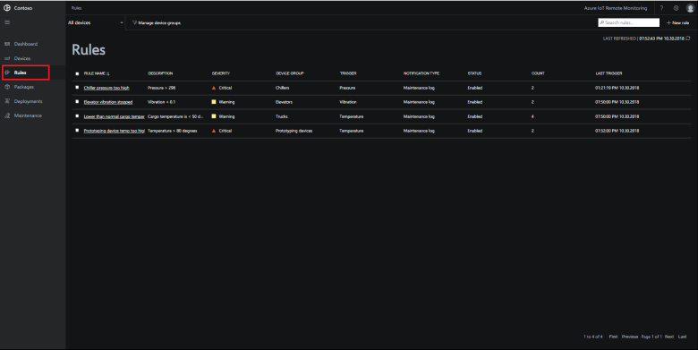](./media/iot-accelerators-remote-monitoring-automate/rulesactions_v2-expanded.png#lightbox)

To view only the rules that apply to chiller devices, apply a filter. You can view more information about a rule and edit it when you select it in the list:

[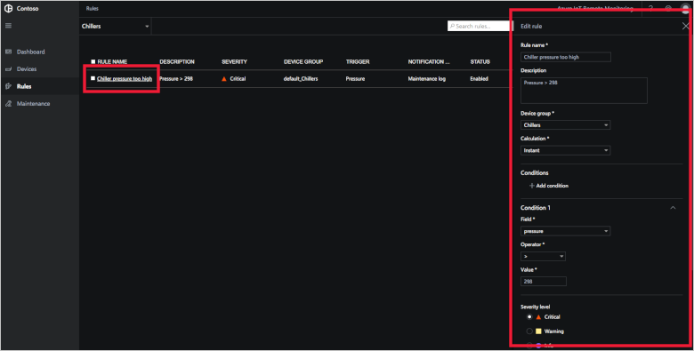](./media/iot-accelerators-remote-monitoring-automate/rulesactionsdetail_v2-expanded.png#lightbox)

## Create a rule

To create a rule that generates a warning when the pressure in a chiller device goes above 150 PSI, click **New rule**. Use the following values to create the rule:

| Setting          | Value                                 |
| ---------------- | ------------------------------------- |
| Rule name        | Chiller warning                       |
| Description      | Chiller pressure has exceeded 150 PSI |
| Device group     | **Chillers** device group             |
| Calculation      | Instant                               |
| Condition 1 Field| pressure                              |
| Condition 1 operator | Greater than                      |
| Condition 1 value    | 150                               |
| Severity level  | Warning                               |

[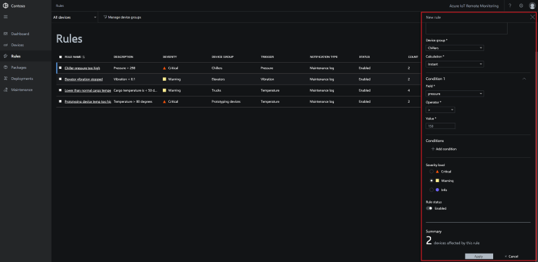](./media/iot-accelerators-remote-monitoring-automate/rulesactionsnewrule_v2-expanded.png#lightbox)

To save the new rule, click **Apply**.

You can see when the rule is triggered on the **Rules** page or on the **Dashboard** page:

[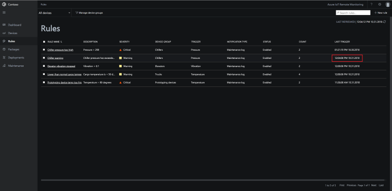](./media/iot-accelerators-remote-monitoring-automate/warningruletriggered-expanded.png#lightbox)

## Create an advanced rule

To create a rule with multiple conditions that generates a critical alert when, over the last five minutes for a chiller device, the average humidity is greater than 80% and the average temperature is greater than 75 degrees fahrenheit, click **New rule**. Use the following values to create the rule:

| Setting          | Value                                 |
| ---------------- | ------------------------------------- |
| Rule name        | Chiller humidity and temp critical    |
| Description      | Humidity and temperature are critical |
| Device group     | **Chillers** device group             |
| Calculation      | Average                               |
| Time period      | 5                                     |
| Condition 1 Field| humidity                              |
| Condition 1 operator | Greater than                      |
| Condition 1 value    | 80                                |
| Severity level  | Critical                              |

[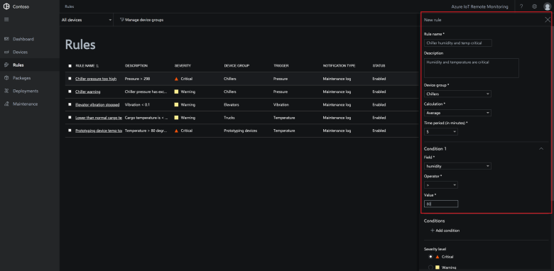](./media/iot-accelerators-remote-monitoring-automate/rulesactionsnewrule_mult_v2-expanded.png#lightbox)

To add the second condition, click on "+ Add condition". Use the following values for the new condition:

| Setting          | Value                                 |
| ---------------- | ------------------------------------- |
| Condition 2 Field| temperature                           |
| Condition 2 operator | Greater than                      |
| Condition 2 value    | 75                                |

[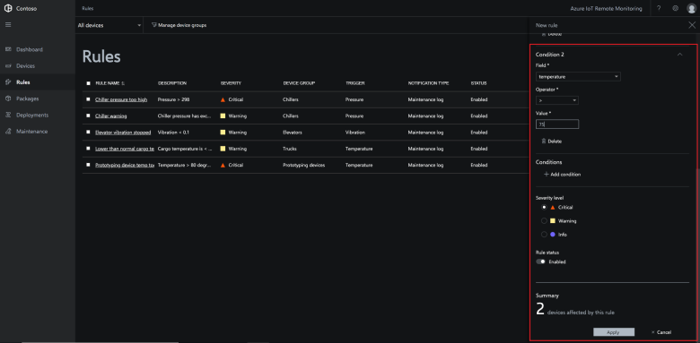](./media/iot-accelerators-remote-monitoring-automate/rulesactionsnewrule_mult_cond2_v2-expanded.png#lightbox)

To save the new rule, click **Apply**.

You can see when the rule is triggered on the **Rules** page or on the **Dashboard** page:

[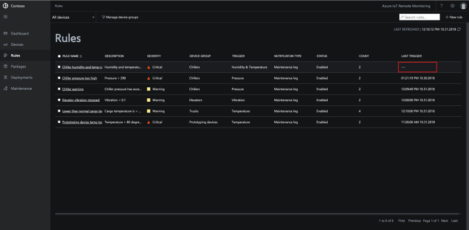](./media/iot-accelerators-remote-monitoring-automate/criticalruletriggered-expanded.png#lightbox)

## Edit an existing rule

To make a change to an existing rule, select it in the list of rules, and click **Edit**:

[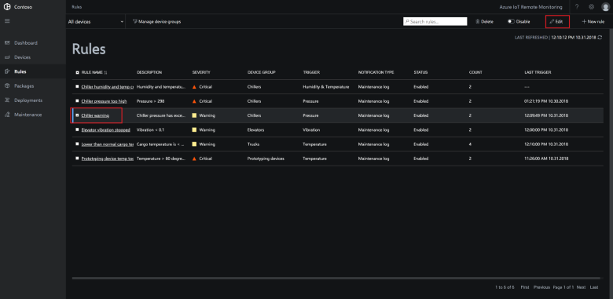](./media/iot-accelerators-remote-monitoring-automate/rulesactionsedit_v2-expanded.png#lightbox)

## Disable a rule

To temporarily switch off a rule, you can disable it in the list of rules. Select the rule to disable, and then choose **Disable**. The **Status** of the rule in the list changes to indicate the rule is now disabled. You can re-enable a rule that you previously disabled using the same procedure.

[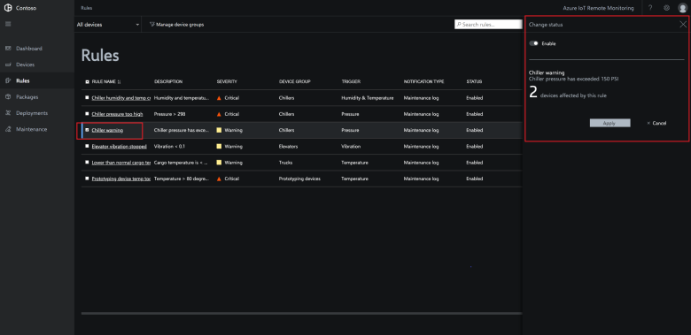](./media/iot-accelerators-remote-monitoring-automate/rulesactionsdisable-expanded.png#lightbox)

You can enable and disable multiple rules at the same time by selecting multiple rules in the list.

## Delete a rule

To permanently delete a rule, you can delete it in the list of rules. Select the rule to delete, and then choose **Delete**.

[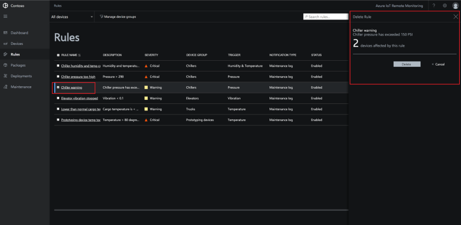](./media/iot-accelerators-remote-monitoring-automate/rulesactionsdelete-expanded.png#lightbox)

After you confirm that you want to delete the rule, you are given the opportunity to delete any alerts associated with the rule from the **Maintenance** page.

[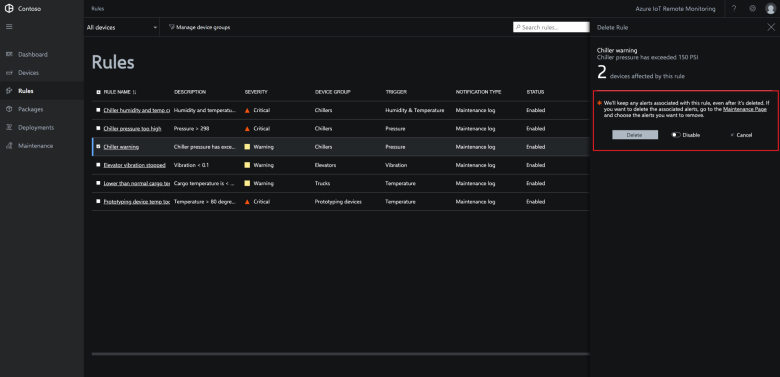](./media/iot-accelerators-remote-monitoring-automate/rulesactionsdeletetidy-expanded.png#lightbox)

You can only delete one rule at a time.

[!INCLUDE [iot-accelerators-tutorial-cleanup](../../includes/iot-accelerators-tutorial-cleanup.md)]

## Next steps

This tutorial showed you how to use the **Rules** page in the Remote Monitoring solution accelerator to create and manage rules that trigger alerts in the solution. To learn how to use the solution accelerator to manage and configure your connected devices, continue to the next tutorial.

> [!div class="nextstepaction"]
> [Configure and manage devices connected to your monitoring solution](iot-accelerators-remote-monitoring-manage.md)