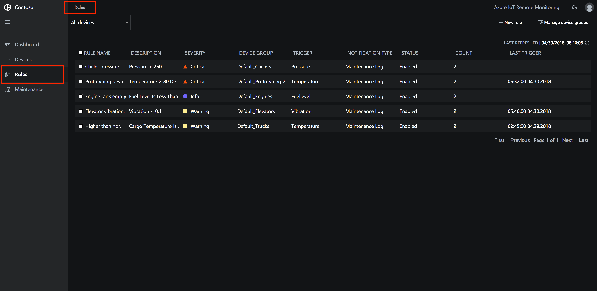
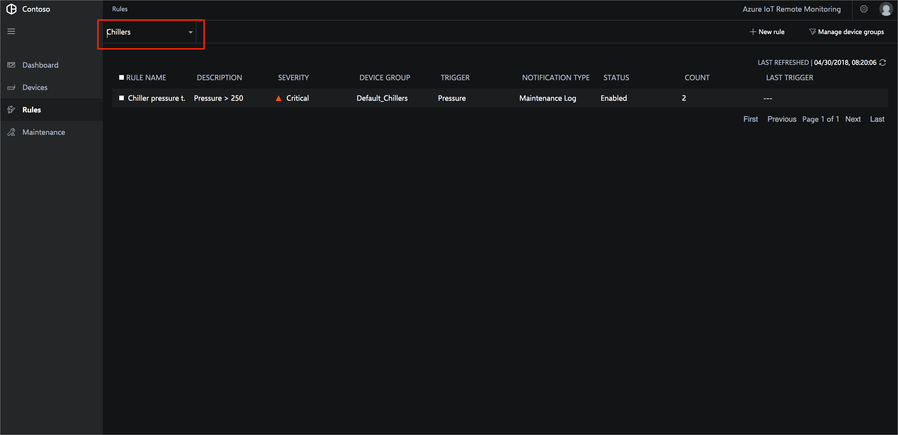
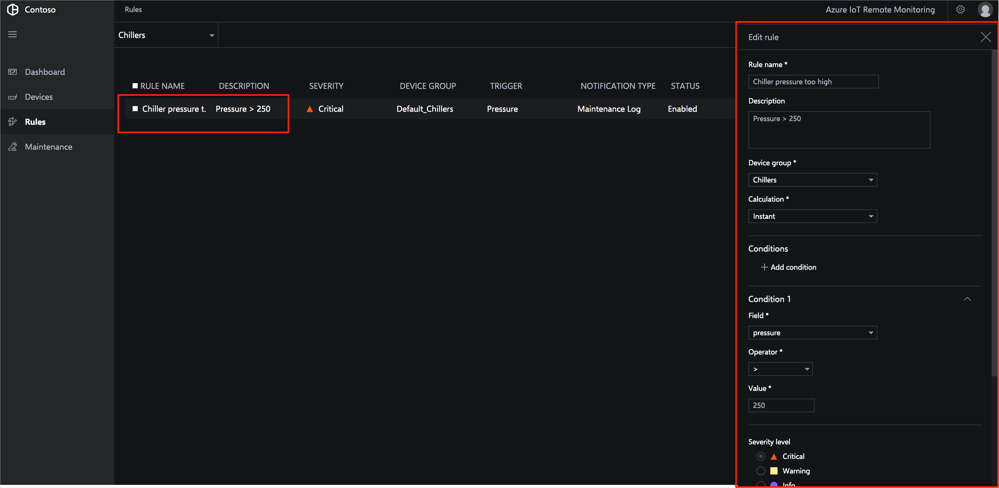
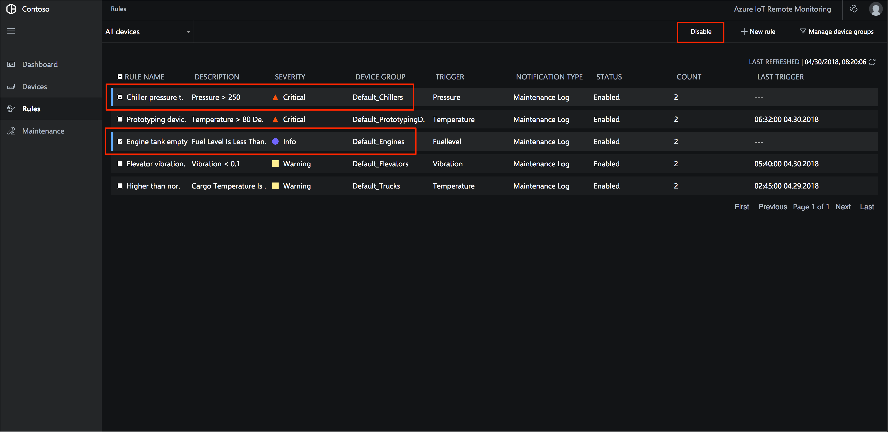
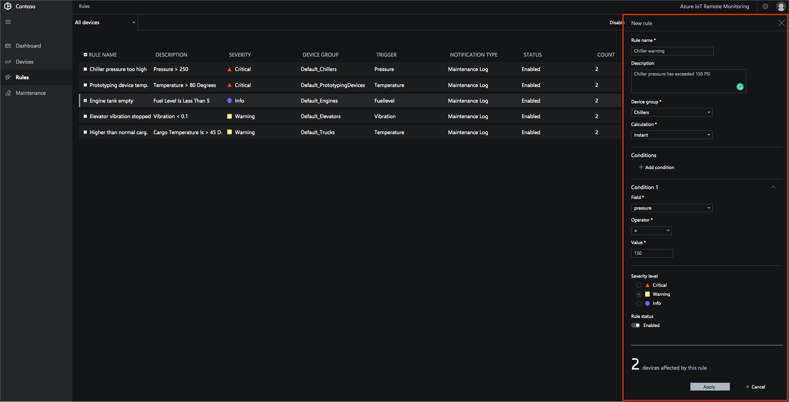
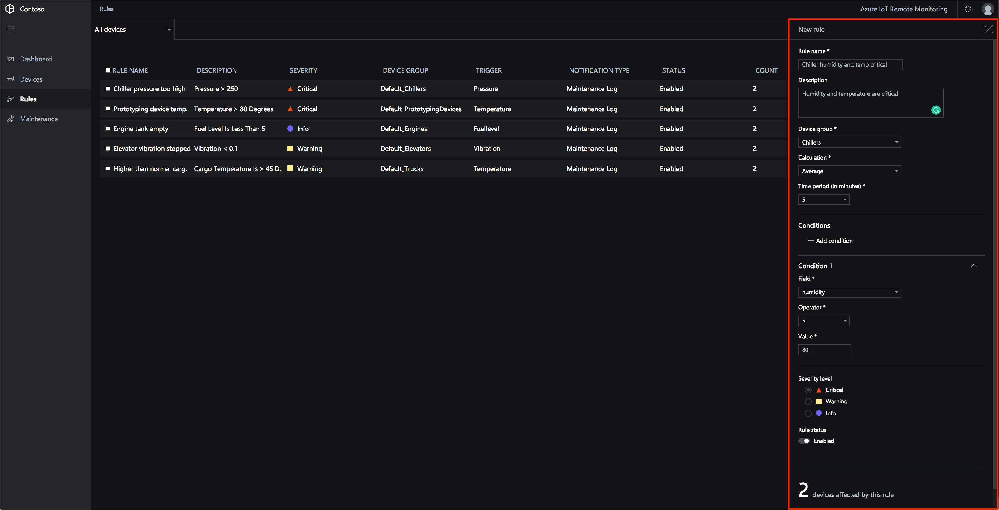
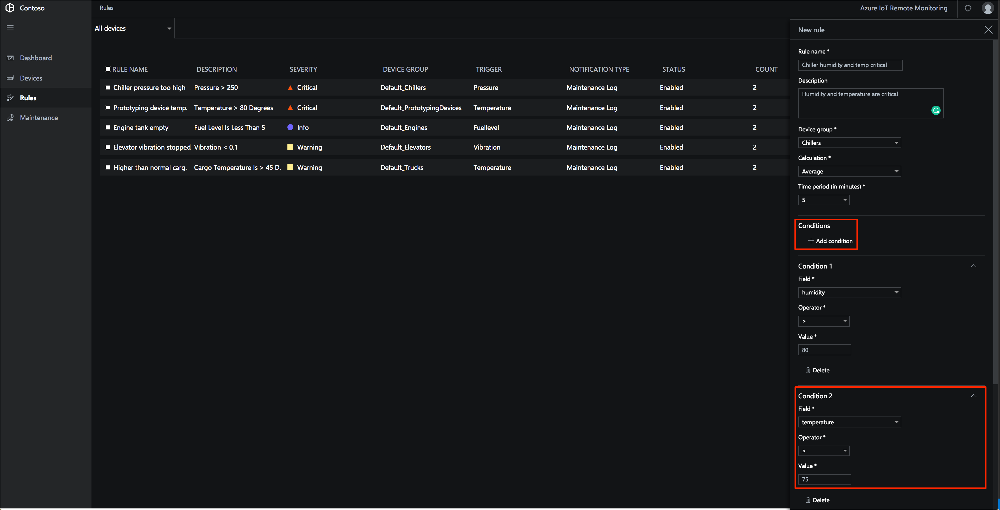
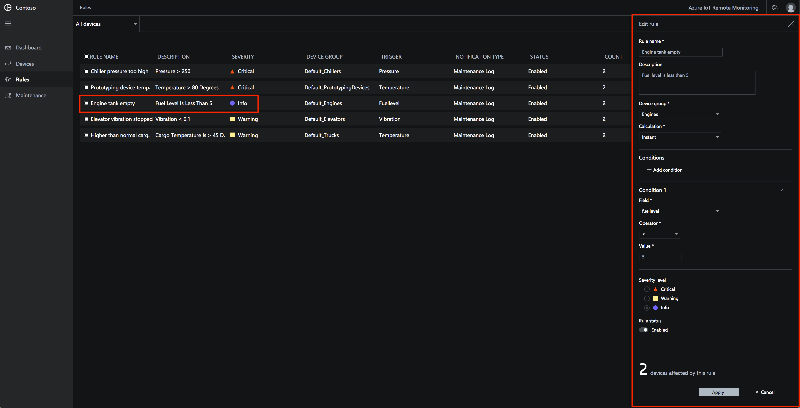

# Detect issues using threshold-based rules

This tutorial shows the capabilities of the rules engine in the Remote Monitoring solution. To introduce these capabilities, the tutorial uses a scenario in the Contoso IoT application.

Contoso has a rule that generates a critical alert when the pressure reported by a **Chiller** device exceeds 250 PSI. As an operator, you want to identify **Chiller** devices that may have problematic sensors by looking for initial pressure spikes. To identify these devices, you create a rule to generate a warning when the pressure exceeds 150 PSI.

You have also been told that a critical alert needs to be triggered when the average humidity of the **Chiller** device in the past 5 minutes is greater than 80% and the temperature of the **Chiller** device in the past 5 minutes is greater than 75 degrees fahrenheit.

In this tutorial, you learn how to:

>[!div class="checklist"]
> * View the rules in your solution
> * Create a new rule
> * Create a new rule with multiple conditions
> * Edit an existing rule
> * Delete a rule

## Prerequisites

To follow this tutorial, you need a deployed instance of the Remote Monitoring solution in your Azure subscription.

If you haven't deployed the Remote Monitoring solution yet, you should complete the [Deploy the Remote Monitoring solution accelerator](iot-accelerators-remote-monitoring-deploy.md) tutorial.

## View the rules in your solution

The **Rules** page in the solution displays a list of all the current rules:

To view only the rules that apply to **Chiller** devices, apply a filter:

You can view more information about a rule and edit it when you select it in the list:

To disable, enable, or delete one or more rules, select multiple rules in the list:

## Create a new rule

To add a new rule that generates a warning when the pressure in a **Chiller** device exceeds 150 PSI, choose **New rule**:

Use the following values to create the rule:

| Setting          | Value                                 |
| ---------------- | ------------------------------------- |
| Rule name        | Chiller warning                       |
| Description      | Chiller pressure has exceeded 150 PSI |
| Device group     | **Chillers** device group             |
| Calculation      | Instant                               |
| Condition 1 Field| pressure                              |
| Condition 1 operator | Greater than                      |
| Condition 1 value    | 150                               |
| Serverity level  | Warning                               |

To save the new rule, choose **Apply**.

You can view when the rule is triggered on the **Rules** page or on the **Dashboard** page.

## Create a new rule with multiple conditions

To create a new rule with multiple conditions that generates a critical alert when the average humidity of the **Chiller** device in the past 5 minutes is greater than 80% and the temperature of the **Chiller** device in the past 5 minutes is greater than 75 degrees fahrenheit, choose **New rule**:

Use the following values to create the rule:

| Setting          | Value                                 |
| ---------------- | ------------------------------------- |
| Rule name        | Chiller humidity and temp critical    |
| Description      | Humidity and temperature are critical |
| Device group     | **Chillers** device group             |
| Calculation      | Average                               |
| Time period      | 5                                     |
| Condition 1 Field| humidity                              |
| Condition 1 operator | Greater than                      |
| Condition 1 value    | 80                               |
| Serverity level  | Critical                              |

To add the second condition, click on "+ Add condition".

Use the following values on the new condition:

| Setting          | Value                                 |
| ---------------- | ------------------------------------- |
| Condition 2 Field| temperature                           |
| Condition 2 operator | Greater than                      |
| Condition 2 value    | 75                                |

To save the new rule, choose **Apply**.

You can view when the rule is triggered on the **Rules** page or on the **Dashboard** page.

## Edit an existing rule

To make a change to an existing rule, select it in the list of rules.

<!--## Disable a rule

To temporarily switch off a rule, you can disable it in the list of rules. Choose the rule to disable, and then choose **Disable**. The **Status** of the rule in the list changes to indicate the rule is now disabled. You can re-enable a rule that you previously disabled using the same procedure.

You can enable and disable multiple rules at the same time if you select multiple rules in the list.-->

<!--## Delete a rule

To permanently delete a rule, choose the rule in the list of rules and then choose **Delete**.

You can delete multiple rules at the same time if you select multiple rules in the list.-->

## Next steps

This tutorial showed you how to:

<!-- Repeat task list from intro -->
>[!div class="checklist"]
> * View the rules in your solution
> * Create a new rule
> * Edit an existing rule
> * Delete a rule

Now that you have learned how to detect issues using threshold-based rules, the suggested next steps are to learn how to:

* [Manage and configure your devices](iot-accelerators-remote-monitoring-manage.md).
* [Troubleshoot and remediate device issues](iot-accelerators-remote-monitoring-maintain.md).
* [Test your solution with simulated devices](iot-accelerators-remote-monitoring-test.md).

<!-- Next tutorials in the sequence -->