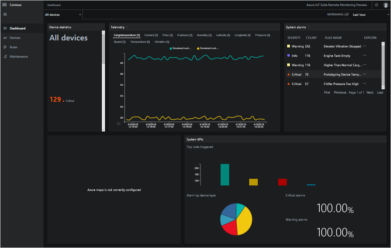
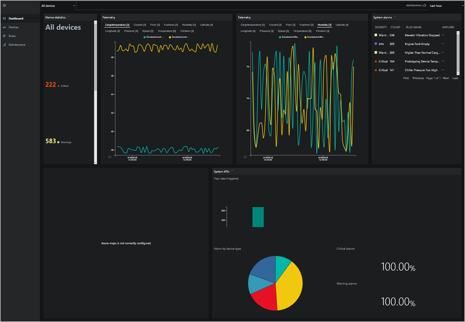
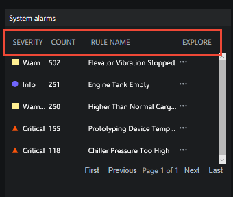
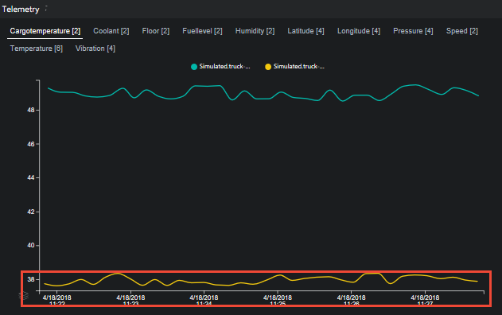
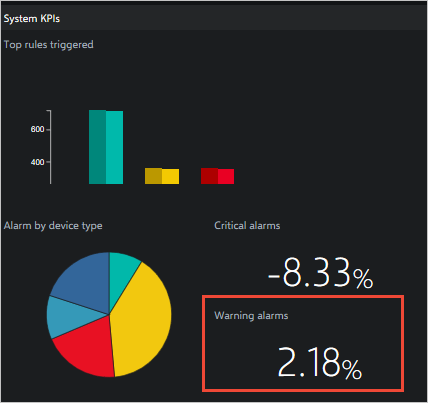

# Customize the Remote Monitoring solution accelerator

This article provides information about how you can access the source code and customize the Remote Monitoring solution accelerator UI.

[!INCLUDE [cloud-shell-try-it.md](../../includes/cloud-shell-try-it.md)]

## Prepare a local development environment for the UI

The Remote Monitoring solution accelerator UI code is implemented using the React.js framework. You can find the source code in the [azure-iot-pcs-remote-monitoring-webui](https://github.com/Azure/azure-iot-pcs-remote-monitoring-webui) GitHub repository.

To make changes to the UI, you can run a copy of it locally. To complete actions such as retrieving telemetry, the local copy connects to a deployed instance of the solution.

The following steps outline the process to set up a local environment for UI development:

1. Deploy a **basic** instance of the solution accelerator using the **pcs** CLI. Make a note of the name of your deployment and the credentials you provided for the virtual machine. For more information, see [Deploy using the CLI](iot-accelerators-remote-monitoring-deploy-cli.md).

1. To enable SSH access to the virtual machine that hosts the microservices in your solution, use the Azure portal or the Azure Cloud Shell. For example:

    ```azurecli-interactive
    az network nsg rule update --name SSH --nsg-name {your solution name}-nsg --resource-group {your solution name} --access Allow
    ```

    Only enable SSH access during test and development. If you enable SSH, [you should disable it as soon as you're finished using it](../security/azure-security-network-security-best-practices.md#disable-rdpssh-access-to-virtual-machines).

1. Use the Azure portal or the Azure Cloud Shell to find the name and public IP address of your virtual machine. For example:

    ```azurecli-interactive
    az resource list --resource-group {your solution name} -o table
    az vm list-ip-addresses --name {your vm name from previous command} --resource-group {your solution name} -o table
    ```

1. Use SSH to connect to your virtual machine. Use the IP address from the previous step, and the credentials you provided when you ran **pcs** to deploy the solution. The `ssh` command is available in the Azure Cloud Shell.

1. To allow the local UX to connect, run the following commands at the bash shell in the virtual machine:

    ```sh
    cd /app
    sudo ./start.sh --unsafe
    ```

1. After you see the command completes and the web site starts, you can disconnect from the virtual machine.

1. In your local copy of the [azure-iot-pcs-remote-monitoring-webui](https://github.com/Azure/azure-iot-pcs-remote-monitoring-webui) repository, edit the **.env** file to add the URL of your deployed solution:

    ```config
    NODE_PATH = src/
    REACT_APP_BASE_SERVICE_URL=https://{your solution name}.azurewebsites.net/
    ```

1. At a command prompt, navigate to your local copy of the `azure-iot-pcs-remote-monitoring-webui` folder.

1. To install the required libraries and run the UI locally, run the following commands:

    ```cmd/sh
    npm install
    npm start
    ```

1. The previous command runs the UI locally at http:\//localhost:3000/dashboard. You can edit the code while the site is running and see it update dynamically.

## Customize the layout

Each page in the Remote Monitoring solution is composed of a set of controls, referred to as *panels* in the source code. The **Dashboard** page is made up of five panels: Overview, Map, Alerts, Telemetry, and Analytics. You can find the source code that defines each page and its panels in the [pcs-remote-monitoring-webui](https://github.com/Azure/pcs-remote-monitoring-webui) GitHub repository. For example, the code that defines the **Dashboard** page, its layout, and the panels on the page is located in the [src/components/pages/dashboard](https://github.com/Azure/pcs-remote-monitoring-webui/tree/master/src/components/pages/dashboard) folder.

Because the panels manage their own layout and sizing, you can easily modify the layout of a page. Make the following changes to the **PageContent** element in the `src/components/pages/dashboard/dashboard.js` file to:

* Swap the positions of the map and telemetry panels.
* Change the relative widths of the map and analytics panels.

```javascript
<PageContent className="dashboard-container">
  <Grid>
    <Cell className="col-1 devices-overview-cell">
      <OverviewPanel
        activeDeviceGroup={activeDeviceGroup}
        openWarningCount={openWarningCount}
        openCriticalCount={openCriticalCount}
        onlineDeviceCount={onlineDeviceCount}
        offlineDeviceCount={offlineDeviceCount}
        isPending={analyticsIsPending || devicesIsPending}
        error={deviceGroupError || devicesError || analyticsError}
        t={t} />
    </Cell>
    <Cell className="col-6">
      <TelemetryPanel
        timeSeriesExplorerUrl={timeSeriesParamUrl}
        telemetry={telemetry}
        isPending={telemetryIsPending}
        lastRefreshed={lastRefreshed}
        error={deviceGroupError || telemetryError}
        theme={theme}
        colors={chartColorObjects}
        t={t} />
    </Cell>
    <Cell className="col-3">
      <AlertsPanel
        alerts={currentActiveAlertsWithName}
        isPending={analyticsIsPending || rulesIsPending}
        error={rulesError || analyticsError}
        t={t}
        deviceGroups={deviceGroups} />
    </Cell>
    <Cell className="col-4">
      <PanelErrorBoundary msg={t('dashboard.panels.map.runtimeError')}>
        <MapPanel
          analyticsVersion={analyticsVersion}
          azureMapsKey={azureMapsKey}
          devices={devices}
          devicesInAlert={devicesInAlert}
          mapKeyIsPending={azureMapsKeyIsPending}
          isPending={devicesIsPending || analyticsIsPending}
          error={azureMapsKeyError || devicesError || analyticsError}
          t={t} />
      </PanelErrorBoundary>
    </Cell>
    <Cell className="col-6">
      <AnalyticsPanel
        timeSeriesExplorerUrl={timeSeriesParamUrl}
        topAlerts={topAlertsWithName}
        alertsPerDeviceId={alertsPerDeviceType}
        criticalAlertsChange={criticalAlertsChange}
        isPending={analyticsIsPending || rulesIsPending || devicesIsPending}
        error={devicesError || rulesError || analyticsError}
        theme={theme}
        colors={chartColorObjects}
        t={t} />
    </Cell>
    {
      Config.showWalkthroughExamples &&
      <Cell className="col-4">
        <ExamplePanel t={t} />
      </Cell>
    }
  </Grid>
</PageContent>
```



You can also add several instances of the same panel, or several versions if you [duplicate and customize a panel](#duplicate-and-customize-an-existing-control). The following example shows you how to add two instances of the telemetry panel. To make these changes, edit the `src/components/pages/dashboard/dashboard.js` file:

```javascript
<PageContent className="dashboard-container">
  <Grid>
    <Cell className="col-1 devices-overview-cell">
      <OverviewPanel
        activeDeviceGroup={activeDeviceGroup}
        openWarningCount={openWarningCount}
        openCriticalCount={openCriticalCount}
        onlineDeviceCount={onlineDeviceCount}
        offlineDeviceCount={offlineDeviceCount}
        isPending={analyticsIsPending || devicesIsPending}
        error={deviceGroupError || devicesError || analyticsError}
        t={t} />
    </Cell>
    <Cell className="col-3">
      <TelemetryPanel
        timeSeriesExplorerUrl={timeSeriesParamUrl}
        telemetry={telemetry}
        isPending={telemetryIsPending}
        lastRefreshed={lastRefreshed}
        error={deviceGroupError || telemetryError}
        theme={theme}
        colors={chartColorObjects}
        t={t} />
    </Cell>
    <Cell className="col-3">
      <TelemetryPanel
        timeSeriesExplorerUrl={timeSeriesParamUrl}
        telemetry={telemetry}
        isPending={telemetryIsPending}
        lastRefreshed={lastRefreshed}
        error={deviceGroupError || telemetryError}
        theme={theme}
        colors={chartColorObjects}
        t={t} />
    </Cell>
    <Cell className="col-3">
      <AlertsPanel
        alerts={currentActiveAlertsWithName}
        isPending={analyticsIsPending || rulesIsPending}
        error={rulesError || analyticsError}
        t={t}
        deviceGroups={deviceGroups} />
    </Cell>
    <Cell className="col-4">
      <PanelErrorBoundary msg={t('dashboard.panels.map.runtimeError')}>
        <MapPanel
          analyticsVersion={analyticsVersion}
          azureMapsKey={azureMapsKey}
          devices={devices}
          devicesInAlert={devicesInAlert}
          mapKeyIsPending={azureMapsKeyIsPending}
          isPending={devicesIsPending || analyticsIsPending}
          error={azureMapsKeyError || devicesError || analyticsError}
          t={t} />
      </PanelErrorBoundary>
    </Cell>
    <Cell className="col-6">
      <AnalyticsPanel
        timeSeriesExplorerUrl={timeSeriesParamUrl}
        topAlerts={topAlertsWithName}
        alertsPerDeviceId={alertsPerDeviceType}
        criticalAlertsChange={criticalAlertsChange}
        isPending={analyticsIsPending || rulesIsPending || devicesIsPending}
        error={devicesError || rulesError || analyticsError}
        theme={theme}
        colors={chartColorObjects}
        t={t} />
    </Cell>
    {
      Config.showWalkthroughExamples &&
      <Cell className="col-4">
        <ExamplePanel t={t} />
      </Cell>
    }
  </Grid>
</PageContent>
```

You can then view different telemetry in each panel:



## Duplicate and customize an existing control

The following steps outline how to duplicate an existing panel, modify it, and then use the modified version. The steps use the **alerts** panel as an example:

1. In your local copy of the repository, make a copy of the **alerts** folder in the `src/components/pages/dashboard/panels` folder. Name the new copy **cust_alerts**.

1. In the **alertsPanel.js** file in the **cust_alerts** folder, edit the name of the class to be **CustAlertsPanel**:

    ```javascript
    export class CustAlertsPanel extends Component {
    ```

1. Add the following line to the `src/components/pages/dashboard/panels/index.js` file:

    ```javascript
    export * from './cust_alerts';
    ```

1. Replace `alertsPanel` with `CustAlertsPanel` in the `src/components/pages/dashboard/dashboard.js` file:

    ```javascript
    import {
      OverviewPanel,
      CustAlertsPanel,
      TelemetryPanel,
      KpisPanel,
      MapPanel,
      transformTelemetryResponse,
      chartColors
    } from './panels';

    ...

    <Cell className="col-3">
      <CustAlertsPanel
        alerts={currentActivealertsWithName}
        isPending={kpisIsPending || rulesIsPending}
        error={rulesError || kpisError}
        t={t} />
    </Cell>
    ```

You've now replaced the original **alerts** panel with a copy called **CustAlerts**. This copy is the same as the original. You can now modify the copy. For example, to change the column ordering in the **alerts** panel:

1. Open the `src/components/pages/dashboard/panels/cust_alerts/alertsPanel.js` file.

1. Modify the column definitions as shown in the following code snippet:

    ```javascript
    this.columnDefs = [
      rulesColumnDefs.severity,
      {
        headerName: 'rules.grid.count',
        field: 'count'
      },
      {
        ...rulesColumnDefs.ruleName,
        minWidth: 200
      },
      rulesColumnDefs.explore
    ];
    ```

The following screenshot shows the new version of the **alerts** panel:



## Customize the telemetry chart

The files in the `src/components/pages/dashboard/panels/telemtry` folder define the telemetry chart on the **Dashboard** page. The UI retrieves the telemetry from the solution back end in the `src/services/telemetryService.js` file. The following steps show you how to change the time period displayed on the telemetry chart from 15 to 5 minutes:

1. In the `src/services/telemetryService.js` file, locate the function called **getTelemetryByDeviceIdP15M**. Make a copy of this function and modify the copy as follows:

    ```javascript
    static getTelemetryByDeviceIdP5M(devices = []) {
      return TelemetryService.getTelemetryByMessages({
        from: 'NOW-PT5M',
        to: 'NOW',
        order: 'desc',
        devices
      });
    }
    ```

1. To use this new function to populate the telemetry chart, open the `src/components/pages/dashboard/dashboard.js` file. Locate the line that initializes the telemetry stream and modify it as follows:

    ```javascript
    const getTelemetryStream = ({ deviceIds = [] }) => TelemetryService.getTelemetryByDeviceIdP5M(deviceIds)
    ```

The telemetry chart now shows the five minutes of telemetry data:



## Add a new KPI

The **Dashboard** page displays KPIs in the **Analytics** panel. These KPIs are calculated in the `src/components/pages/dashboard/dashboard.js` file. The KPIs are rendered by the `src/components/pages/dashboard/panels/analytics/analyticsPanel.js` file. The following steps describe how to calculate and render a new KPI value on the **Dashboard** page. The example shown is to add a new percentage change in warning alerts KPI:

1. Open the `src/components/pages/dashboard/dashboard.js` file. Modify the **initialState** object to include a **warningAlertsChange** property as follows:

    ```javascript
    const initialState = {
      ...

      // Analytics data
      analyticsVersion: 0,
      currentActiveAlerts: [],
      topAlerts: [],
      alertsPerDeviceId: {},
      criticalAlertsChange: 0,
      warningAlertsChange: 0,
      analyticsIsPending: true,
      analyticsError: null

      ...
    };
    ```

1. Modify the **currentAlertsStats** object to include **totalWarningCount** as a property:

    ```javascript
    return {
      openWarningCount: (acc.openWarningCount || 0) + (isWarning && isOpen ? 1 : 0),
      openCriticalCount: (acc.openCriticalCount || 0) + (isCritical && isOpen ? 1 : 0),
      totalWarningCount: (acc.totalWarningCount || 0) + (isWarning ? 1 : 0),
      totalCriticalCount: (acc.totalCriticalCount || 0) + (isCritical ? 1 : 0),
      alertsPerDeviceId: updatedAlertsPerDeviceId
    };
    ```

1. Calculate the new KPI. Find the calculation for the critical alerts count. Duplicate the code and modify the copy as follows:

    ```javascript
    // ================== Warning Alerts Count - START
    const currentWarningAlerts = currentAlertsStats.totalWarningCount;
    const previousWarningAlerts = previousAlerts.reduce(
      (cnt, { severity }) => severity === Config.ruleSeverity.warning ? cnt + 1 : cnt,
      0
    );
    const warningAlertsChange = ((currentWarningAlerts - previousWarningAlerts) / currentWarningAlerts * 100).toFixed(2);
    // ================== Warning Alerts Count - END
    ```

1. Include the new **warningAlertsChange** KPI in the KPI stream:

    ```javascript
    return ({
      analyticsIsPending: false,
      analyticsVersion: this.state.analyticsVersion + 1,

      // Analytics data
      currentActiveAlerts,
      topAlerts,
      criticalAlertsChange,
      warningAlertsChange,
      alertsPerDeviceId: currentAlertsStats.alertsPerDeviceId,

      ...
    });
    ```

1. Include the new **warningAlertsChange** KPI in the state data used to render the UI:

    ```javascript
    const {
      ...

      analyticsVersion,
      currentActiveAlerts,
      topAlerts,
      alertsPerDeviceId,
      criticalAlertsChange,
      warningAlertsChange,
      analyticsIsPending,
      analyticsError,

      ...
    } = this.state;
    ```

1. Update the data passed to the KPIs panel:

    ```javascript
    <AnalyticsPanel
      timeSeriesExplorerUrl={timeSeriesParamUrl}
      topAlerts={topAlertsWithName}
      alertsPerDeviceId={alertsPerDeviceType}
      criticalAlertsChange={criticalAlertsChange}
      warningAlertsChange={warningAlertsChange}
      isPending={analyticsIsPending || rulesIsPending || devicesIsPending}
      error={devicesError || rulesError || analyticsError}
      theme={theme}
      colors={chartColorObjects}
      t={t} />
    ```

You've now finished the changes in the `src/components/pages/dashboard/dashboard.js` file. The following steps describe the changes to make in the `src/components/pages/dashboard/panels/analytics/analyticsPanel.js` file to display the new KPI:

1. Modify the following line of code to retrieve the new KPI value as follows:

    ```javascript
    const { t, isPending, criticalAlertsChange, warningAlertsChange, alertsPerDeviceId, topAlerts, timeSeriesExplorerUrl, error } = this.props;
    ```

1. Modify the markup to display the new KPI value as follows:

    ```javascript
    <div className="analytics-cell">
      <div className="analytics-header">{t('dashboard.panels.analytics.criticalAlerts')}</div>
      <div className="critical-alerts">
        {
          !showOverlay &&
            <div className="analytics-percentage-container">
              <div className="analytics-value">{ !isNaN(criticalAlertsChange) ? criticalAlertsChange : 0 }</div>
              <div className="analytics-percentage-sign">%</div>
            </div>
        }
      </div>
      <div className="critical-alerts">
        {
          !showOverlay &&
            <div className="analytics-percentage-container">
              <div className="analytics-value">{ !isNaN(warningAlertsChange) ? warningAlertsChange : 0 }</div>
              <div className="analytics-percentage-sign">%</div>
            </div>
        }
      </div>
    </div>
    ```

The **Dashboard** page now displays the new KPI value:



## Customize the map

See the [Customize map](https://github.com/Azure/azure-iot-pcs-remote-monitoring-dotnet/wiki/Developer-Reference-Guide#upgrade-map-key-to-see-devices-on-a-dynamic-map) page in GitHub for details of the map components in the solution.

<!--
### Connect an external visualization tool

See the [Connect an external visualization tool](https://github.com/Azure/azure-iot-pcs-remote-monitoring-dotnet/) page in GitHub for details of how to connect an external visualization tool.

-->

## Other customization options

To further modify the presentation and visualizations layer in the Remote Monitoring solution, you can edit the code. The relevant GitHub repositories are:

* [The configuration microservice for Azure IoT Solutions (.NET)](https://github.com/Azure/remote-monitoring-services-dotnet/tree/master/config)
* [The configuration microservice for Azure IoT Solutions  (Java)](https://github.com/Azure/remote-monitoring-services-java/tree/master/config)
* [Azure IoT PCS Remote Monitoring Web UI](https://github.com/Azure/pcs-remote-monitoring-webui)

## Next steps

In this article, you learned about the resources available to help you customize the web UI in the Remote Monitoring solution accelerator. To learn more about customizing the UI, see the following articles:

* [Add a custom page to the Remote Monitoring solution accelerator web UI](iot-accelerators-remote-monitoring-customize-page.md)
* [Add a custom service to the Remote Monitoring solution accelerator web UI](iot-accelerators-remote-monitoring-customize-service.md)
* [Add a custom grid to the Remote Monitoring solution accelerator web UI](iot-accelerators-remote-monitoring-customize-grid.md)
* [Add a custom flyout to the Remote Monitoring solution accelerator web UI](iot-accelerators-remote-monitoring-customize-flyout.md)
* [Add a custom panel to the dashboard in the Remote Monitoring solution accelerator web UI](iot-accelerators-remote-monitoring-customize-panel.md)

For more conceptual information about the Remote Monitoring solution accelerator, see [Remote Monitoring architecture](iot-accelerators-remote-monitoring-sample-walkthrough.md)

For more information about customizing the Remote Monitoring solution microservices, see [Customize and redeploy a microservice](iot-accelerators-microservices-example.md).
<!-- Next tutorials in the sequence -->
