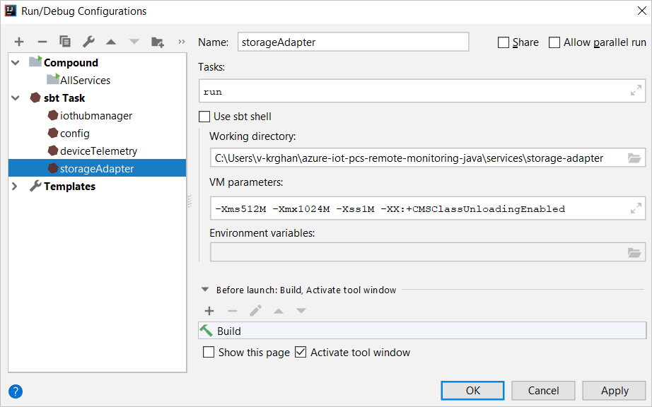
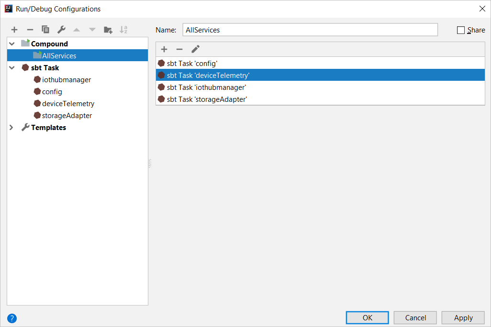

# Deploy the Remote Monitoring solution accelerator locally - IntelliJ

[!INCLUDE [iot-accelerators-selector-local](../../includes/iot-accelerators-selector-local.md)]

This article shows you how to deploy the Remote Monitoring solution accelerator to your local machine for testing and development. You'll learn how to run the microservices in IntelliJ. A local microservices deployment will use the following cloud services: IoT Hub, Azure Cosmos DB, Azure Streaming Analytics, and Azure Time Series Insights.

If you want to run the Remote Monitoring solution accelerator in Docker on your local machine, see [Deploy the Remote Monitoring solution accelerator locally - Docker](iot-accelerators-remote-monitoring-deploy-local-docker.md).

## Prerequisites

To deploy the Azure services used by the Remote Monitoring solution accelerator, you need an active Azure subscription.

If you don’t have an account, you can create a free trial account in just a couple of minutes. For details, see [Azure Free Trial](https://azure.microsoft.com/pricing/free-trial/).

### Machine setup

To complete the local deployment, you need the following tools installed on your local development machine:

* [Git](https://git-scm.com/)
* [Docker](https://www.docker.com)
* [Java 8](https://www.oracle.com/technetwork/java/javase/downloads/index.html)
* [IntelliJ Community Edition](https://www.jetbrains.com/idea/download/)
* [IntelliJ Scala plugin](https://plugins.jetbrains.com/plugin/1347-scala)
* [IntelliJ SBT plugin](https://plugins.jetbrains.com/plugin/5007-sbt)
* [IntelliJ SBT Executor plugin](https://plugins.jetbrains.com/plugin/7247-sbt-executor)
* [Nginx](https://nginx.org/en/download.html)
* [Node.js v8](https://nodejs.org/)

Node.js v8 is a prerequisite for the PCS CLI that the scripts use to create Azure resources. Don't use Node.js v10.

> [!NOTE]
> IntelliJ IDE is available for Windows and Mac.

## Download the source code

The Remote Monitoring source code repositories include the source code and the Docker configuration files you need to run the microservices Docker images.

To clone and create a local version of the repository, use your command-line environment to go to a suitable folder on your local machine. Then run one of the following sets of commands to clone the Java repository:

* To download the latest version of the Java microservice implementations, run the following command:

  ```cmd/sh
  git clone --recurse-submodules https://github.com/Azure/azure-iot-pcs-remote-monitoring-java.git
  ```

* To retrieve the latest submodules, run the following commands:

   ```cmd/sh
   cd azure-iot-pcs-remote-monitoring-java
   git submodule foreach git pull origin master
    ```

> [!NOTE]
> These commands download the source code for all the microservices in addition to the scripts you use to run the microservices locally. You don't need the source code to run the microservices in Docker. But the source code is useful if you later plan to modify the solution accelerator and test your changes locally.

## Deploy the Azure services

Although this article shows you how to run the microservices locally, they depend on Azure services running in the cloud. Use the following script to deploy the Azure services. The script examples assume you're using the Java repository on a Windows machine. If you're working in another environment, adjust the paths, file extensions, and path separators appropriately.

### Create new Azure resources

If you've not yet created the required Azure resources, follow these steps:

1. In your command-line environment, go to the **\services\scripts\local\launch** folder in your cloned copy of the repository.

1. Run the following commands to install the **pcs** CLI tool and sign in to your Azure account:

    ```cmd
    npm install -g iot-solutions
    pcs login
    ```

1. Run the **start.cmd** script. The script prompts you for the following information:

   * A solution name.
   * The Azure subscription to use.
   * The location of the Azure datacenter to use.

   The script creates a resource group in Azure that has your solution name. This resource group contains the Azure resources that the solution accelerator uses. You can delete this resource group after you no longer need the corresponding resources.

   The script also adds a set of environment variables to your local machine. Each variable name has the prefix **PCS**. These environment variables provide details that let Remote Monitoring read its configuration values from an Azure Key Vault resource.

   > [!TIP]
   > When the script finishes, it saves the environment variables to a file called **\<your home folder\>\\.pcs\\\<solution name\>.env**. You can use them for future solution-accelerator deployments. Note that any environment variables set on your local machine override the values in the **services\\scripts\\local\\.env** file when you run **docker-compose**.

1. Close your command-line environment.

### Use existing Azure resources

If you've already created the required Azure resources, set the corresponding environment variables on your local machine:
* **PCS_KEYVAULT_NAME**: The name of the Key Vault resource.
* **PCS_AAD_APPID**: The Azure Active Directory (Azure AD) application ID.
* **PCS_AAD_APPSECRET**: The Azure AD application secret.

Configuration values will be read from this Key Vault resource. These environment variables can be saved in the **\<your home folder\>\\.pcs\\\<solution name\>.env** file from the deployment. Note that environment variables set on your local machine override values in the **services\\scripts\\local\\.env** file when you run **docker-compose**.

Some of the configuration needed by the microservice is stored in an instance of Key Vault that was created on initial deployment. The corresponding variables in the key vault should be modified as needed.

## Run the microservices

In this section, you run the Remote Monitoring microservices. You run:

* The web UI natively.
* The Azure IoT Device Simulation, Auth, and Azure Stream Analytics Manager services in Docker.
* The microservices in IntelliJ.

### Run the Device Simulation service

Open a new Command Prompt window. Check that you have access to the environment variables set by the **start.cmd** script in the previous section.

Run the following command to open the Docker container for the Device Simulation service. The service simulates devices for the Remote Monitoring solution.

```cmd
<path_to_cloned_repository>\services\device-simulation\scripts\docker\run.cmd
```

### Run the Auth service

Open a new Command Prompt window, and then run the following command to open the Docker container for the Auth service. By using this service, you can manage the users who are authorized to access Azure IoT solutions.

```cmd
<path_to_cloned_repository>\services\auth\scripts\docker\run.cmd
```

### Run the Stream Analytics Manager service

Open a new Command Prompt window, and then run the following command to open the Docker container for the Stream Analytics Manager service. With this service, you can manage Stream Analytics jobs. Such management includes setting job configuration and starting, stopping, and monitoring job status.

```cmd
<path_to_cloned_repository>\services\asa-manager\scripts\docker\run.cmd
```

### Deploy all other microservices on your local machine

The following steps show you how to run the Remote Monitoring microservices in IntelliJ.

#### Import a project

1. Open the IntelliJ IDE.
1. Select **Import Project**.
1. Choose **azure-iot-pcs-remote-monitoring-java\services\build.sbt**.

#### Create run configurations

1. Select **Run** > **Edit Configurations**.
1. Select **Add New Configuration** > **sbt task**.
1. Enter **Name**, and then enter **Tasks** as **run**.
1. Select the **Working Directory** based on the service you want to run.
1. Select **Apply** > **OK** to save your choices.
1. Create run configurations for the following web services:
    * WebService (services\config)
    * WebService (services\device-telemetry)
    * WebService (services\iothub-manager)
    * WebService (services\storage-adapter)

As an example, the following image shows how to add a configuration for a service:

[](./media/deploy-locally-intellij/run-configurations.png#lightbox)

#### Create a compound configuration

1. To run all the services together, select **Add new Configuration** > **Compound**.
1. Enter **Name**, and then select **add sbt tasks**.
1. Select **Apply** > **OK** to save your choices.

As an example, the following image shows how to add all sbt tasks to a single configuration:

[](./media/deploy-locally-intellij/all-services.png#lightbox)

Select **Run** to build and run the web services on the local machine.

Each web service opens a Command Prompt window and web browser window. At the command prompt, you see output from the running service. The browser window lets you monitor the status. Don't close the Command Prompt windows or webpages, as these actions stop the web service.

To access the status of the services, go to the following URLs:

* IoT-Hub Manager: [http://localhost:9002/v1/status](http://localhost:9002/v1/status)
* Device Telemetry: [http://localhost:9004/v1/status](http://localhost:9004/v1/status)
* config: [http://localhost:9005/v1/status](http://localhost:9005/v1/status)
* storage-adapter: [http://localhost:9022/v1/status](http://localhost:9022/v1/status)

### Start the Stream Analytics job

Follow these steps to start the Stream Analytics job:

1. Go to the [Azure portal](https://portal.azure.com).
1. Go to the **Resource group** created for your solution. The name of the resource group is the name you chose for your solution when you ran the **start.cmd** script.
1. Select the **Stream Analytics job** in the list of resources.
1. On the Stream Analytics job **overview** page, select the **Start** button, and then select **Start** to start the job.

### Run the web UI

In this step, you start the web UI. Open a new Command Prompt window. Check that you have access to the environment variables set by the **start.cmd** script. Go to the **webui** folder in your local copy of the repository, and then run the following commands:

```cmd
npm install
npm start
```

When the **start** command is completed, your browser displays the page at the address [http://localhost:3000/dashboard](http://localhost:3000/dashboard). The errors on this page are expected. To view the application without errors, complete the following steps.

### Configure and run Nginx

Set up a reverse proxy server that links the web application to the microservices running on your local machine:

1. Copy the **nginx.conf** file from the **webui\scripts\localhost** folder in your local copy of the repository to the **nginx\conf** installation directory.
1. Run Nginx.

For more information about running Nginx, see [nginx for Windows](https://nginx.org/en/docs/windows.html).

### Connect to the dashboard

To access the Remote Monitoring solution dashboard, go to http://localhost:9000 in your browser.

## Clean up

To avoid unnecessary charges, remove the cloud services from your Azure subscription after you've finished your testing. To remove the services, go to the [Azure portal](https://ms.portal.azure.com), and delete the resource group that the **start.cmd** script created.

You can also delete the local copy of the Remote Monitoring repository that was created when you cloned the source code from GitHub.

## Next steps

Now that you've deployed the Remote Monitoring solution, the next step is to [explore the capabilities of the solution dashboard](quickstart-remote-monitoring-deploy.md).
