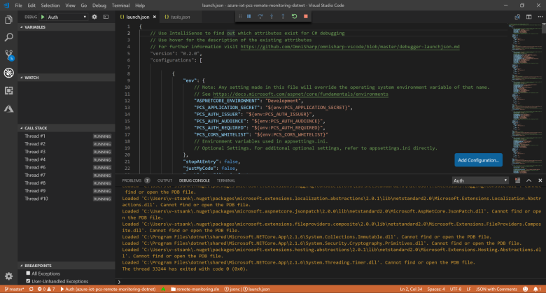

# Deploy the Remote Monitoring solution accelerator locally - Visual Studio Code

[!INCLUDE [iot-accelerators-selector-local](../../includes/iot-accelerators-selector-local.md)]

This article shows you how to deploy the Remote Monitoring solution accelerator to your local machine for testing and development. You learn how to run the microservices in Visual Studio Code. A local microservices deployment uses the following cloud services: IoT Hub, Cosmos DB, Azure Streaming Analytics, and Azure Time Series Insights.

## Prerequisites

To deploy the Azure services used by the Remote Monitoring solution accelerator, you need an active Azure subscription.

If you don’t have an account, you can create a free trial account in just a couple of minutes. For details, see [Azure Free Trial](https://azure.microsoft.com/pricing/free-trial/).

### Machine setup

To complete the local deployment, you need the following tools installed on your local development machine:

* [Git](https://git-scm.com/)
* [.NET Core](https://dotnet.microsoft.com/download)
* [Docker](https://www.docker.com)
* [Nginx](https://nginx.org/en/download.html)
* [Visual Studio Code](https://code.visualstudio.com/)
* [VS Code's C# extension](https://code.visualstudio.com/docs/languages/csharp)
* [Node.js v8](https://nodejs.org/) - this software is a prerequisite for the PCS CLI that the scripts use to create Azure resources. Don't use Node.js v10

> [!NOTE]
> Visual Studio Code is available for Windows, Mac and Ubuntu.

[!INCLUDE [iot-accelerators-local-setup](../../includes/iot-accelerators-local-setup.md)]

## Run the microservices

In this section, you run the Remote Monitoring microservices. You run the web UI natively, the Device Simulation service in Docker, and the microservices in Visual Studio Code.

### Build the code

Navigate to azure-iot-pcs-remote-monitoring-dotnet\services in the command prompt and run the following commands to build the code.

```cmd
dotnet restore
dotnet build -c Release
```

### Deploy all other microservices on local machine

The following steps show you how to run the Remote Monitoring microservices in Visual Studio Code:

1. Launch Visual Studio Code.
1. In VS Code, open the **azure-iot-pcs-remote-monitoring-dotnet** folder.
1. Create a new folder called **.vscode** in the **azure-iot-pcs-remote-monitoring-dotnet** folder.
1. Copy the files **launch.json** and **tasks.json** from services\scripts\local\launch\idesettings\vscode to the **.vscode** folder you just created.
1. Open the **Debug panel** in VS Code and run the **Run All microservices** configuration. This configuration runs the device simulation microservice in Docker and runs the other microservices in the debugger.

The output from running **Run All microsoervices** in the Debug Console looks like the following:

[](./media/deploy-locally-vscode/auth-debug-results-expanded.png#lightbox)

### Run the web UI

In this step, you start the web UI. Navigate to **azure-iot-pcs-remote-monitoring-dotnet\webui** folder in your local copy and run the following commands:

```cmd
npm install
npm start
```

When the start is complete, your browser displays the page **http:\//localhost:3000/dashboard**. The errors on this page are expected. To view the application without errors, complete the following step.

### Configure and run NGINX

Set up a reverse proxy server to link the web application and microservices running on your local machine:

* Copy the **nginx.conf** file from the **webui\scripts\localhost** folder to the **nginx\conf** install directory.
* Run **nginx**.

For more information about running **nginx**, see [nginx for Windows](https://nginx.org/en/docs/windows.html).

### Connect to the dashboard

To access the Remote Monitoring solution dashboard, navigate to http:\//localhost:9000 in your browser.

## Clean up

To avoid unnecessary charges, when you've finished your testing remove the cloud services from your Azure subscription. To remove the services, navigate to the [Azure portal](https://ms.portal.azure.com) and delete the resource group that the **start.cmd** script created.

You can also delete the local copy of the Remote Monitoring repository created when you cloned the source code from GitHub.

## Next steps

Now that you've deployed the Remote Monitoring solution, the next step is to [explore the capabilities of the solution dashboard](quickstart-remote-monitoring-deploy.md).
