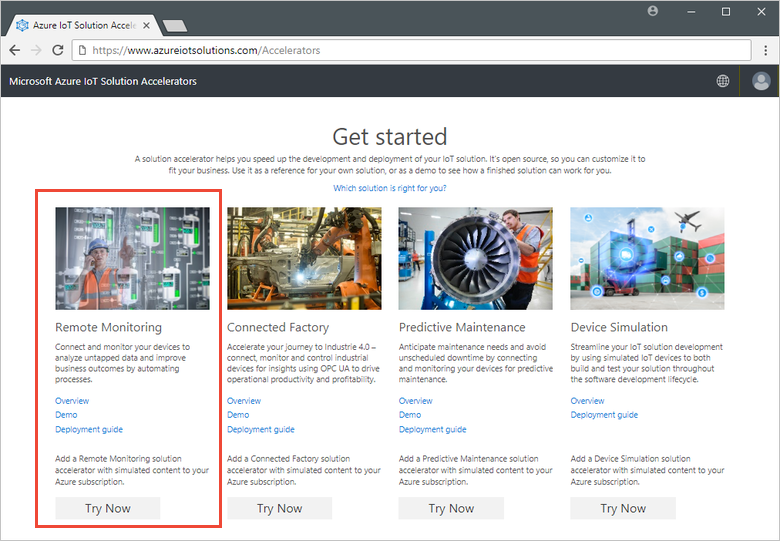
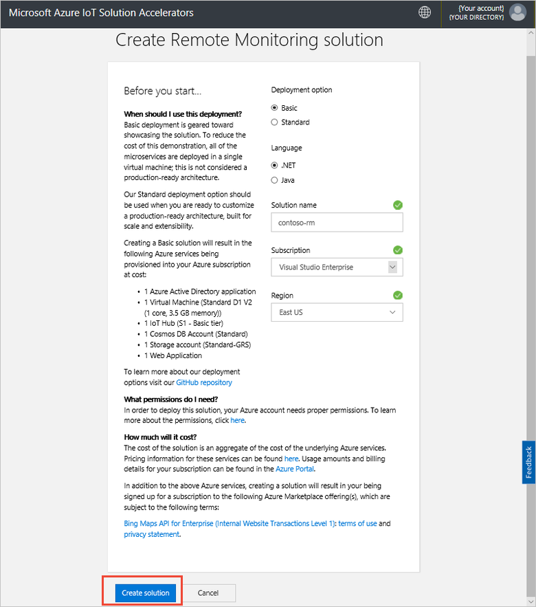
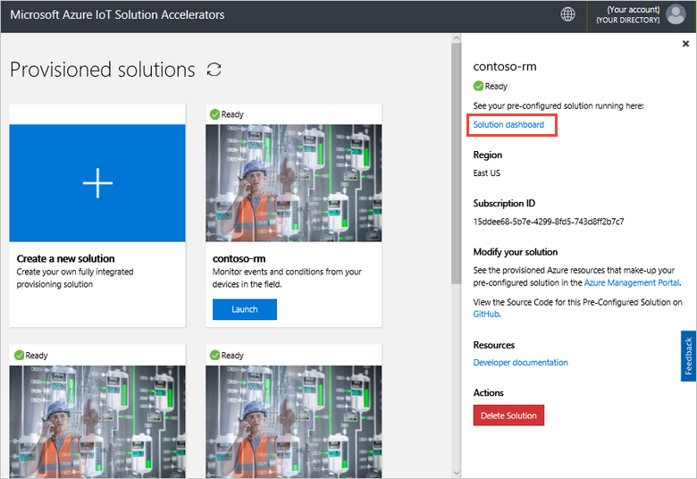

# Deploy the Remote Monitoring solution accelerator

This tutorial shows you how to provision the Remote Monitoring solution accelerator. You deploy the solution from azureiotsuite.com. You can also deploy the solution using the CLI, to learn about this option see [Deploy a solution accelerator from the command line](iot-accelerators-remote-monitoring-deploy-cli.md).

In this tutorial, you learn how to:

> [!div class="checklist"]
> * Configure the solution accelerator
> * Deploy the solution accelerator
> * Sign in to the solution accelerator

## Prerequisites

To complete this tutorial, you need an active Azure subscription.

If you don’t have an account, you can create a free trial account in just a couple of minutes. For details, see [Azure Free Trial](http://azure.microsoft.com/pricing/free-trial/).

## Deploy the solution accelerator

Before you deploy the solution accelerator to your Azure subscription, you must choose some configuration options:

1. Log on to [azureiotsolutions.com](https://www.azureiotsolutions.com/Accelerators) using your Azure account credentials.

1. Click **Try Now** on the **Remote Monitoring** tile.

    

1. On the **Create Remote Monitoring solution** page, enter a **Solution name** for your Remote Monitoring solution accelerator.

1. Select a **Basic** or **Standard** deployment. If you are deploying the solution to learn how it works or to run a demonstration, choose the **Basic** option to minimize costs.

1. Choose either **Java** or **.NET** as the language. All the microservices are available as either Java or .NET implementations.

1. Review the **Solution details** panel for more information about your configuration choices.

1. Select the **Subscription** and **Region** you want to use to provision the solution.

1. Click **Create Solution** to begin the provisioning process. This process typically takes several minutes to run:

    

For troubleshooting information, see [What to do when a deployment fails](https://github.com/Azure/azure-iot-pcs-remote-monitoring-dotnet/wiki/Developer-Troubleshooting-Guide#what-to-do-when-a-deployment-fails) in the GitHub repository.

## Sign in to the solution accelerator

When the provisioning process is complete, you can sign in to your Remote Monitoring solution accelerator.

1. On the **Provisioned solutions** page, choose your new Remote Monitoring solution:

    

1. You can view information about your Remote Monitoring solution in the panel that appears. Choose **Solution dashboard** to connect to your Remote Monitoring solution.

    > [!NOTE]
    > You can delete your Remote Monitoring solution from this panel when you are finished with it.

    

1. The Remote Monitoring solution dashboard displays in your browser.

## Next steps

In this tutorial, you learned how to:

> [!div class="checklist"]
> * Configure the solution accelerator
> * Deploy the solution accelerator
> * Sign in to the solution accelerator

Now that you have deployed the Remote Monitoring solution, the next step is to [explore the capabilities of the solution dashboard](iot-accelerators-remote-monitoring-explore.md).

<!-- Next tutorials in the sequence -->