# Tutorial: Detect anomalies at the edge with the Remote Monitoring solution accelerator

In this tutorial, you configure the Remote Monitoring solution to respond to anomalies detected by an IoT Edge device. IoT Edge devices let you process telemetry at the edge to reduce the volume of telemetry sent to the solution and to enable faster responses to events on devices. To learn more about the benefits of edge processing, see [What is Azure IoT Edge](../iot-edge/about-iot-edge.md).

To introduce edge processing with remote monitoring, this tutorial uses a simulated oil pump jack device. This oil pump jack is managed by an organization called Contoso and is connected to the Remote Monitoring solution accelerator. Sensors on the oil pump jack measure temperature and pressure. Operators at Contoso know that an abnormal increase in temperature can cause the oil pump jack to slow down. Operators at Contoso don't need to monitor the device's temperature when it's within its normal range.

Contoso wants to deploy an intelligent edge module to the oil pump jack that detects temperature anomalies. Another edge module sends alerts to the Remote Monitoring solution. When an alert is received, a Contoso operator can dispatch a maintenance technician. Contoso could also configure an automated action, such as sending an email, to run when the solution receives an alert.

The following diagram shows the key components in the tutorial scenario:

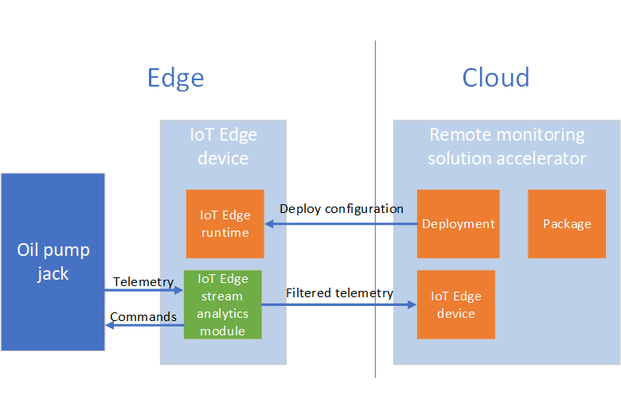

In this tutorial, you:

>[!div class="checklist"]
> * Add an IoT Edge device to the solution
> * Create an Edge manifest
> * Import the manifest as a package that defines the modules to run on the device
> * Deploy the package to your IoT Edge device
> * View alerts from the device

On the IoT Edge device:

* The runtime receives the package and installs the modules.
* The stream analytics module detects temperature anomalies in the pump and sends commands resolve the issue.
* The stream analytics module forwards filtered data to the solution accelerator.

This tutorial uses a Linux virtual machine as an IoT Edge device. You also install an edge module to simulate the oil pump jack device.

If you don't have an Azure subscription, create a [free account](https://azure.microsoft.com/free/?WT.mc_id=A261C142F) before you begin.

[!INCLUDE [iot-accelerators-tutorial-prereqs](../../includes/iot-accelerators-tutorial-prereqs.md)]

[!INCLUDE [cloud-shell-try-it.md](../../includes/cloud-shell-try-it.md)]

## Add an IoT Edge device

There are two steps to add an IoT Edge device to your Remote Monitoring solution accelerator. This section shows you how to use:

* Add an IoT Edge device on the **Device Explorer** page in the Remote Monitoring web UI.
* Install the IoT Edge runtime in a Linux virtual machine (VM).

### Add an IoT Edge device to your solution

To add an IoT Edge device to the Remote Monitoring solution accelerator, navigate to the **Device Explorer** page in the web UI and click **+ New device**.

In the **New device** panel, choose **IoT Edge device** and enter **oil-pump** as the device ID. You can leave the default values for the other settings. Then click **Apply**:

[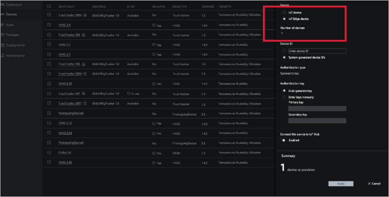](./media/iot-accelerators-remote-monitoring-edge/addedgedevice-expanded.png#lightbox)

Make a note of the device connection string, you need it in the next section of this tutorial.

When you register a device with the IoT hub in the Remote Monitoring solution accelerator, it's listed on the **Device Explorer** page in the web UI:

[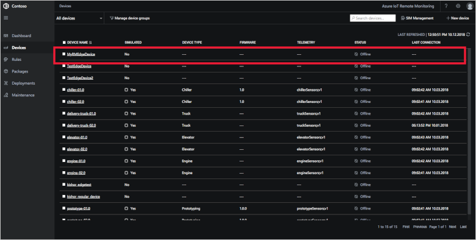](./media/iot-accelerators-remote-monitoring-edge/newedgedevice-expanded.png#lightbox)

To make it easier to manage  the IoT Edge devices in the solution, create a device group and add the IoT Edge device:

1. Select the **oil-pump** device in the list on the **Device Explorer** page and then click **Jobs**.

1. Create a job to add the **IsEdge** tag to the device using the following settings:

    | Setting | Value |
    | ------- | ----- |
    | Job     | Tags  |
    | Job Name | AddEdgeTag |
    | Key     | IsOilPump |
    | Value   | Y     |
    | Type    | Text  |

    [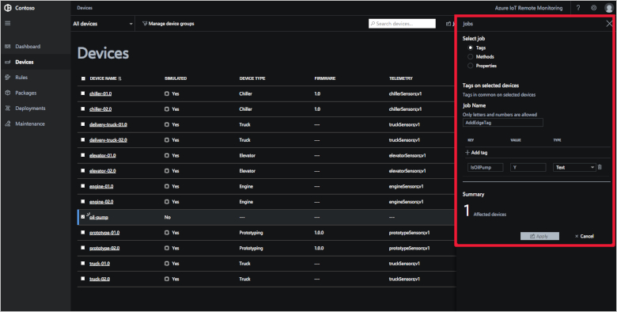](./media/iot-accelerators-remote-monitoring-edge/addtag-expanded.png#lightbox)

1. Click **Apply**, then **Close**.

1. On the **Device Explorer** page, click **Manage device groups**.

1. Click **Create new device group**. Create a new device group with the following settings:

    | Setting | Value |
    | ------- | ----- |
    | Name    | OilPumps |
    | Field   | Tags.IsOilPump |
    | Operator | = Equals |
    | Value    | Y |
    | Type     | Text |

    [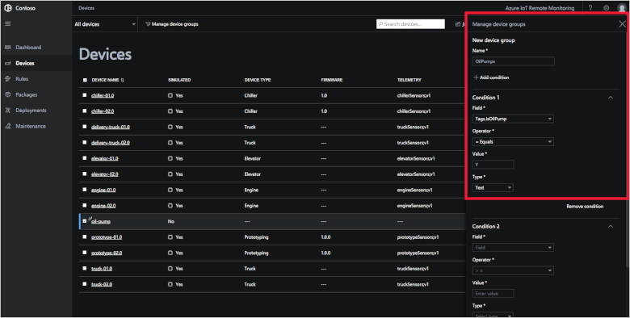](./media/iot-accelerators-remote-monitoring-edge/createdevicegroup-expanded.png#lightbox)

1. Click **Save**.

You IoT Edge device is now in the **OilPumps** group.

### Install the Edge runtime

An Edge device requires the Edge runtime to be installed. In this tutorial, you install the Edge runtime in an Azure Linux VM to test the scenario. The following steps use the Azure cloud shell in install and configure the VM:

1. To create a Linux VM in Azure, run the following commands. You can use a location close to where you are:

    ```azurecli-interactive
    az group create \
      --name IoTEdgeDevices \
      --location eastus
    az vm create \
      --resource-group IoTEdgeDevices \
      --name EdgeVM \
      --image microsoft_iot_edge:iot_edge_vm_ubuntu:ubuntu_1604_edgeruntimeonly:latest \
      --admin-username azureuser \
      --generate-ssh-keys \
      --size Standard_B1ms
    ```

1. To configure the Edge runtime with the device connection string, run the following command using the device connection string you made a note of previously:

    ```azurecli-interactive
    az vm run-command invoke \
      --resource-group IoTEdgeDevices \
      --name EdgeVM \
      --command-id RunShellScript \
      --scripts 'sudo /etc/iotedge/configedge.sh "YOUR_DEVICE_CONNECTION_STRING"'
    ```

    Be sure to include your connection string inside double-quotation marks.

You've now installed and configured the IoT Edge runtime on a Linux device. Later in this tutorial, you use the Remote Monitoring solution to deploy IoT Edge modules to this device.

## Create an Edge manifest

To simulate the oil jack pump device, you need to add the following modules to your Edge device:

* Temperature simulation module.
* Azure Stream Analytics anomaly detection.

The following steps show you how to create an Edge deployment manifest that includes these modules. Later in this tutorial you import this manifest as a package in the Remote Monitoring solution accelerator.

### Create the Azure Stream Analytics job

You define the Stream Analytics job in the portal before packaging it as an Edge module.

1. In the Azure portal, create an Azure storage account using the default options in the **IoTEdgeDevices** resource group. Make a note of the name you chose.

1. In the Azure portal, create a **Stream Analytics Job** in the **IoTEdgeDevices** resource group. Use following configuration values:

    | Option | Value |
    | ------ | ----- |
    | Job name | EdgeDeviceJob |
    | Subscription | Your Azure subscription |
    | Resource group | IoTEdgeDevices |
    | Location | East US |
    | Hosting environment | Edge |
    | Streaming units | 1 |

1. Open the **EdgeDeviceJob** Stream Analytics job in the portal, click Inputs, and add an **Edge Hub** stream input called **telemetry**.

1. In the **EdgeDeviceJob** Stream Analytics job in the portal, click **Outputs** and add an **Edge Hub** output called **output**.

1. In the **EdgeDeviceJob** Stream Analytics job in the portal, click **Outputs** and add a second **Edge Hub** output called **alert**.

1. In the **EdgeDeviceJob** Stream Analytics job in the portal, click **Query** and add the following **select** statement:

    ```sql
    SELECT  
    avg(machine.temperature) as temperature, 
    'F' as temperatureUnit 
    INTO output 
    FROM telemetry TIMESTAMP BY timeCreated 
    GROUP BY TumblingWindow(second, 5) 
    SELECT 'reset' as command 
    INTO alert 
    FROM telemetry TIMESTAMP BY timeCreated 
    GROUP BY TumblingWindow(second, 3) 
    HAVING avg(machine.temperature) > 400
    ```

1. In the **EdgeDeviceJob** Stream Analytics job in the portal, click **Storage account settings**. Add the storage account you added to the **IoTEdgeDevices** resource group as the start of this section. Create a new container called **edgeconfig**.

The following screenshot shows the saved Stream Analytics job:

[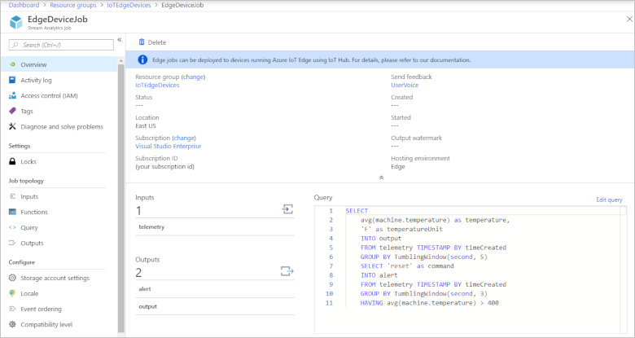](./media/iot-accelerators-remote-monitoring-edge/streamjob-expanded.png#lightbox)

You've now defined a Stream Analytics job to run on your edge device. The job calculates average temperature over a 5-second window. The job also sends an alert if the average temperature in a 3-second window goes above 400.

### Create the IoT Edge deployment

Next, you create an IoT Edge deployment manifest that defines the modules to run on your Edge device. In the next section, you import this manifest as a package in the Remote Monitoring solution.

1. In the Azure portal, navigate to the IoT hub in your Remote Monitoring solution. You can find the IoT hub in the resource group that has the same name as your Remote Monitoring solution.

1. In the IoT hub, click **IoT Edge** in the **Automatic Device Management** section. Click  **Add an IoT Edge deployment**.

1. On the **Create Deployment > Name and Label** page, enter the name **oil-pump-device**. Click **Next**.

1. On the **Create Deployment > Add Modules** page, click **+ Add**. Choose **IoT Edge Module**.

1. In the **IoT Edge Custom Modules** panel, enter **temperatureSensor** as the name, and **asaedgedockerhubtest/asa-edge-test-module:sensor-ad-linux-amd64** as the image URI. Click **Save**.

1. On the **Create Deployment > Add Modules** page, click **+ Add** to add a second module. Choose **Azure Stream Analytics Module**.

1. In the **Edge deployment** panel, select your subscription and the **EdgeDeviceJob** you created in the previous section. Click **Save**.

1. On the **Create Deployment > Add Modules** page, click **Next**.

1. On the **Create Deployment > Specify Routes** page, add the following code:

    ```sql
    {
      "routes": { 
        "alertsToReset": "FROM /messages/modules/EdgeDeviceJob/outputs/alert INTO BrokeredEndpoint(\"/modules/temperatureSensor/inputs/control\")", 
        "telemetryToAsa": "FROM /messages/modules/temperatureSensor/* INTO BrokeredEndpoint(\"/modules/EdgeDeviceJob/inputs/telemetry\")", 
        "ASAToCloud": "FROM /messages/modules/EdgeDeviceJob/* INTO $upstream" 
      } 
    }
    ```

    This code routes the output from the Stream Analytics module to the correct locations.

    Click **Next**.

1. On the **Create Deployment > Specify Metrics** page, click **Next**.

1. On the **Create Deployment > Target Devices** page, enter 10 as the priority. Click **Next**.

1. On the **Create Deployment > Review Deployment** page, click **Submit**:

    [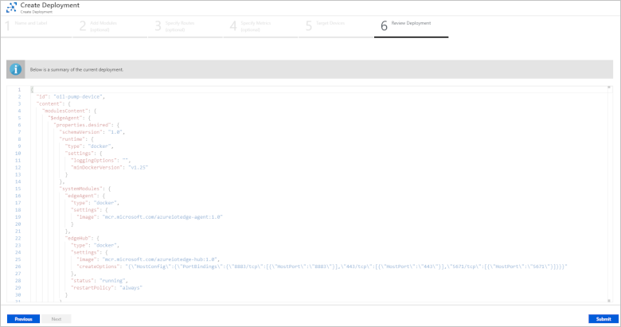](./media/iot-accelerators-remote-monitoring-edge/reviewdeployment-expanded.png#lightbox)

1. On the main **IoT Edge** page, click **IoT Edge deployments**. You can see **oil-pump-device** in the list of deployments.

1. Click the **oil-pump-device** deployment and then click **Download IoT Edge manifest**. Save the file as **oil-pump-device.json** to a suitable location on your local machine. You need this file in the next section of this tutorial.

You've now created an IoT Edge manifest to import into the Remote Monitoring solution as a package. Typically, a developer creates the IoT Edge modules and manifest file.

## Import a package

In this section, you import the Edge manifest as a package in the Remote Monitoring solution.

1. In the Remote Monitoring web UI, navigate to the **Packages** page and click **+ New Package**:

    [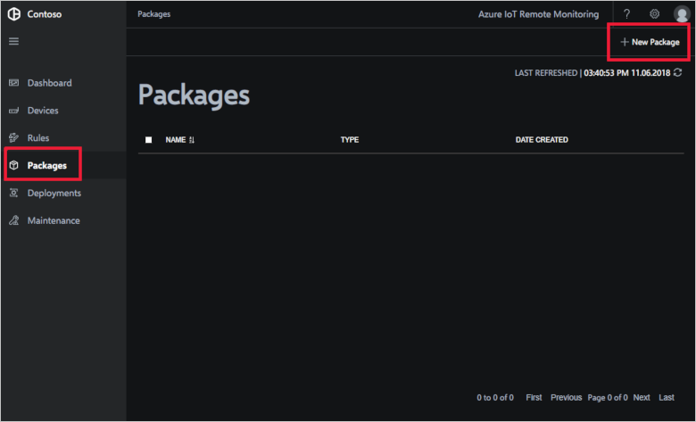](./media/iot-accelerators-remote-monitoring-edge/newpackage-expanded.png#lightbox)

1. On the **New Package** panel, choose **Edge Manifest** as the package type, click **Browse** to find the **oil-pump-device.json** file on your local machine, and click **Upload**:

    [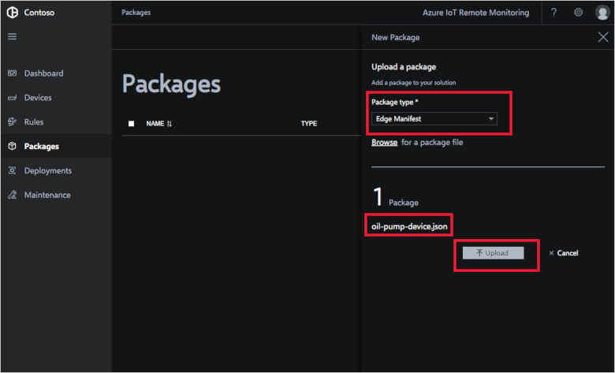](./media/iot-accelerators-remote-monitoring-edge/uploadpackage-expanded.png#lightbox)

    The list of packages now includes the **oil-pump-device.json** package.

In the next section, you create a deployment that applies the package to your Edge device.

## Deploy a package

Now you're ready to deploy the package to your device.

1. In the Remote Monitoring web UI, navigate to the **Deployments** page and click **+ New deployment**:

    [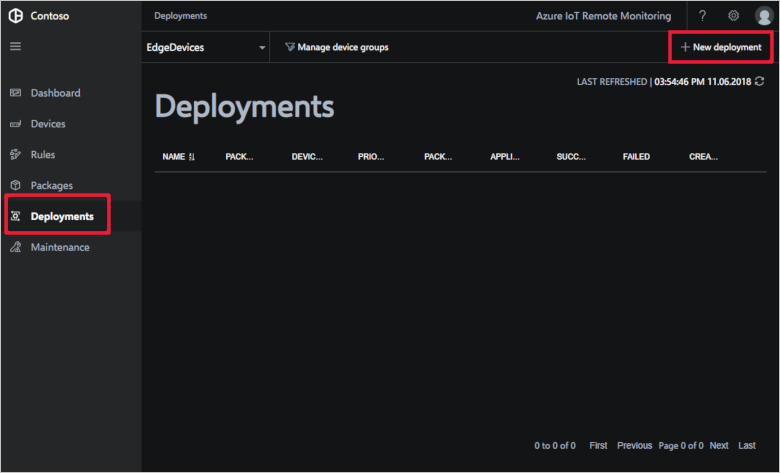](./media/iot-accelerators-remote-monitoring-edge/newdeployment-expanded.png#lightbox)

1. In the **New deployment** panel, create a deployment with the following settings:

    | Option | Value |
    | ------ | ----- |
    | Name   | OilPumpDevices |
    | Package type | Edge Manifest |
    | Package | oil-pump-device.json |
    | Device Group | OilPumps |
    | Priority | 10 |

    [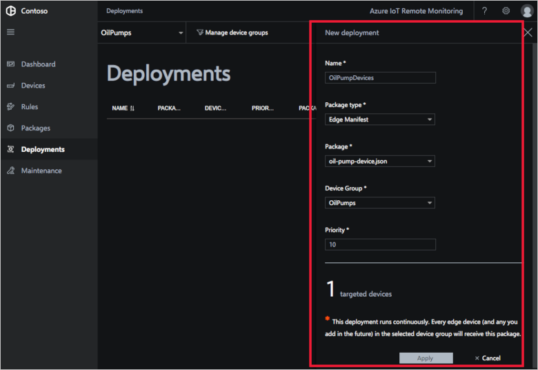](./media/iot-accelerators-remote-monitoring-edge/createdeployment-expanded.png#lightbox)

    Click **Apply**.

You need to wait several minutes for the package to deploy to your device and for telemetry to start flowing from the device.

[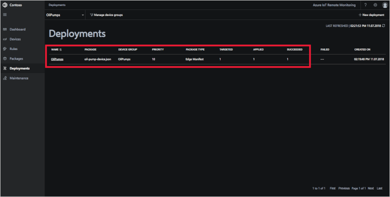](./media/iot-accelerators-remote-monitoring-edge/deploymentactive-expanded.png#lightbox)

The **Deployments** page shows the following metrics:

* **Targeted** shows the number of devices in the device group.
* **Applied** shows the number of devices that have had the deployment content applied.
* **Succeeded** shows  the number of Edge devices in the deployment reporting success from the IoT Edge client runtime.
* **Failed** shows  the number of Edge devices in the deployment reporting failure from the IoT Edge client runtime.

## Monitor the device

You can view the temperature telemetry from your oil pump device in the Remote Monitoring web UI:

1. Navigate to the **Device Explorer** page and select your oil pump device.
1. In the **Telemetry** section of the **Device details** panel, click **Temperature**:

    [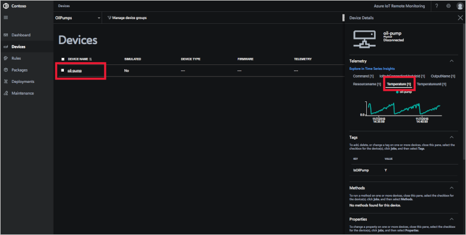](./media/iot-accelerators-remote-monitoring-edge/viewtelemetry-expanded.png#lightbox)

You can see how the temperature rises until it reaches a threshold. The Stream Analytics Edge module detects when the temperature reaches this threshold and sends a command to the device to reduce the temperature immediately. All of this processing happens on the device without communicating with the cloud.

If you want to notify operators when the threshold was reached, you can create a rule in the Remote Monitoring web UI:

1. Navigate to the **Rules** page and click **+ New rule**.
1. Create a new rule with the following settings:

    | Option | Value |
    | ------ | ----- |
    | Rule name | Oil pump temperature |
    | Description | Oil pump temperature exceeded 300 |
    | Device group | OilPumps |
    | Calculation | Instant |
    | Field | temperature |
    | Operator | > |
    | Value | 300 |
    | Severity level | Info |

    [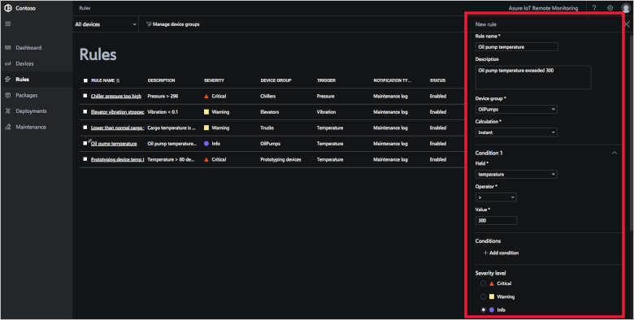](./media/iot-accelerators-remote-monitoring-edge/newrule-expanded.png#lightbox)

    Click **Apply**.

1. Navigate to the **Dashboard** page. An alert shows in the **Alerts** panel when the temperature in the **oil-pump** device goes over 300.

## Next steps

This tutorial showed you how to add and configure an IoT Edge device in the Remote Monitoring solution accelerator. To learn more about working with IoT Edge packages in the Remote Monitoring solution, see the following how-to guide:

> [!div class="nextstepaction"]
> [Import an IoT Edge package into your Remote Monitoring solution accelerator](iot-accelerators-remote-monitoring-import-edge-package.md)

To learn more about installing the IoT Edge runtime, see [Install the Azure IoT Edge runtime on Linux (x64)](../iot-edge/how-to-install-iot-edge-linux.md).

To learn more about Azure Stream Analytics on Edge devices, see [Deploy Azure Stream Analytics as an IoT Edge module](../iot-edge/tutorial-deploy-stream-analytics.md).
