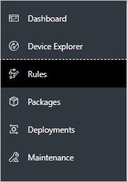
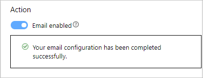

# Prerequisites
To create or modify a rule, you must be an Admin for your solution accelerator, or have the correct permissions. [Learn how to configure role-based access controls](https://docs.microsoft.com/en-us/azure/iot-accelerators/iot-accelerators-remote-monitoring-rbac).

# Add an email action
Adding an email action to a rule helps make sure that you will never miss an alert again. You can either add an email action to an existing rule that you have defined earlier, or while creating a new rule. 

## Existing rule

Follow these steps to add an email action:
  1. Navigate to your Remote Monitoring solution.
  2. From your dashboard, navigate to the **Rules** page.

      

  3. Click the checkbox next to the [existing rule](https://docs.microsoft.com/azure/iot-accelerators/iot-accelerators-remote-monitoring-automate#edit-an-existing-rule) that you would like to modify, and then click **Edit** at the top. An editable flyout will appear.
  4. In the Action section, toggle **Email enabled** to on. 

      

  5. If this is the first-time email actions have been enabled within the solution accelerator, you will see a warning box at the top to [sign in to outlook](#outlook).
  6. Enter an email address into the recipient box and hit enter for each email address added. 
      
  7. Enter a subject for the email.
  8. Enter any comments for the email recipients in **text format**. *HTML* formatting is supported by editing the email template. [Directions for editing the HTML format](#htmledit)
  9. Make sure that **Rule Status** is enabled
  10. Click **Apply**

## Creating a new rule

Follow these steps to add an email action:
  1. Navigate to your Remote Monitoring solution.
  2. From your dashboard, navigate to the **Rules** page. 

      

  3. Follow the [create a rule](https://docs.microsoft.com/azure/iot-accelerators/iot-accelerators-remote-monitoring-automate#create-a-rule) and [create an advanced rule](https://docs.microsoft.com/azure/iot-accelerators/iot-accelerators-remote-monitoring-automate#create-an-advanced-rule) up to the **Severity level** only. Do *not* click apply yet. 
  4. In the Action section, toggle **Email enabled** to on. 

      

  5. If this is the first-time email actions have been enabled within the solution accelerator, you will see a warning box at the top to [sign in to outlook](#outlook).
  6. Enter an email address into the recipient box and hit enter for each email address added. 
      
  7. Enter a subject for the email.
  8. Enter any comments for the email recipients in **text format**. *HTML* formatting is supported by editing the email template. [Directions for editing the HTML format](#htmledit)
  9. Make sure that **Rule Status** is enabled
  10. Click **Apply**

Your rule with *Email Action* has now been enabled. Each time the action is triggered, a new email will be sent out. 

## Sign in to Outlook 

If this is your first-time enabling email actions within your solution accelerator, you will see a warning not saying that you need to sign into Outlook. The purpose of this is to set up an email account, which will be responsible for sending out the email notification. It is recommended that you create a specific Outlook account just for solution accelerator notifications and use that to sign in with. You will continue to see this warning note until you have signed in with an Outlook account. Once you have signed in, you will see a successful message below the email actions toggle. 

## Customizing the email HTML 

Out of the box, the Remote Monitoring solution accelerator provides a basic HTML template for emails sent when alerts are triggered. The email constructed is based off of the variables filled out when setting up email action. Here's an example of email sent when an alert is triggered and email actions are enabled: 

However, if you would like to edit the HTML to include more information, custom images, etc. follow these steps:
  1. Make sure that you have cloned the Github repository for Remote Monitoring in either .NET or Java. 
  2. Navigate to the email template location.
    
      `Dotnet: device-telemetry\ActionsAgent\data\EmailTemplate.html`
    
      `Java device-telemetry/app/resources/data/EmailTemplate.html`
  3. This template is where you can add or remove any parameters. Make sure to also add or remove, or replace calls as needed. 

      For example, in the .NET code: 
      `emailTemplate = emailTemplate.Replace("${subject}", emailAction.GetSubject());`

      For example, in the Java code:
      `this.emailTemplate.replace("${subject}", emailAction.GetSubject());`
  4. Parameters in the template are in the form of `${...}`. If you want to delete a parameter, just delete the required line. If you want to add a parameter, add a line with the value you want inserted into the template in the format above. 
  5. If you would like to add images or any other custom text, updates can be directly in the `EmailTemplate.HTML`

## Next steps

This guide showed you how to add an email action to a new or existing rule within a Remote Monitoring solution and how to edit the out of the box HTML.

The suggested next step is to learn [how to use alerts and fix device issues](iot-accelerators-remote-monitoring-maintain.md).
