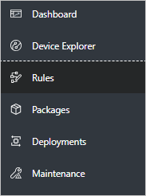
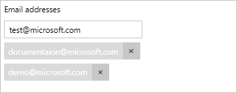
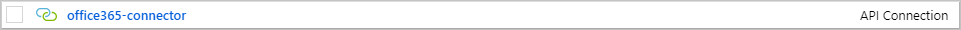
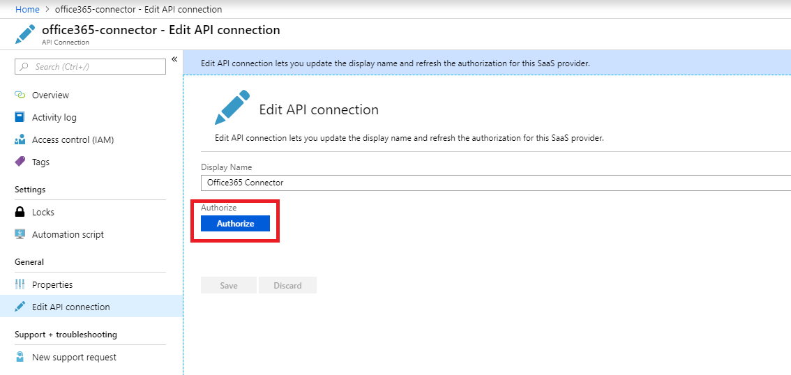
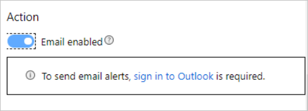
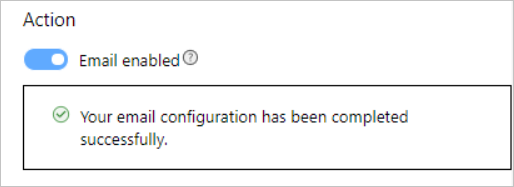
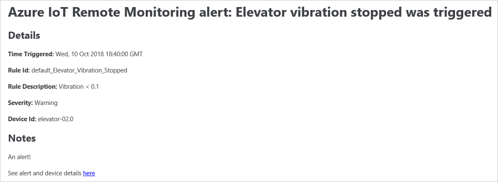
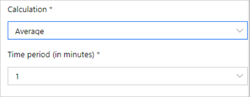

# Add an email action

Email actions help make sure you never miss alerts. You can add an email action to an existing rule, or when you create a new rule.

To complete the steps in this how-to guide, you need a deployed instance of the Remote Monitoring solution accelerator in your Azure subscription.

To create or modify a rule, you must be an [**Administrator**, or have the correct permissions](iot-accelerators-remote-monitoring-rbac.md).

## Edit an existing rule

Follow these steps to add an email action to an existing rule:

1. Navigate to your Remote Monitoring solution.

1. From the **Dashboard**, navigate to the **Rules** page:

    

1. Click the checkbox next to the existing rule to modify, and then click **Edit** at the top. An editable **Rule** panel appears.

1. In the **Action** section, toggle **Email enabled** to **On**.

1. The first time you enable an email action in the solution accelerator, you must [sign in to Outlook](#outlook).

1. Enter an email address into the recipient box and press the **Enter** key for each email address to add:

    

1. Enter a subject for the email.

1. Enter any additional notes for the email recipients as plain text. You can use HTML formatting if you [edit the email template](#htmledit).

1. Make sure that the **Rule Status** is set to **Enabled**.

1. Click **Apply**.

## Create a new rule

Follow these steps to add an email action when you create a new rule:

1. Navigate to your Remote Monitoring solution.

1. From the **Dashboard**, navigate to the **Rules** page:

    

1. Follow the steps in the [create a rule section](iot-accelerators-remote-monitoring-automate.md#create-a-rule). The follow the steps in the [create an advanced rule](iot-accelerators-remote-monitoring-automate.md#create-an-advanced-rule) section up to the point where you set a **Severity level**. Don't click **Apply** yet.

1. In the **Action** section, toggle **Email enabled** to **On**.

1. The first time you enable an email action in the solution accelerator, you must [sign in to Outlook](#outlook).

1. Enter an email address into the recipient box and press the **Enter** key for each email address to add:

    

1. Enter a subject for the email.

1. Enter any additional notes for the email recipients as plain text. You can use HTML formatting if you [edit the email template](#htmledit).

1. Make sure that the **Rule Status** is set to **Enabled**.

1. Click **Apply**.

Your rule with an email action is now enabled. Each time the action is triggered, a new email is sent to the recipients.

## Sign in to Outlook 

The first time you enable an email action in your solution accelerator, you must sign into Outlook. This action sets up the email account that sends out the email notifications.

> [!NOTE]
> You should create a specific Outlook account just for solution accelerator notifications and use that account when you enable your first email action.

### Contributor role Outlook setup

If someone in the **contributor** role in the subscription deployed the solution accelerator, the application doesn't have sufficient permissions to set up and verify email actions through the Web UI.

Before you start, create an Outlook account to use to send email notifications from your solution accelerator.

The following steps show you how to set up and verify the email actions manually:

1. Navigate to the [Azure portal](https://portal.azure.com).

1. Navigate to the Resource Group for your solution accelerator.

1. Click the **office365-connector**:

    

1. Click the banner to begin the authorization process:

    

1. Click **Authorize**. You're prompted to sign in. The account you use to sign in should be the email address the application uses to send email notifications:

    

1. Click **Save** at the bottom. Your authorization will be successful if the banner is gone.

1. To change the email address from which the notifications are sent from, click **Edit API connection**.

    

### Owner role Outlook setup

If someone in the **owner** role in the subscription deployed the solution accelerator, the application can verify email actions have been correctly set up through the Web UI.

Before you start, create an Outlook account to use to send email notifications from your solution accelerator.

The following steps help you to sign in and set up email actions:

1. Click to sign in to Outlook. You're taken to the Azure portal:

   

1. Click **Authorize**. You're prompted to sign in. The account you use to sign in should be the email address the application uses to send email notifications:

1. Click **Save**. Return to your solution accelerator and refresh the page.

1. If you've successfully configured the email notification, you see this message:

   

## Customize the email HTML 

Out-of-the-box, the Remote Monitoring solution accelerator provides a basic HTML template for action emails. The email template uses values from the email action settings. Here's an example email:

The following steps show you how to edit the HTML email template. For example, you can include more information or add custom images:

1. Clone either the Java or .NET Remote Monitoring GitHub repository:

1. Navigate to the email template location:
  
    `Dotnet: device-telemetry\ActionsAgent\data\EmailTemplate.html`
  
    `Java device-telemetry/app/resources/data/EmailTemplate.html`

1. You can add or remove any parameters in this template to customize the message. You can also add, remove, or replace calls as needed:

    For example, in the .NET code:
    `emailTemplate = emailTemplate.Replace("${subject}", emailAction.GetSubject());`

    For example, in the Java code:
    `this.emailTemplate.replace("${subject}", emailAction.GetSubject());`

1. Parameters in the template take the form of `${...}`. To delete a parameter, delete the required line. To add a parameter, add a line with the value to insert.

1. To add images or custom text, update the EmailTemplate.HTML file directly.

## Throttling

The Remote Monitoring solution accelerator uses Outlook to send email notifications. Outlook limits the number of emails sent to [30 emails per 1 minute](https://docs.microsoft.com/office365/servicedescriptions/exchange-online-service-description/exchange-online-limits#receiving-and-sending-limits). Email clients receiving the emails may also throttle the number of emails received per minute. Check with your specific email client on limitations. When you set up email notification for a rule, the rule should calculate average values over a period of at least one minute, and not use instant values:

## Next steps

This guide showed you how to add an email action to a new or existing rule within a Remote Monitoring solution. The guide also showed you and how to edit the HTML that defines the message format.

The suggested next step is to learn [how to use alerts and fix device issues](iot-accelerators-remote-monitoring-maintain.md).
