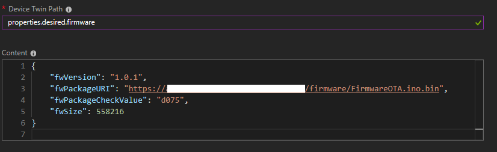
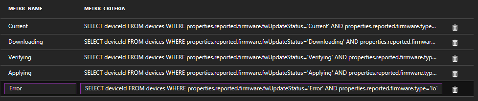
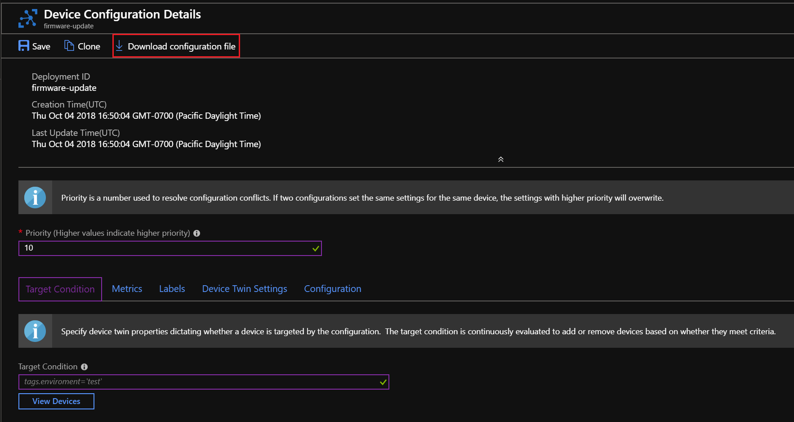

# Tutorial: Update the firmware on connected devices

In this tutorial, you use the Remote Monitoring solution accelerator to update the firmware on a group of devices connected to your solution.

As an operator at Contoso, you need to update a group of devices with a new firmware version. You don't want to have to update the firmware on each device individually. To update the firmware on a group of devices, you can use device groups and automatic device management in the Remote Monitoring solution accelerator. Any device that you add to the device group gets the latest firmware as soon as the device comes online.

In this tutorial, you:

>[!div class="checklist"]
> * Create a device group
> * Prepare and host the firmware
> * Create a device configuration in the Azure portal
> * Import a device configuration into your Remote Monitoring solution
> * Deploy the configuration to the devices in the device group
> * Monitor the deployment

If you don't have an Azure subscription, create a [free account](https://azure.microsoft.com/free/?WT.mc_id=A261C142F) before you begin.

<!--
If this is going to be a tutorial - we need to split this include into two so that we can accommodate the additional prerequisites:

[!INCLUDE [iot-accelerators-tutorial-prereqs](../../includes/iot-accelerators-tutorial-prereqs.md)]
-->

## Prerequisites

To follow this tutorial, you need a deployed instance of the Remote Monitoring solution accelerator in your Azure subscription.

If you haven't deployed the Remote Monitoring solution accelerator yet, you should complete the [Deploy a cloud-based remote monitoring solution](quickstart-remote-monitoring-deploy.md) quickstart.

You need an Azure storage account to host your firmware files. You can use an existing storage account, or [create a new storage account](../storage/common/storage-quickstart-create-account) in your subscription.

The tutorial uses an [IoT DevKit](https://microsoft.github.io/azure-iot-developer-kit/) device as a sample device.

You need the following software installed on your local machine:

* [Visual Studio Code (VS Code)](https://code.visualstudio.com/).
* The [Azure IoT Workbench](https://marketplace.visualstudio.com/items?itemName=vsciot-vscode.vscode-iot-workbench) VS Code extension.

Before you start:

* Make sure the [bootloader on your IoT DevKit  device is at version 1.4.0 or higher](https://microsoft.github.io/azure-iot-developer-kit/docs/firmware-upgrading/).
* Make sure the IoT DevKit SDK is at the same version as the bootloader. You can update the IoT DevKit SDK using the Azure IoT Workbench in VS Code. Open the command palette and enter **Arduino: Board Manager**. For more information, see [Prepare the development environment](../iot-hub/iot-hub-arduino-iot-devkit-az3166-get-started.md#prepare-the-development-environment)

You also need to connect at least one IoT DevKit device to your Remote Monitoring solution accelerator. If you haven't connected an IoT DevKit device yet, follow the instructions in the [Connect MXChip IoT DevKit AZ3166 to the IoT Remote Monitoring solution accelerator](iot-accelerators-arduino-iot-devkit-az3166-devkit-remote-monitoringV2.md) how-to guide.

## Navigate to the dashboard

To view to the Remote Monitoring solution dashboard in your browser, first navigate to [Microsoft Azure IoT Solution Accelerators](https://www.azureiotsolutions.com/Accelerators#dashboard). You may be asked to sign in using your Azure subscription credentials.

Then click **Launch** on the tile for the Remote Monitoring solution accelerator you deployed in the [Quickstart](../articles/iot-accelerators/quickstart-remote-monitoring-deploy.md).

## Create a device group

<!--
TODO - if this is a tutorial, it should be expanded to provide detailed steps - if it's a how-to, we can leave as is.
-->

To automatically update the firmware on a device, the device must be a member of a device group in your Remote Monitoring solution. In your Remote Monitoring solution, add a new device group called **DevKit** and make sure that your IoT DevKit device is a member of this group.

For more information about creating a device group, see the [Configure and manage devices connected to your monitoring solution](iot-accelerators-remote-monitoring-manage#organize-your-devices) tutorial.

## Prepare and host the firmware

The [Azure IoT Workbench](https://marketplace.visualstudio.com/items?itemName=vsciot-vscode.vscode-iot-workbench) VS Code extension includes the sample device code for the firmware update.

### Open the Firmware OTA sample in VS Code

1. Make sure your IoT DevKit isn't connected to your computer. Start VS Code, and then connect the DevKit to your computer.

1. Press **F1** to open the command palette, type and select **IoT Workbench: Examples**. Then select **IoT DevKit** as the board.

1. Find **Firmware OTA** and click **Open Sample**. A new VS Code window opens and shows the **firmware_ota** project folder:

    

### Build the new firmware

The initial version of the device firmware is 1.0.0. The new firmware should have a higher version number.

1. In VS Code, open the **FirmwareOTA.ino** file and change the `currentFirmwareVersion` from `1.0.0` to `1.0.1`:

    

1. Open the command palette, then type and select **IoT Workbench: Device**. Then select **Device Compile** to compile the code:

    

<!-- TODO What is this doing?
1. VS Code compiles the code and generates the **.bin** file. Take the file and put it into the **.build** folder.
    
-->

### Generate the CRC value and calculate the firmware file size

1. Open the command palette, then type and select **IoT Workbench: Device**. Then select **Generate CRC**:

    

1. VS Code generates and prints the CRC value, the firmware filename and path, and the file size in the output window. Make a note of these values for later:

    

### Upload the firmware to the cloud

Use your Azure storage account to host your new firmware file in the cloud.

1. Navigate to your storage account in the Azure portal. In the Services section, select **Blobs**. Create a public container called **firmware** to store your firmware files:

    

1. To upload your firmware file to the container, Select the **firmware** container and click **Upload**.

1. Select the **FirmwareOTA.ino.bin**. You made a note of the full path to this file in the previous section.

1. After the firmware file upload complete, make a note of the file URL.

### Build and upload the original firmware to the IoT DevKit device

1. In VS Code, open the **FirmwareOTA.ino** file and change the `currentFirmwareVersion` back to `1.0.0`:

    

1. Open the command palette, then type and select **IoT Workbench: Device**. Then select **Device Upload**:

    

1. VS Code verifies and uploads the code to your IoT DevKit device.

1. When the upload finishes, the IoT DevKit device reboots. When the reboot is complete, the screen of IoT DevKit shows **FW version: 1.0.0**, and that it's checking for new firmware:

    

## Create a device configuration

<!--
TODO - Do we need this section? Couldn't we just provide some JSON to use instead?
-->

Automatic device management works by targeting a set of devices based on their properties, defining a desired configuration, and letting IoT Hub update devices whenever they come into scope. Typically, confgurations are defined by a developer and then managed by an operator.

1. In the Azure Portal, navigate to the IoT Hub that is part of your Remote Monitoring solution and has the MXChip connected to it. Select **IoT device configuration** and then select **Add Configuration**.

1. On the **Create Configuration > Name and Label** page enter then name **firmware-update**. Add the following labels to describe your configuration further:

    |Name|Value|
    |---|---|
    |Version|1.0.1|
    |Device|MXChip|

    Click **Next**.

1. On the **Create Configuration > Specify Settings** page enter **properties.desired.firmware** for the Device Twin Path. This is the path to the JSON section within the twin desired properties that will be set. Next, specify the JSON content to be inserted into that section:

    * "fwVersion" : [firmware version](#build-the-new-firmware) (string).
    * "fwPackageURI" : [URL of the firmware](#upload-the-firmware-to-the-cloud) (string).
    * "fwPackageCheckValue" : [CRC value of the firmware](#generate-the-crc-value-and-firmware-file-size) (string).
    * "fwSize" : [file size of the firmware](#generate-the-crc-value-and-firmware-file-size) (int).

    The final configuration content should look like this:
    

    Click **Next**.

1. On the **Create Configuration > Specify Metrics** page, add in the following Custom Metrics into your configuration and then click **Next**. These custom metrics will allow you to understand a summary count of the state of your MXChip devices during the update process.

    |Metric Name|Metric Criteria|
    |---|---|
    |Current|`SELECT deviceId FROM devices WHERE properties.reported.firmware.fwUpdateStatus='Current' AND properties.reported.firmware.type='IoTDevKit'`|
    |Downloading|`SELECT deviceId FROM devices WHERE properties.reported.firmware.fwUpdateStatus='Downloading' AND properties.reported.firmware.type='IoTDevKit'`|
    |Verifying|`SELECT deviceId FROM devices WHERE properties.reported.firmware.fwUpdateStatus='Verifying' AND properties.reported.firmware.type='IoTDevKit'`|
    |Applying|`SELECT deviceId FROM devices WHERE properties.reported.firmware.fwUpdateStatus='Applying' AND properties.reported.firmware.type='IoTDevKit'`|
    |Error|`SELECT deviceId FROM devices WHERE properties.reported.firmware.fwUpdateStatus='Error' AND properties.reported.firmware.type='IoTDevKit'`|

    

1. On the **Create Configuration > Target Devices** page enter 10 as the Priority and then click **Next**. Note that this priority value will be overriden by the value that is set in Remote Monitoring when actually deploying the configuration.

1. On the **Create Configuration > Review Configuration** page review the summary of the configuration and then click **Submit**.

1. On the main **IoT device configuration** page you should now see **firmware-update** listed as a configuraton.

1. Click the **firmware-update** configuration and then click **Download configuration file**. Save the file as **firmware-update.json** to a suitable location on your local machine. You will need this file in the next section of this tutorial.

    

## Import a configuration

In this section you import the device configuration as a package into the Remote Monitoring solution accelerator.

1. In the Remote Monitoring web UI, navigate to the **Packages** page and click **+ New Package**:

    

1. In the **New Package** panel, choose **Device configuration** as the package type and **Firmware - MXChip** as the configuration type. Click **Browse** to find the **firmware-update.json** file on your local machine, and then click **Upload**:

    

1. The list of packages now includes the **firmware-update** package. You can also see the labels that are part of the configuration file in the summary section.

## Deploy the configuration to your devices

In this section, you create and execute a deployment that applies the configuration to your IoT DevKit devices.

1. In the Remote Monitoring web UI, navigate to the **Deployments** page and click **+ New deployment**:

    

1. In the **New deployment** panel, create a deployment with the following settings:

    |Option|Value|
    |---|---|
    |Name|Deploy firmware update|
    |Package type|Device Configuration|
    |Configuration type|Firmware - MXChip|
    |Package|firmware-update.json|
    |Device Group|DevKit|
    |Priority|10|

    

    Click **Apply**. You see a new deployment in the **Deployments** page that shows the following metrics:

    * **Targeted** shows the number of devices in the device group.
    * **Applied** shows the number of devices whose desired properties in the *device twins* were updated with the configuration content.
    * **Succeeded** shows the number of MXChips in the deployment reporting success from the reported properties of the MXChip device twin.
    * **Failed** shows the number of Edge devices in the deployment reporting failure from the reported properties of the MXChip device twin.

## Monitor the deployment

After a few minutes, the IoT DevKit retrieves the new firmware information and starts downloading it to the device:

Depending on the speed of your network, the download may take up to a couple of minutes. After the firmware is downloaded, the device verifies the file size and CRC value. The screen on the MXChip displays "passed" if verification is successful.

If the check is successful, the device reboots. You see a countdown from **5** to **0** before the reboot happens.

After the reboot, the IoT DevKit bootloader upgrades the firmware to the new version. The upgrade may take several seconds. During this stage the RGB LED in the device is red and the screen is blank.

When the reboot is finished, your IoT DevKit device is now running version 1.0.1 of the firmware.

You can click on a deployment on the **Deployments** page in Remote Monitoring to see the status of your device as it updates. You can see the status of each device in your device group and the custom metrics you defined in your configuration.

## Next steps

This tutorial showed you how to update the firmware of your IoT DevKit device through automatic device management in Remote Monitoring. To learn more about working with device configurations in the Remote Monitoring solution, see the following how-to-guide:

To learn more about automatic device management, see [Configure and monitor IoT devices at scale using the Azure portal](https://docs.microsoft.com/azure/iot-hub/iot-hub-auto-device-config)