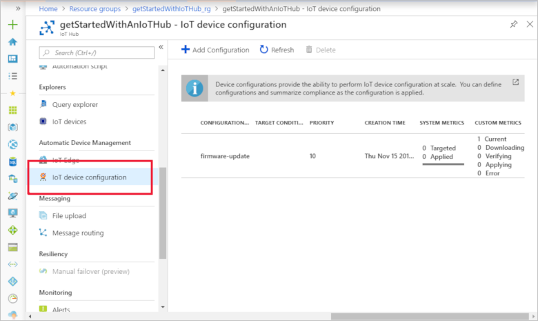
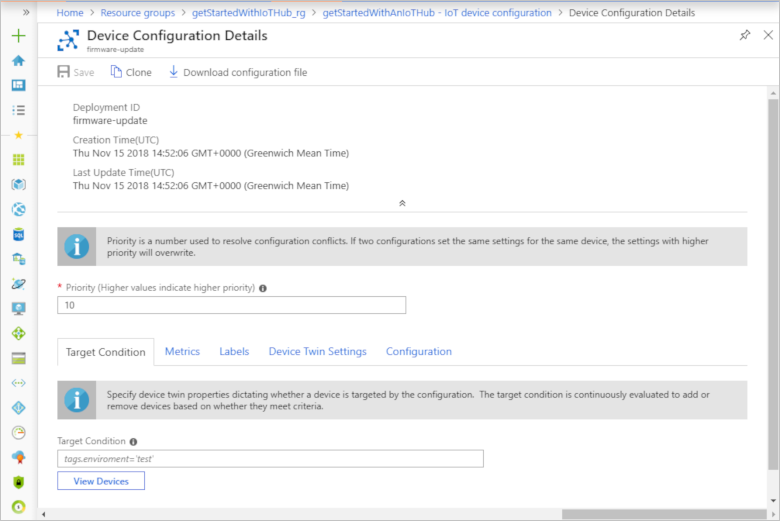
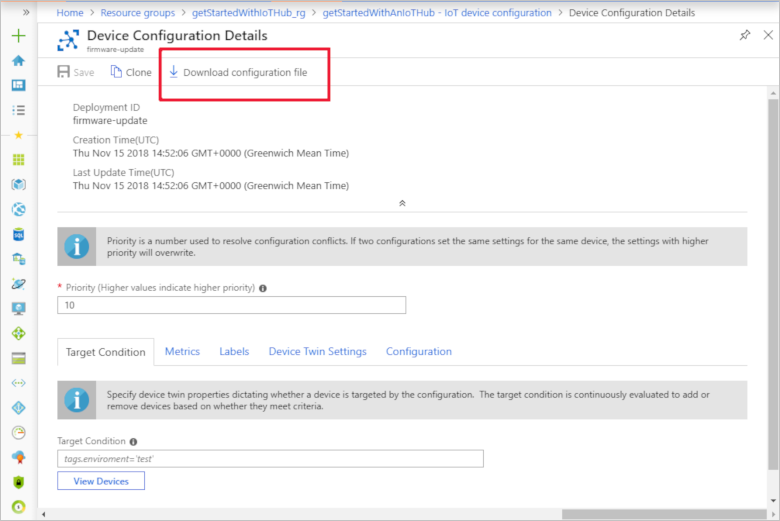
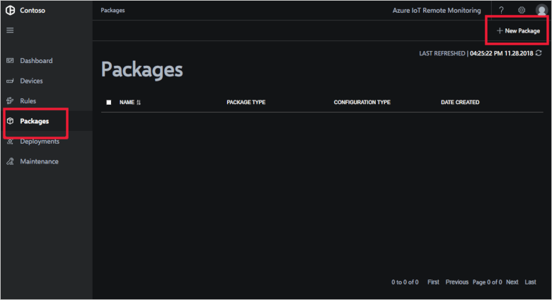
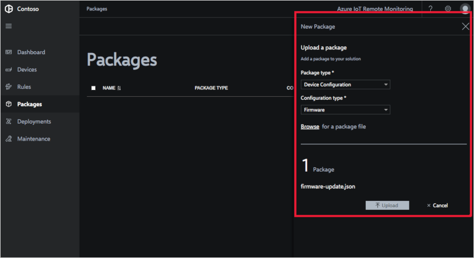
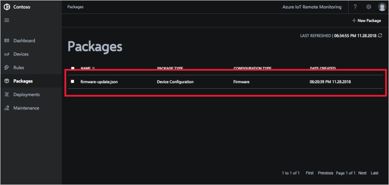

# Import an automatic device management package into your Remote Monitoring solution accelerator

An automatic device management configuration defines the configuration changes to deploy to a group of devices. This article assumes a developer in your organization has already created an automatic device management configuration. To learn about how a developer creates a configuration, see one of the following IoT Hub how-to articles:

- [Configure and monitor IoT devices at scale using the Azure portal](../iot-hub/iot-hub-auto-device-config.md)
- [Configure and monitor IoT devices at scale using the Azure CLI](../iot-hub/iot-hub-auto-device-config-cli.md)

A developer creates and tests an automatic device management configuration in a development environment. When you're ready, you can import the configuration into your Remote Monitoring solution accelerator.

## Export a configuration

Use the Azure portal to export the automatic device management configuration from your development environment:

1. In the Azure portal, navigate to the IoT hub you're using to develop and test your IoT devices. Click **IoT device configuration**:

    

1. Click the configuration you want to use. The **Device Configuration Details** page displays:

    
1. Click **Download configuration file**:

    

1. Save the JSON file as a local file called **configuration.json**.

Now you have a file that contains the automatic device management configuration. In the next section, you import this configuration as a package into the Remote Monitoring solution.

## Import a package

Follow the steps below to import an automatic device management configuration as a package into your solution:

1. Navigate to the **Packages** page in the Remote Monitoring web UI:
    

1. Click **+ New Package**, choose **Configuration** as the package type, and click **Browse** to select the **configuration.json** file you saved in the previous section:

    

1. Click **Upload** to add the package to your Remote Monitoring solution:

    

You've now uploaded an automatic device management configuration as a package. On the **Deployments** page, you can deploy this package to your connected devices.

## Next steps

Now that you've learned how to create a configuration package and import it into from the Remote Monitoring solution, the next step is to learn how to [Manage devices connected to Remote Monitoring in bulk](iot-accelerators-remote-monitoring-bulk-configuration-update.md).
