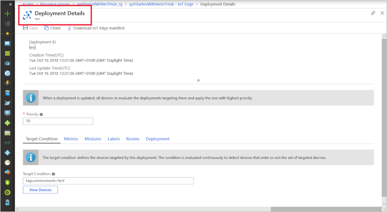
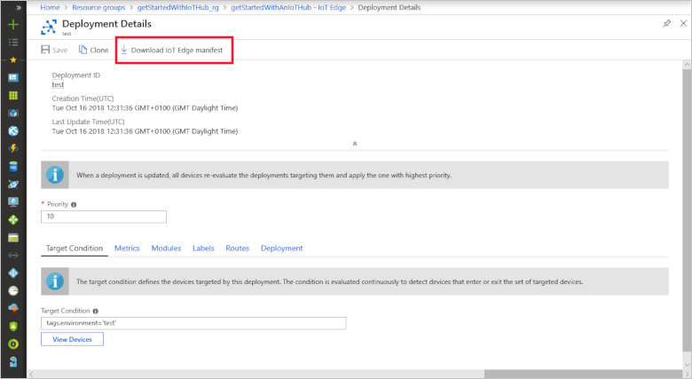
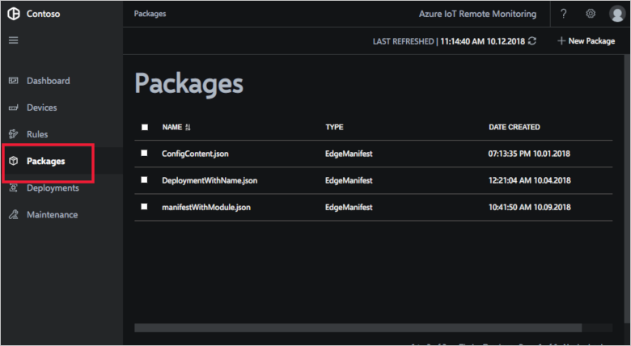
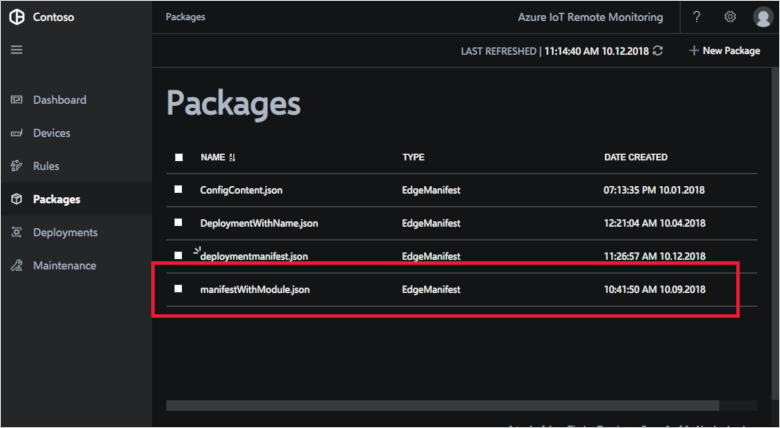

# Import an IoT Edge package into your Remote Monitoring solution accelerator

A deployment manifest defines the modules to deploy to an IoT Edge device. This article assumes a developer in your organization has already created deployment manifest. To learn about how a developer creates a manifest, see one of the following IoT Edge how-to articles:

- [Deploy Azure IoT Edge modules from the Azure portal](../iot-edge/how-to-deploy-modules-portal.md)
- [Deploy Azure IoT Edge modules with Azure CLI](../iot-edge/how-to-deploy-modules-cli.md)
- [Deploy Azure IoT Edge modules from Visual Studio Code](../iot-edge/how-to-deploy-modules-vscode.md)

A developer creates and tests a deployment manifest in a development environment. When you're ready, you can import the manifest into your Remote Monitoring solution accelerator.

## Export a manifest

Use the Azure portal to export the deployment manifest from your development environment:

1. In the Azure portal, navigate to the IoT hub you're using to develop and test your IoT Edge devices. Click **IoT Edge** and then **IoT Edge deployments**:
    

1. Click the deployment that has the deployment configuration you want to use. The **Deployment Details** page displays:
    

1. Click **Download IoT Edge manifest**:
    

1. Save the JSON file as a local file called **deploymentmanifest.json**.

Now you have a file that contains the deployment manifest. In the next section, you import this manifest as a package into the Remote Monitoring solution.

## Import a package

Follow the steps below to import an Edge deployment manifest as a package into your solution:

1. Navigate to the **Packages** page in the Remote Monitoring web UI:
    

1. Click **+ New Package**, choose **Edge Manifest** as the package type, and click **Browse** to select the **deploymentmanifest.json** file you saved in the previous section:
    

1. Click **Upload** to add the package to your Remote Monitoring solution:
    

You've now uploaded an IoT Edge deployment manifest as a package. On the **Deployments** page, you can deploy this package to your connected IoT Edge devices.

## Next steps

Now that you have learned how to deploy modules to an IoT Edge device from the Remote Monitoring solution, the next step is to learn more about [IoT Edge](../iot-edge/about-iot-edge.md).
