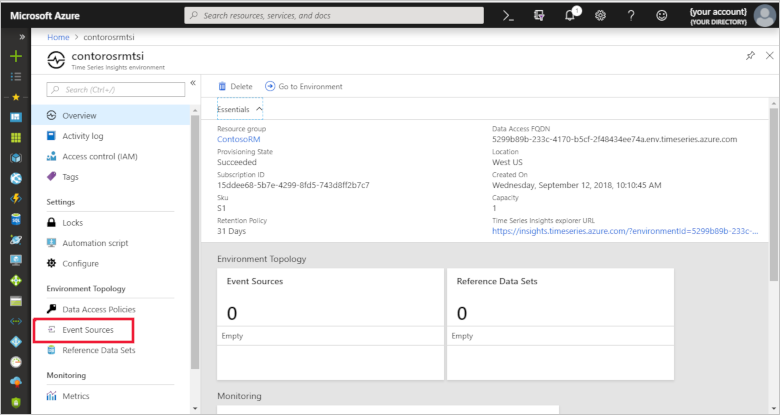
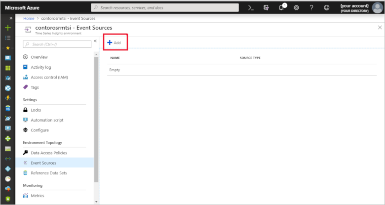
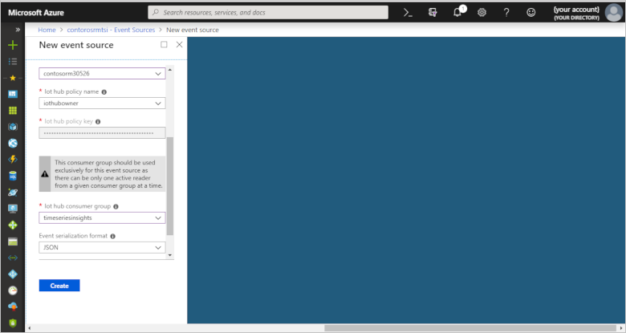

# Integrate Azure Time Series Insights with Remote Monitoring

Azure Time Series Insights is a fully managed analytics, storage, and visualization service for managing IoT-scale time-series data in the cloud. You can use Time Series Insights to store and manage time-series data, explore and visualize events simultaneously, conduct root-cause analysis, and to compare multiple sites and assets.

The Remote Monitoring solution accelerator now provides automatic deployment and integration with Time Series Insights. In this how-to, you learn how to configure Time Series Insights for an existing Remote Monitoring solution that doesn't already include Time Series Insights.

> [!NOTE]
> Time Series Insights is not currently available in the Azure China cloud. New Remote Monitoring solution accelerator deployments in the Azure China cloud use Cosmos DB for all storage.

## Prerequisites

To complete this how-to, you need to have already deployed a Remote Monitoring solution:

* [Deploy the Remote Monitoring solution accelerator](quickstart-remote-monitoring-deploy.md)

## Create a consumer group

Create a dedicated consumer group in your IoT Hub to be used for streaming data to Time Series Insights.

> [!NOTE]
> Consumer groups are used by applications to pull data from Azure IoT Hub. Each consumer group allows up to five output consumers. You should create a new consumer group for every five output sinks and you can create up to 32 consumer groups.

1. In the Azure portal, click the Cloud Shell button.

1. Execute the following command to create a new consumer group. Use the name of the IoT hub in your Remote Monitoring deployment, and the name of your Remote Monitoring deployment as the resource group name:

```azurecli-interactive
az iot hub consumer-group create --hub-name contosorm30526 --name timeseriesinsights --resource-group ContosoRM
```

## Deploy Time Series Insights

Next, deploy Time Series Insights as an additional resource into your Remote Monitoring solution and connect it to the IoT hub.

1. Sign in to the [Azure portal](https://portal.azure.com/).

1. Select **Create a resource** > **Internet of Things** > **Time Series Insights**.

    

1. To create your Time Series Insights environment, use the values in the following table:

    | Setting | Value |
    | ------- | ----- |
    | Environment Name | The following screenshot uses the name **contorosrmtsi**. Choose your own unique name when you complete this step. |
    | Subscription | Select your Azure subscription in the drop-down. |
    | Resource group | **Use existing**. Select the name of your existing Remote Monitoring resource group. |
    | Location | We are using **East US**. Create your environment in the same region as your Remote Monitoring solution if possible. |
    | Sku |**S1** |
    | Capacity | **1** |

    

1. Click **Create**. It can take a moment for the environment to be created.

## Create event source

Create a new event source to connect to your IoT hub. Make sure that you use the consumer group created in the previous steps. Time Series Insights requires each service to have a dedicated consumer group not in use by another service.

1. Navigate to your new Time Series Insights environment.

1. On the left, select **Event Sources**.

    

1. Click **Add**.

    

1. To configure your IoT hub as a new event source, use the values in the following table:

    | Setting | Value |
    | ------- | ----- |
    | Event source name | The following screenshot uses the name **contosorm-iot-hub**. Use your own unique name when you complete this step. |
    | Source | **IoT Hub** |
    | Import option | **Use IoT Hub from available subscriptions** |
    | Subscription ID | Select your Azure subscription in the drop-down. |
    | Iot hub name | **contosorma57a6**. Use the name of your IoT hub from your Remote Monitoring solution. |
    | Iot hub policy name | **iothubowner** Ensure the policy used is an owner policy. |
    | Iot hub policy key | This field is populated automatically. |
    | Iot hub consumer group | **timeseriesinsights** |
    | Event serialization format | **JSON**     | 
    | Timestamp property name | Leave blank |

    

1. Click **Create**.

## Configure the data access policy

To make sure all users who have access to your Remote Monitoring solution are able to explore data in the Time Series Insights explorer, add your application and users under data access policies in the Azure portal. 

1. In the navigation list, choose **Resource groups**.

1. Choose the **ContosoRM** resource group.

1. Choose **contosormtsi** in the list of Azure resources.

1. Choose **Data Access Policies** to see the current list of role assignments.

1. Choose **Add** to open the **Select User Rule** pane.

   If you don't have permissions to assign roles, you don't see the **Add** option.

1. In the **Role** drop-down list, select a role such as **Reader** and **Contributor**.

1. In the **Select** list, select a user, group, or application. If you don't see the security principal in the list, you can type in the **Select** box to search the directory for display names, email addresses, and object identifiers.

1. Choose **Save** to create the role assignment. After a few moments, the security principal is assigned the role in data access policies.

> [!NOTE]
> If you need to grant additional users access to the Time Series Insights explorer, you can use these steps to [grant data access](../time-series-insights/time-series-insights-data-access.md#grant-data-access).

## Configure Azure Stream Analytics 

The next step is to configure the Azure Stream Analytics Manager microservice to discontinue sending messages to Cosmos DB and store them only in Time Series Insights. Skip this step if you would like to duplicate your messages in Cosmos DB.

1. In the navigation list, choose **Resource groups**.

1. Choose the **ContosoRM** resource group.

1. Find the Azure Stream Analytics (ASA) streaming job in the list of resources. The resource name starts with **streamingjobs-**.

1. At the top, click the button to stop the ASA streaming jobs.

1. Edit the ASA query and remove the **SELECT**, **INTO**, and **FROM** clauses that point to the messages stream in Cosmos DB. These clauses should be at the bottom of the query and look like the following example:

    ```sql
    SELECT
            CONCAT(T.IoTHub.ConnectionDeviceId, ';', CAST(DATEDIFF(millisecond, '1970-01-01T00:00:00Z', T.EventEnqueuedUtcTime) AS nvarchar(max))) as id,
            1 as [doc.schemaVersion],
            'd2cmessage' as [doc.schema],
            T.IoTHub.ConnectionDeviceId as [device.id],
            'device-sensors;v1' as [device.msg.schema],
            'StreamingJobs' as [data.schema],
            DATEDIFF(millisecond, '1970-01-01T00:00:00Z', System.Timestamp) as [device.msg.created],
            DATEDIFF(millisecond, '1970-01-01T00:00:00Z', T.EventEnqueuedUtcTime) as [device.msg.received],
            udf.removeUnusedProperties(T) as Data
    INTO
        Messages
    FROM
        DeviceTelemetry T PARTITION BY PartitionId TIMESTAMP BY T.EventEnqueuedUtcTime
    ```

6. Restart the Azure Stream Analytics streaming jobs.

7. Pull the latest changes to the Azure Stream Analytics manager microservice by typing the following command at the command prompt:

.NET: 

```cmd/sh
docker pull azureiotpcs/asa-manager-dotnet:1.0.2
```

Java:

```cmd/sh
docker pull azureiotpcs/asa-manager-java:1.0.2
```

## Configure the Telemetry microservice

Pull the latest Telemetry microservice by typing the following command into the command prompt:

.NET:

```cmd/sh
docker pull azureiotpcs/telemetry-dotnet:1.0.2
```

Java:

```cmd/sh
docker pull azureiotpcs/telemetry-java:1.0.2
```

## *[Optional]* Configure the web UI to link to the Time Series Insights explorer

To easily view your data in the Time Series Insights explorer, we recommend customizing the UI to easily link to the environment. To do so, pull the latest changes to the Web UI using the following command:

```cmd/sh
docker pull azureiotpcs/pcs-remote-monitoring-webui:1.0.2
```

## Configure the environment variables

To complete the Time Series Insights integration, you will need to configure the environment of your deployment for the updated microservices.

### Basic deployments

Configure the environment of `basic` deployment for the updated microservices.

1. In the Azure portal, click on the **Azure Active Directory** tab on the left-hand panel.

1. Click on **App registrations**.

1. Search for and click on your **ContosoRM** application.

1. Navigate to **Settings** > **Keys** and then create a new key for your application. Make sure to copy the Key Value to safe location.

1. Pull the [latest docker compose yaml file](https://github.com/Azure/pcs-cli/tree/5a9b4e0dbe313172eff19236e54a4d461d4f3e51/solutions/remotemonitoring/single-vm) from GitHub repo using the latest tag. 

1. SSH into the VM by following the steps outlined on [how to create and use SSH Keys](https://docs.microsoft.com/azure/virtual-machines/linux/ssh-from-windows).

1. Once connected, type `cd /app`.

1. Add the following environment variables to each microservice in the docker compose yaml file and the `env-setup` script in the VM:

    ```sh
    PCS_TELEMETRY_STORAGE_TYPE=tsi
    PCS_TSI_FQDN={TSI Data Access FQDN}
    PCS_AAD_TENANT={AAD Tenant Id}
    PCS_AAD_APPID={AAD application Id}
    PCS_AAD_APPSECRET={AAD application key}
    ```

1. Navigate to the **telemetry service** and also edit the docker compose file by adding the same environment variables above.

1. Navigate to the **ASA manager service** and edit the docker compose file by adding `PCS_TELEMETRY_STORAGE_TYPE`.

1. Restart the docker containers using `sudo ./start.sh` from the VM.

> [!NOTE]
> The above configuration of environment variables is valid for Remote Monitoring versions before 1.0.2

### Standard deployments

Configure the environment of `standard` deployment for the updated micro services above

1. At the command line, run `kubectl proxy`. For more information, see [accessing the Kubernetes API](https://kubernetes.io/docs/tasks/access-kubernetes-api/http-proxy-access-api/#using-kubectl-to-start-a-proxy-server).

1. Open the Kubernetes management console.

1. Find the configuration map to add the following new environment variables for TSI:

    ```yaml
    telemetry.storage.type: "tsi"
    telemetry.tsi.fqdn: "{TSI Data Access FQDN}"
    security.auth.serviceprincipal.secret: "{AAD application service principal secret}"
    ```

4. Edit the template yaml file for telemetry service pod:

    ```yaml
    - name: PCS_AAD_TENANT
        valueFrom:
        configMapKeyRef:
            name: deployment-configmap
            key: security.auth.tenant
    - name: PCS_AAD_APPID
        valueFrom:
        configMapKeyRef:
            name: deployment-configmap
            key: security.auth.audience
    - name: PCS_AAD_APPSECRET
        valueFrom:
        configMapKeyRef:
            name: deployment-configmap
            key: security.auth.serviceprincipal.secret
    - name: PCS_TELEMETRY_STORAGE_TYPE
        valueFrom:
        configMapKeyRef:
            name: deployment-configmap
            key: telemetry.storage.type
    - name: PCS_TSI_FQDN
        valueFrom:
        configMapKeyRef:
            name: deployment-configmap
            key: telemetry.tsi.fqdn
    ```

5. Edit the template yaml file for ASA manager service pod:

    ```yaml
    - name: PCS_TELEMETRY_STORAGE_TYPE
        valueFrom:
        configMapKeyRef:
            name: deployment-configmap
            key: telemetry.storage.type
    ```

## Next steps

* To learn about how to explore your data and diagnose an alert in the Time Series Insights explorer, see our tutorial on [conducting a root cause analysis](iot-accelerators-remote-monitoring-root-cause-analysis.md).

* To learn how to explore and query data in the Time Series Insights explorer, see documentation on the [Azure Time Series Insights explorer](https://docs.microsoft.com/azure/time-series-insights/time-series-insights-explorer).
