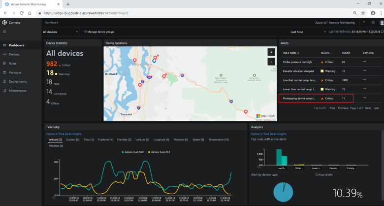
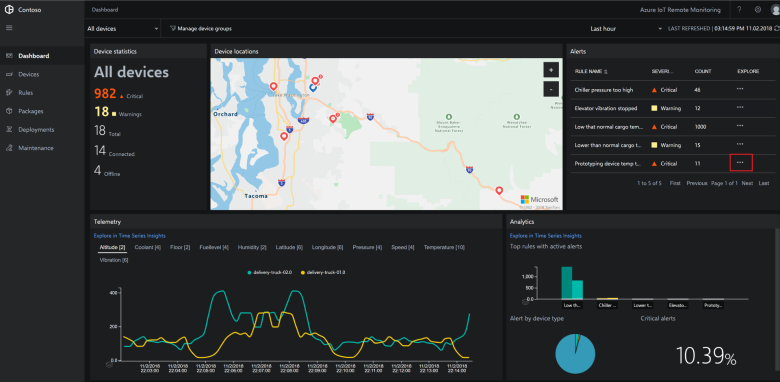
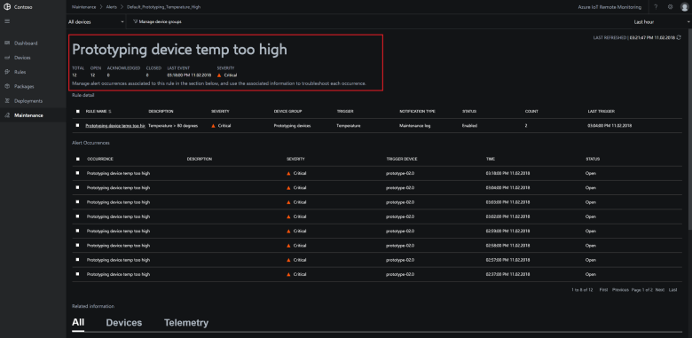
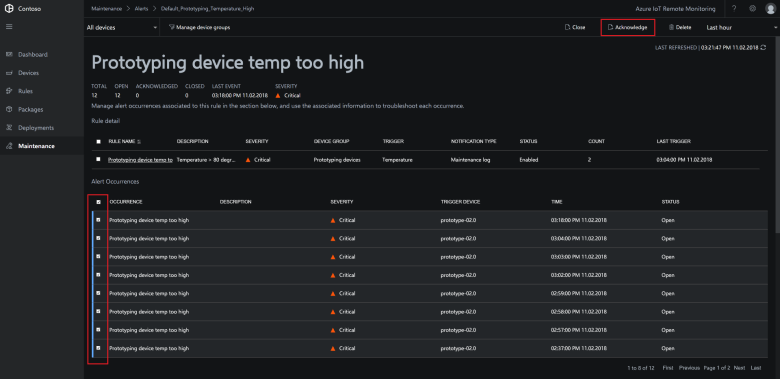
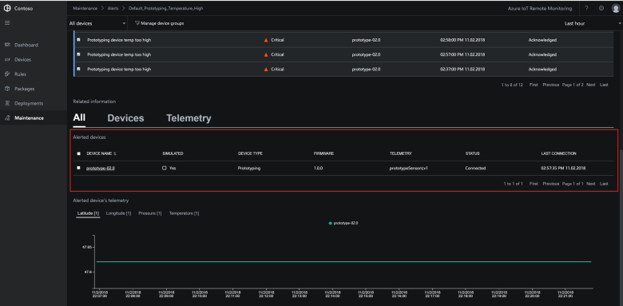
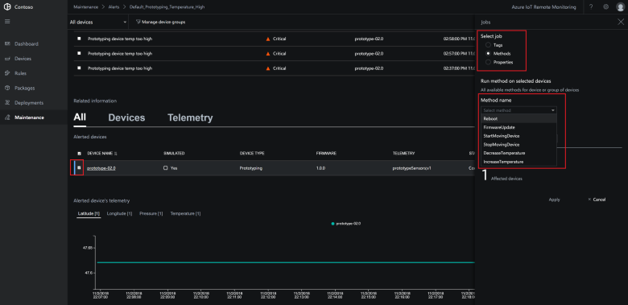
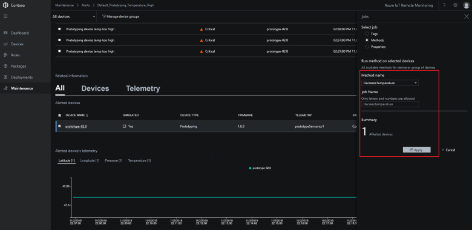
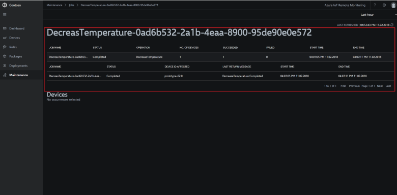
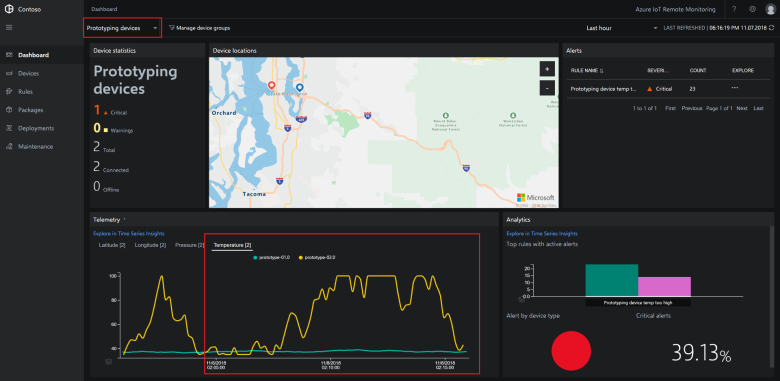

# Tutorial: Troubleshoot and fix device issues

In this tutorial, you use the Remote Monitoring solution accelerator to identify and fix issues with your connected IoT devices. You use alerts in the solution accelerator dashboard to identify issues and then run remote jobs to fix those issues.

Contoso is testing a new **Prototype** device in the field. As a Contoso operator, you notice during testing that the **Prototype** device is unexpectedly triggering a temperature alert on the dashboard. You must now investigate the behavior of this faulty **Prototype** device and resolve the issue.

In this tutorial, you:

>[!div class="checklist"]
> * Investigate an alert from a device
> * Resolve the issue with the device

If you don't have an Azure subscription, create a [free account](https://azure.microsoft.com/free/?WT.mc_id=A261C142F) before you begin.

[!INCLUDE [iot-accelerators-tutorial-prereqs](../../includes/iot-accelerators-tutorial-prereqs.md)]

## Investigate an alert

On the **Dashboard** page you notice there are unexpected temperature alerts coming from the rule associated with the **Prototype** devices:

To investigate the issue further, choose the **Explore Alert** option next to the alert:

The detail view of the alert shows:

* When the alert was triggered
* Status information about the devices associated with the alert
* Telemetry from the devices associated with the alert

To acknowledge the alert, select all the **Alert occurrences** and choose **Acknowledge**. This action lets other operators know that you have seen the alert and are working on it:

When you acknowledge the alert, the status of the occurrence changes to **Acknowledged**.

In the list of alerted devices, you can see the **Prototype** device responsible for firing the temperature alert:

## Resolve the issue

To resolve the issue with the **Prototype** device, you need to call the **DecreaseTemperature** method on the device.

To act on a device, select it in the list of alerted devices and then choose **Jobs**. The **Prototype** device model supports six methods:

Choose **DecreaseTemperature** and set the job name to **DecreaseTemperature**. Then click **Apply**:

To track the status of the job, click **View job status**. Use the **Jobs** view to track all the jobs and method calls in the solution:

You can check that the temperature of the device has fallen by viewing the telemetry on the **Dashboard** page:

[!INCLUDE [iot-accelerators-tutorial-cleanup](../../includes/iot-accelerators-tutorial-cleanup.md)]

## Next steps

This tutorial showed you how to use alerts to identify issues with your devices and how to act on those devices to resolve the issues. To learn how to connect a real device to your solution accelerator, continue to the how-to articles.

Now you have learned how to manage device issues, the suggested next step is to learn how to [Connect your device to the Remote Monitoring solution accelerator](iot-accelerators-connecting-devices.md).
